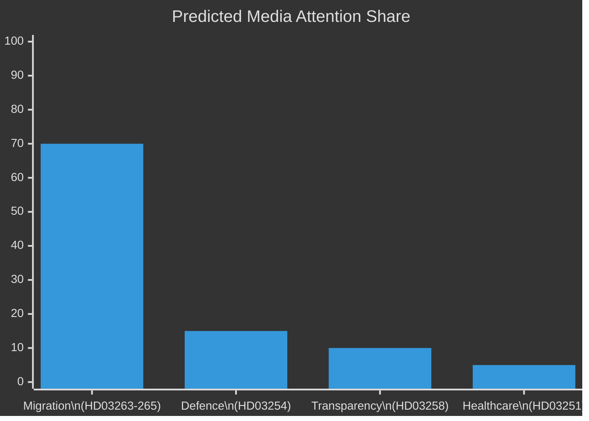

# Media Framing Analysis — Realtime Pulse 2026-04-30

**Author**: James Pether Sörling | **Date**: 2026-04-30 | **Confidence**: MEDIUM [B3]
**Note**: Predictive framing analysis — based on media pattern analysis, not real-time monitoring

---

## Predicted Media Frames by Outlet Type

| Outlet Type | Primary Frame | Headline Prediction | Angle |
|-------------|--------------|---------------------|-------|
| Riksmedia (SVT/SR) | Policy detail | "Regeringen lämnar in ny migrationslag — tre propositioner på en dag" | Balanced factual |
| Tabloid (Aftonbladet/Expressen) | Conflict/tension | "SD-krav i lagform: Här är de nya deporteringsreglerna" | Dramatisation |
| Conservative (Svenska Dagbladet) | Government capability | "Kraftig lagpaketet: Försvaret och migrationen i fokus" | Supportive framing |
| Progressive (Dagens Nyheter) | Rights/accountability | "Advokatsamfundet kritisk till HD03265: 'Rättssäkerheten ifrågasätts'" | Critical examination |
| SD-aligned media | Validation | "Tidöavtalet levereras: Tre migrationslagar på plats" | Enthusiastic affirmation |
| International | NATO angle | "Sweden submits military cooperation law, NATO integration advances" | Strategic framing |

## Frame Competition Forecast

**Dominant frame (likelihood: HIGH)**: The migration trifecta will dominate all domestic coverage on 2026-04-30 and for several days following. The three-bill bundle creates a "migration day" narrative that will overshadow HD03254 (defence) and HD03258 (transparency) in media attention.

**Government communications risk**: If government wants media attention on HD03254 (NATO/defence) and HD03258 (transparency), they should have issued separate press releases on different days. By bundling all submissions on April 30, the migration frame will cannibalize the governance/defence narrative in terms of news cycles.

**Opposition media strategy**: S will likely amplify HD03265 (detention) as the "most extreme" bill to activate the rights-concerned voter segment. UNHCR statement expected within 48 hours of publication.

## Narrative Virality Assessment

| Narrative | Virality Risk | Audience |
|-----------|--------------|---------|
| "Sweden builds detention regime" | HIGH — international media pickup likely | International, MP/V domestic |
| "Swedish defence modernised" | MEDIUM — positive but less dramatic | Defence-interested, C voters |
| "Political transparency milestone" | LOW — technical subject, limited viral potential | Political observers |
| "Government healthcare reform" | LOW — positive but overshadowed | KD voters |

