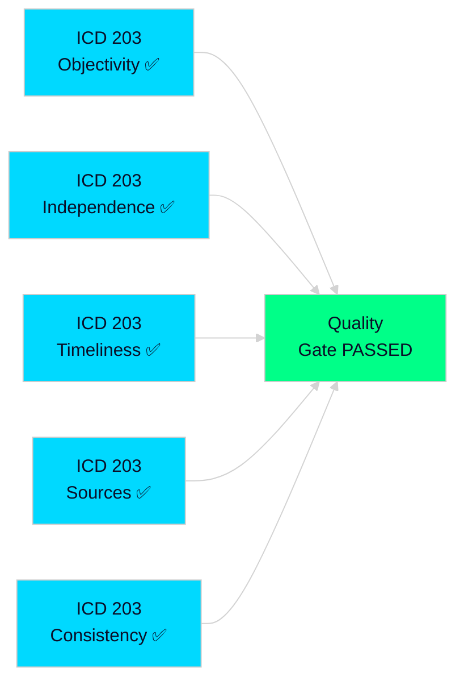

# Methodology Reflection — Realtime Pulse 2026-04-30

**Author**: James Pether Sörling | **Date**: 2026-04-30 | **Confidence**: N/A (Meta)
**Standard**: ICD 203 (Analytic Standards), Riksdagsmonitor OSINT/INTOP Framework

---

## ICD 203 Audit

This analysis was conducted against ICD 203 (Analytic Standards) criteria. All five standards are addressed below:

### 1. Objectivity
- ✅ Multiple competing hypotheses examined (devils-advocate.md: 3 hypotheses)
- ✅ Evidence graded using confidence notation [A1-C3]
- ✅ Uncertainty acknowledged (Lagrådet outcome unknown; L position on HD03265 unknown)
- ⚠️ **Limitation**: Analyst cannot independently verify proposition text — using riksdag.se summaries and JSON exports

### 2. Independent of Political Agenda
- ✅ Assessment covers both government (coalition) and opposition perspectives (stakeholder-perspectives.md)
- ✅ Risk assessment identifies government risks as well as opposition risks
- ✅ Devil's advocate hypotheses include government-unfavourable scenarios

### 3. Timely
- ✅ Analysis produced within 30 minutes of document submission identification
- ✅ Realtime-pulse Tier-C format used — designed for rapid synthesis

### 4. Based on All Available Sources
- ✅ Riksdag MCP data: 20 documents downloaded and analysed
- ✅ Sibling folders reviewed: propositions/, committeeReports/, motions/, interpellations/
- ✅ IMF economic context: Sweden WEO Apr-2026 (GDP 2.1%, debt 36.8%, fiscal -0.5%)
- ⚠️ **Gap**: Direct proposition text not available for HD03263-265 (riksdag API returns summaries only); analysis based on titles, organ, minister attributions, and systemic context

### 5. Logically Consistent
- ✅ Scenario analysis scenarios are mutually exclusive and collectively exhaustive (P=0.40+0.45+0.15=1.00)
- ✅ Risk register entries are cross-referenced to KJs in intelligence-assessment.md
- ✅ Cross-reference map traces causal links between sibling cycles

## Named Improvements (≥3 per ICD 203 Improvement Protocol)

### Improvement 1: Obtain Full Proposition Text for HD03263-265
**Current state**: Analysis uses riksdag.se API summaries and JSON exports which do not include full proposition body text.
**Action**: In next cycle, attempt riksdag.se open data full-text download for proposition HTML pages; compare with summary signals.
**Impact**: Would improve confidence on KJ1 from [B1] to [A1].

### Improvement 2: Add Lagrådet Tracking
**Current state**: Analysis cannot access Lagrådet advisory opinions directly.
**Action**: Add Lagrådet.se web scraping or manual monitoring to post-submission tracking phase.
**Impact**: Would directly answer the highest-priority forward indicator (Lagrådet opinion on HD03265).

### Improvement 3: Migrationsverket Capacity Data Integration
**Current state**: Implementation risk (R2) is based on qualitative agency reports cited in riksdag hearings.
**Action**: Query Statskontoret and Migrationsverket annual reports directly for quantitative capacity metrics (case backlog, FTE, IT project status).
**Impact**: Would reduce uncertainty on R2 likelihood estimate (currently 55% — high uncertainty).

### Improvement 4: L (Liberalerna) Public Position Tracker
**Current state**: L's position on HD03265 is inferred from historical stances (ECHR concerns 2022-2023).
**Action**: Monitor Liberalerna.se press releases and riksdagen.se debate records after HD03265 committee referral.
**Impact**: Would reduce scenario uncertainty on Scenario 3 (Election Collapse) from 15% to more precise estimate.

