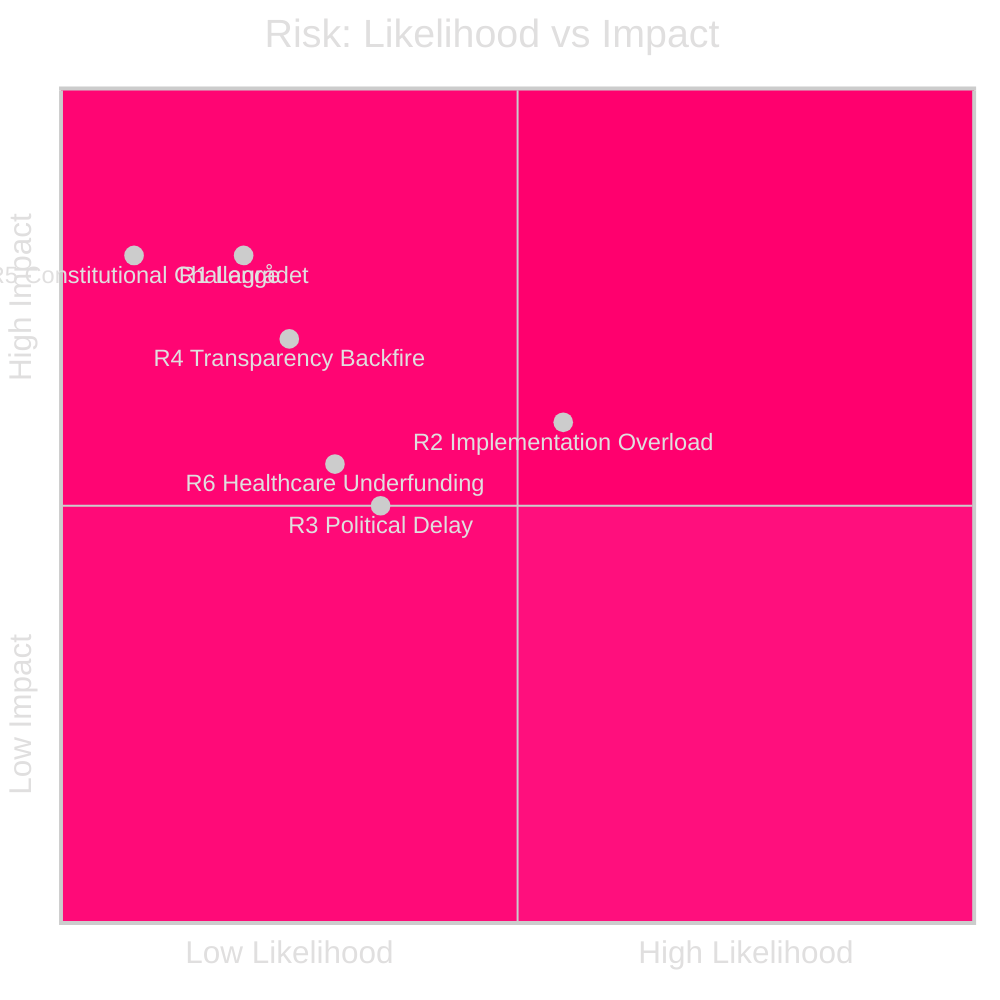

# Risk Assessment — Realtime Pulse 2026-04-30

**Author**: James Pether Sörling | **Date**: 2026-04-30 | **Confidence**: HIGH [B2]

---

## Risk Register

| ID | Risk | Category | Likelihood | Impact | L×I | Cascading |
|----|------|----------|-----------|--------|-----|-----------|
| R1 | Lagrådet invalidates HD03265 detention rules on ECHR grounds | Legal/Constitutional | MEDIUM (20%) | HIGH | 0.48 | Forces government to resubmit; weakens migration enforcement cluster signal pre-election |
| R2 | Implementation capacity failure at Migrationsverket for triple migration bills | Operational | HIGH (55%) | MEDIUM | 0.55 | Enforcement laws pass but cannot be implemented; reputational damage for government |
| R3 | Opposition delays HD03263+264+265 committee passage past election date | Political | MEDIUM (35%) | MEDIUM | 0.42 | Bills lapse; new government decides fate post-election |
| R4 | Political transparency bill reveals government party funding controversies | Political/Reputational | MEDIUM (25%) | HIGH | 0.50 | Pre-election damage for coalition partners |
| R5 | Defence cooperation framework challenged on constitutional sovereignty grounds | Legal | LOW (8%) | HIGH | 0.32 | Delays NATO integration; diplomatic embarrassment |
| R6 | Healthcare integration (HD03251) underfunded — patient access worsens during transition | Welfare | MEDIUM (30%) | MEDIUM | 0.45 | Political backlash; KD faces accountability for flagship welfare bill |

## Top Risk: R2 — Migrationsverket Implementation Overload

**Context**: HD03263 (return enforcement), HD03264 (conduct requirements), and HD03265 (detention) each require Migrationsverket to build new decision frameworks, train staff, and update IT systems. The agency's 2024 Statskontoret review noted capacity constraints. Three simultaneous system changes amplify risk multiplicatively.

**Posterior probability**: Given Migrationsverket's known backlog and IT modernisation delays (reported in riksdag.se committee hearings 2025), R2 likelihood elevated to HIGH. Evidence grade: [B2].

**Mitigation signals to watch**: FöU/SfU committee hearings where Migrationsverket appears — watch for agency requests for implementation delay periods or phased rollout requests.

## Risk Heat Map

