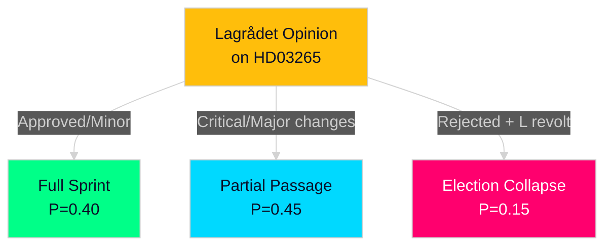

# Scenario Analysis — Realtime Pulse 2026-04-30

**Author**: James Pether Sörling | **Date**: 2026-04-30 | **Confidence**: MEDIUM [B2]

---

## Scenario Framework: 3 Futures for the Legislative Package

### Scenario 1 — "Full Sprint" (P=0.40): All Five Priority Bills Pass Before Election

**Conditions**: Tidöalliansen maintains internal discipline; L accepts HD03265 with minor amendments to satisfy ECHR concerns; S and C provide enough cross-party support on HD03254 and HD03258 to prevent filibuster; Lagrådet approves HD03265 with conditions the government accepts.

**Timeline**: Bills through committee by June 2026; chamber votes by late August 2026; all in force by election date 2026-09-13.

**Outcome**: Government enters election campaign with record of completed security/migration/defence legislation. SD voters reassured; M law-and-order narrative complete. Sweden demonstrates NATO ally reliability (HD03254 fully ratified).

**Indicators to watch**: Lagrådet advisory opinion tone; SfU committee chair scheduling decisions; government's response to Lagrådet if challenged.

### Scenario 2 — "Partial Passage" (P=0.45): Migration Cluster Stalls; Defence + Transparency Pass

**Conditions**: Lagrådet issues critical advisory on HD03265 detention rules; government must either amend substantially (delaying into post-election period) or override (politically costly); HD03263+264 pass on original timeline; HD03254 and HD03258 pass with broad support.

**Timeline**: HD03254+258 in force by August 2026; HD03263+264 in force Q4 2026; HD03265 returns for amendment Q1 2027.

**Outcome**: Government can claim majority of programme delivered. SD somewhat disappointed by HD03265 delay. Opposition frames it as "human rights stopped the worst parts."

**Indicators to watch**: Lagrådet advisory language on Article 5 ECHR; government spokesperson comments on detention bill timeline.

### Scenario 3 — "Election Collapse" (P=0.15): Package Becomes Campaign Battleground

**Conditions**: L publicly distances from HD03265; opposition forces multiple committee votes; election arrives before all bills are voted on; new government (S-led) drops or substantially rewrites HD03263-265.

**Timeline**: Election 2026-09-13; incoming government decides fate by December 2026.

**Outcome**: Migration enforcement cluster becomes central election issue; polarisation increases; NATO obligations (HD03254) likely still fulfilled by interim measures.

**Indicators to watch**: L press conferences on HD03265; opinion polls on migration; S shadow minister statements.

## Decision Tree

