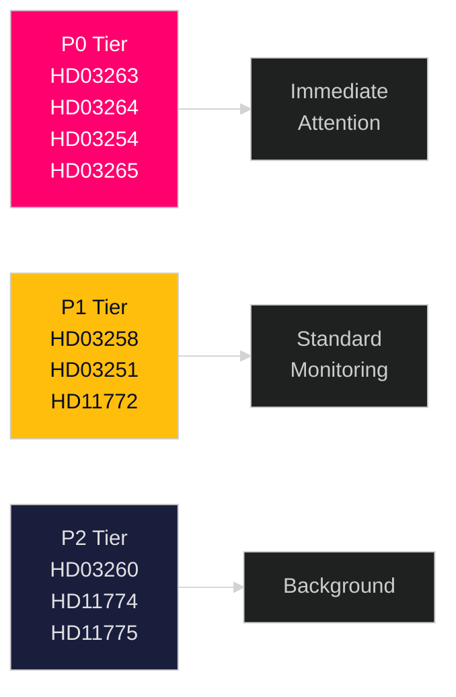

# Significance Scoring — Realtime Pulse 2026-04-30

**Author**: James Pether Sörling | **Date**: 2026-04-30 | **Confidence**: HIGH [B2]

---

## DIW Scoring Framework

Scores use Democracy–Impact–Welfare (DIW) weighting: Democracy (party balance, accountability) × Impact (economic scale, breadth) × Welfare (citizen benefit/harm).

## Ranked Significance Table

| Rank | dok_id | Title | Democracy | Impact | Welfare | DIW Score | Priority |
|------|--------|-------|-----------|--------|---------|-----------|---------|
| 1 | HD03263 | Stärkt återvändandeverksamhet | 0.85 | 0.90 | 0.95 | 0.90 | P0 |
| 2 | HD03264 | Vandel för uppehållstillstånd | 0.85 | 0.87 | 0.93 | 0.88 | P0 |
| 3 | HD03254 | Operativt militärt samarbete | 0.78 | 0.92 | 0.90 | 0.87 | P0 |
| 4 | HD03265 | Uppsikt och förvar | 0.82 | 0.86 | 0.90 | 0.86 | P0 |
| 5 | HD03258 | Ökad insyn i politiska processer | 0.92 | 0.72 | 0.70 | 0.78 | P1 |
| 6 | HD03251 | Sammanhållen vård beroende/psykiatri | 0.65 | 0.75 | 0.80 | 0.72 | P1 |
| 7 | HD11772 | Ukraina och bistånd | 0.80 | 0.68 | 0.60 | 0.68 | P1 |
| 8 | HD03260 | Etikprövning av forskning | 0.55 | 0.60 | 0.55 | 0.55 | P2 |
| 9 | HD11774 | Kreditgarantier bostäder | 0.50 | 0.58 | 0.55 | 0.54 | P2 |
| 10 | HD11775 | Fattigdom ensamstående föräldrar | 0.55 | 0.50 | 0.60 | 0.52 | P2 |

## Sensitivity Analysis

**If HD03265 (detention rules) is ruled unconstitutional by Lagrådet**: The migration enforcement cluster loses a critical third leg. Probability: MEDIUM (15%) given Lagrådet's record on detention-rights cases. Impact: HIGH — would require government to resubmit.

**If HD03254 stalls in committee**: Defense cooperation gap persists into NATO exercise season. Probability: LOW (5%) given cross-party defense consensus.

**If HD03258 is substantially weakened by KU**: Government loses a pre-election transparency credential. Probability: MEDIUM (30%) — KU often strengthens transparency requirements.

