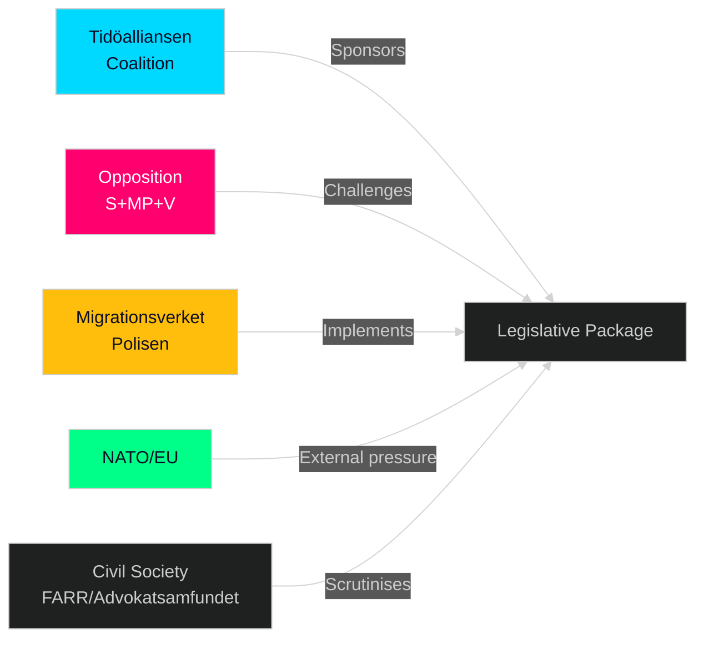

# Stakeholder Perspectives — Realtime Pulse 2026-04-30

**Author**: James Pether Sörling | **Date**: 2026-04-30 | **Confidence**: MEDIUM-HIGH [B2]

---

## 6-Lens Stakeholder Matrix

### 1. Government Coalition (Tidöalliansen: M+SD+KD+L)

**Moderaterna (M)**: Primary sponsor of HD03254, HD03258, HD03263-265 via Justitiedepartementet (Forssell) and Försvarsdepartementet (Jonson). Gains pre-election law-and-order credentials and defence expansion signals.

**Sverigedemokraterna (SD)**: HD03263+264+265 directly implement Tidöavtalet migration provisions SD negotiated. SD can take joint credit. Position: strongly supportive. Risk: SD's enforcement demands may have been maximalist; HD03265 may not go as far as SD wanted.

**Kristdemokraterna (KD)**: Jakob Forssmed (Socialdepartementet) sponsors HD03251 — the welfare/healthcare bill. This is KD's signature win in the package. Position: enthusiastic. Forssmed has championed integrated addiction-psychiatry care since 2022.

**Liberalerna (L)**: Historically uncomfortable with the detention rules (HD03265) on rights grounds. May abstain or request Lagrådet review. Position: ambivalent. Risk: public L dissent would signal coalition crack.

### 2. Opposition Parties

**Socialdemokraterna (S)**: Will likely oppose HD03263-265 on procedural if not substantive grounds. Can support HD03254 (cross-party defence consensus since 2022) and HD03258 (transparency — S will try to strengthen it). Position: split response — support defence + transparency, oppose migration.

**Miljöpartiet (MP)**: Strong opposition to all three migration bills; will use committee to demand human rights impact assessments. Position: firmly against HD03263-265.

**Vänsterpartiet (V)**: Same as MP on migration. Will oppose HD03254 on sovereignty grounds. Position: against most of package.

**Centerpartiet (C)**: Potentially supportive of HD03254 (defence) and HD03258 (transparency). May extract concessions on HD03251 (healthcare) in exchange for smoother passage. Position: constructive on defence/transparency.

### 3. Civil Society & Rights Organisations

**Riksorganisationen för asylsökande och flyktingar (FARR)**: Will publicly oppose HD03263-265 and call for UNHCR review. Evidence: FARR has opposed every prior return enforcement bill.

**Swedish Bar Association (Advokatsamfundet)**: Will request extended consultation on HD03265 detention rules. Evidence: prior advocacy on detention rights in riksdagen.se committee submissions.

**Medical/psychiatric community**: Broadly supportive of HD03251 — fragmented addiction/mental health care has been a systemic problem since the 2021 SOU 2021:93. Evidence: Swedish Psychiatric Association has lobbied for integrated care.

### 4. Implementing Agencies

**Migrationsverket**: Operationally challenged by three simultaneous migration laws. Director-General may signal to SfU committee a need for phased implementation timeline. Evidence: agency's 2024 annual report noted IT backlog.

**Polismyndigheten**: Return enforcement (HD03263) requires police cooperation for forced returns — existing capacity constraints documented in 2024 riksdag interrogations.

**Försvarsmakten**: Strongly supportive of HD03254 — operational legal gaps have constrained joint exercises. Chief of Defence has publicly called for legislative clarity on operational cooperation.

### 5. International/EU

**NATO**: HD03254 fulfils a direct commitment Sweden made at the 2024 accession — to bring national legislation into line with operational cooperation standards. NATO secretariat watch indicator.

**UNHCR Sweden**: Will issue a statement opposing HD03263+265; will request human rights impact assessments. Evidence: UNHCR issued similar statements on all 2022-2024 return enforcement bills.

**EU Commission**: HD03260 (research ethics) must be compatible with the EU Research Framework Regulation. Commission scrutiny expected.

### 6. Economic/Business Sector

**Defence industry**: HD03254 expands the legal basis for bilateral and multilateral defence procurement and operational cooperation — directly benefits Saab, BAE Systems UK (Sweden), Patria (Finland). IMF WEO Apr-2026 notes Sweden defence spending at ~2.1% GDP.

**Financial sector**: Day's broader package includes HD03253 (EU banking transposition from sibling propositions folder) — banks monitoring Basel III capital impacts.

