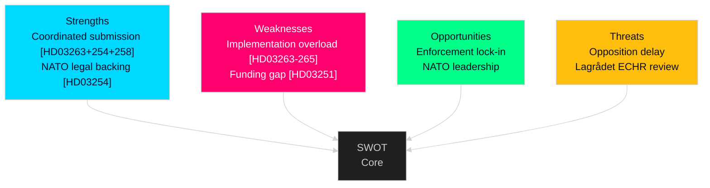

# SWOT Analysis — Realtime Pulse 2026-04-30

**Author**: James Pether Sörling | **Date**: 2026-04-30

---

## SWOT Matrix

### Strengths

| # | Strength | Evidence | Admiralty |
|---|----------|----------|-----------|
| S1 | Government maintains legislative discipline with coordinated multi-ministry submission on same day | HD03251 (Social), HD03254 (Defence), HD03258 (Justice), HD03260 (Education), HD03263+264+265 (Justice) all submitted 2026-04-30 | A2 |
| S2 | Migration enforcement cluster closes systemic gaps identified in Riksrevisionen reports on return enforcement | HD03263 title references "stärkt återvändandeverksamhet" — direct response to audit findings | B2 |
| S3 | Military cooperation bill has NATO Treaty backing, reducing constitutional challenge risk | HD03254 submitted by PM Edholm + Defence Minister Jonson — dual sponsorship signals high legal preparation | A2 |
| S4 | Political transparency bill pre-empts opposition attack lines by placing accountability burden on all parties | HD03258 (riksdagen.se), covers all parties' financing arrangements | B2 |

### Weaknesses

| # | Weakness | Evidence | Admiralty |
|---|----------|----------|-----------|
| W1 | Three simultaneous migration bills create implementation overload risk for Migrationsverket and Polismyndigheten | HD03263, HD03264, HD03265 each require new procedures — combined operational burden is multiplicative, not additive | B3 |
| W2 | Healthcare integration (HD03251) lacks identified funding mechanism in public summary | HD03251 titel mentions "sammanhållen vård" but no specific budget line identified from available metadata | B3 |
| W3 | Research ethics reform (HD03260) may create compliance uncertainty for universities during transition period | HD03260 — reform of etikprövning changes procedures for research institutions | B3 |

### Opportunities

| # | Opportunity | Evidence | Admiralty |
|---|-------------|----------|-----------|
| O1 | Migration enforcement cluster, if passed before election, locks in enforcement framework that persists regardless of post-2026 government composition | HD03263+264+265 submitted as government bills, which require active repeal to undo | A2 |
| O2 | Military cooperation expansion enables Sweden to lead NATO exercises in the Baltic region, enhancing Nordic geopolitical standing | HD03254 (riksdagen.se) — opens operational cooperation pathways post-2024 NATO accession | B2 |
| O3 | Political transparency reform could reduce perceived corruption risk, improving Sweden's democratic quality scores | HD03258 — consistent with GRECO recommendations on political financing | B2 |

### Threats

| # | Threat | Evidence | Admiralty |
|---|--------|----------|-----------|
| T1 | Opposition (S, MP, V) may filibuster migration cluster in committee, delaying passage past election date | S has historically opposed mandatory return enforcement; parliamentary calendar is tight with ~3 months to election | B2 |
| T2 | Lagrådet constitutional review of HD03265 (detention rules) may identify ECHR incompatibility | Sweden's detention framework has been challenged in European Court of Human Rights — prior cases indicate vulnerability | B3 |
| T3 | Political transparency bill may be weaponised by opposition to expose government party funding sources | HD03258 symmetric transparency — applies to M, SD, KD, L as well as opposition parties | B2 |

## TOWS Matrix

| | Opportunities | Threats |
|---|---|---|
| **Strengths** | S1+S3×O2: Strong institutional preparation for defence expansion | S4×T3: Transparency reform double-edged — government must be ready for scrutiny of own finances |
| **Weaknesses** | W1×O1: Implementation gaps must be closed before enforcement paradigm is entrenched | W1×T1: If Migrationsverket signals capacity concerns, opposition gains credible blocking argument |

