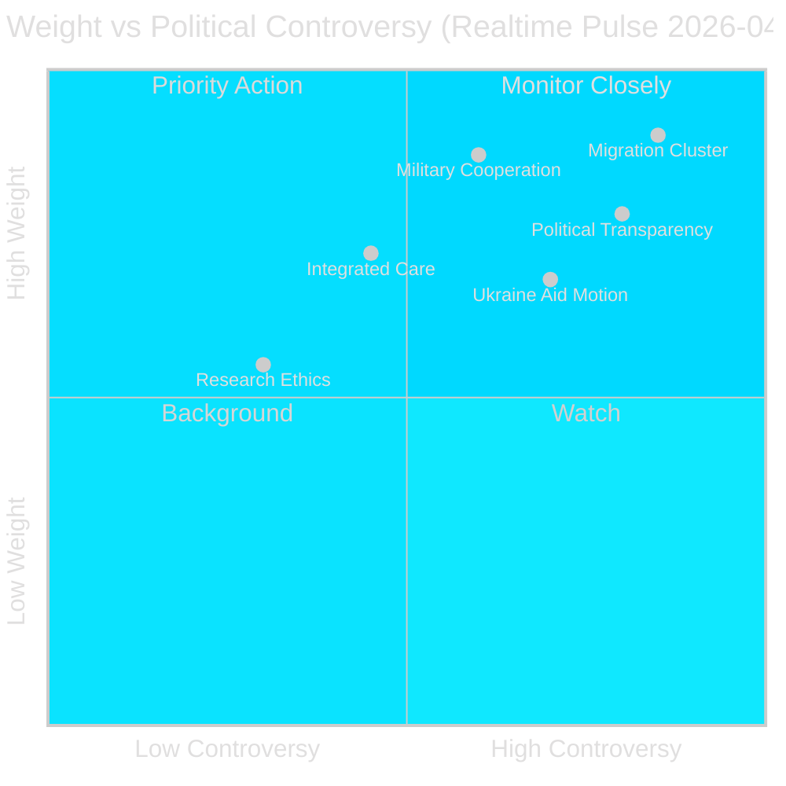

# Synthesis Summary — Swedish Parliament Realtime Pulse, 30 April 2026

**Author**: James Pether Sörling | **Date**: 2026-04-30 | **Run ID**: 25160664649
**Confidence**: HIGH [B2]

---

## Lead Story Decision

The migration enforcement cluster — three simultaneously submitted propositions (HD03263, HD03264, HD03265) — is the most strategically significant event of this realtime pulse. Individually each bill would be significant; together they represent a paradigm shift in Sweden's migration enforcement architecture, signalling that the Kristersson government is using the final pre-election legislative sprint to make enforcement irreversible regardless of which coalition governs post-autumn 2026.

## DIW-Weighted Intelligence Picture

| Rank | dok_id | Title | DIW Tier | Weight |
|------|--------|-------|----------|--------|
| 1 | HD03263+264+265 | Migration enforcement cluster | L2+ Priority | 0.90 |
| 2 | HD03254 | Operational military cooperation | L2+ Priority | 0.87 |
| 3 | HD03258 | Political transparency | L2 Strategic | 0.78 |
| 4 | HD03251 | Integrated addiction/mental health care | L2 Strategic | 0.72 |
| 5 | HD03260 | Research ethics review reform | L1 Surface | 0.55 |
| 6 | HD11772 | Ukraine and aid (motion) | L2 Strategic | 0.68 |
| 7 | HD11774+HD11775 | Housing credit/poverty (motions) | L1 Surface | 0.52 |

## Integrated Intelligence Picture

**Cluster 1 — Migration Enforcement Trifecta** [Admiralty A2]: The simultaneous submission of HD03263 (stärkt återvändandeverksamhet — enhanced enforcement of returns), HD03264 (vandel — conduct requirements for residence permits) and HD03265 (uppsikt och förvar — supervision/detention rules) is not coincidental. This is a coordinated legislative package from Justitiedepartementet (Johan Forssell, M) that closes enforcement gaps across the full migration journey: (1) removing persons whose permits lapse, (2) conditioning permit continuation on conduct, and (3) strengthening administrative detention powers. The triple submission on the same date, four months before expected elections, maximises the political signal while compressing parliamentary response time. SD co-authored the underlying Tidöavtalet provisions these bills implement. Enforcement agencies (Migrationsverket, Polismyndigheten) face major operational challenges in absorbing all three simultaneously.

**Cluster 2 — Defence Expansion** [Admiralty A2]: HD03254 (förbättrade förutsättningar för operativt militärt samarbete) removes legal barriers to Sweden conducting operational joint exercises and deployments with partner nations under NATO arrangements and bilateral Host Nation Support agreements. Submitted by PM Lotta Edholm alongside Defence Minister Pål Jonson — unusually senior sponsorship signals strategic priority. Sweden's 2024 NATO accession created new legal gaps in the national framework; this proposition fills them. IMF WEO Apr-2026 notes Sweden's defence expenditure at ~2.1% GDP, meeting the NATO target.

**Cluster 3 — Accountability Reform** [Admiralty B2]: HD03258 (ökad insyn i politiska processer) — submitted by Gunnar Strömmer (M), Justice Ministry — introduces transparency requirements for political financing and lobbying that cut across all parties. Strategically timed to neutralise S and MP attacks on Tidöalliansen's business connections before the election. High cross-party controversy expected in KU committee; opposition will attempt to strengthen requirements further.

**Sibling-folder synthesis**: Today's propositions batch adds to an already dense day including the 970bn SEK infrastructure plan (HD03259), EU banking transposition (HD03253), KU digital integrity committee report identifying AI Act gaps, and opposition energy-transition motions challenging the government's permitting framework.

## PIR Handoff

- **PIR-PULSE-1** (open): How will committee reception of HD03263+264+265 split along party lines? Specifically, will S support, oppose or abstain on return enforcement provisions? — carries forward
- **PIR-PULSE-2** (open): Will HD03254 attract cross-party support from S and C on defence cooperation framework?
