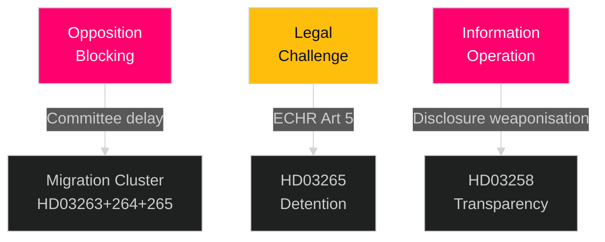

# Threat Analysis — Realtime Pulse 2026-04-30

**Author**: James Pether Sörling | **Date**: 2026-04-30 | **Confidence**: MEDIUM-HIGH [B2]

---

## Political Threat Taxonomy

### Threat 1: Opposition Blocking Strategy (Migration Cluster)

**Threat Actor**: S (Socialdemokraterna), MP (Miljöpartiet), V (Vänsterpartiet)
**Target**: HD03263, HD03264, HD03265 (migration enforcement cluster)
**Method**: Committee procedural delay — requesting extended remiss periods, calling for additional agency reviews (Lagrådet, Riksrevisionen), filing yrkanden (motions in committee) requiring parliamentary division votes on each clause
**Likelihood**: MEDIUM [B2] — S has historically used committee procedure to slow migration enforcement bills without outright rejection (evidence: 2022-2023 return enforcement debate, riksdagen.se)
**Impact**: HIGH — if bills don't pass before autumn 2026 election, they are carried to next government

### Threat 2: ECHR Legal Challenge to HD03265

**Threat Actor**: Academic legal community, UNHCR Sweden, civil society
**Target**: HD03265 (detention rules)
**Method**: Post-enactment constitutional challenge; ECHR Article 5 (liberty) compatibility review
**Likelihood**: LOW-MEDIUM [B3] — prior Swedish detention laws have survived ECHR scrutiny but with modifications
**Impact**: MEDIUM-HIGH — partial invalidation would require amendment

### Threat 3: Election-Year Information Operation Against HD03258

**Threat Actor**: Partisan media, social media amplifiers
**Target**: HD03258 (political transparency)
**Method**: Selective disclosure of party finance data revealed under new transparency rules; out-of-context narrative construction
**Likelihood**: MEDIUM [B3] — all transparency measures create disclosure risk
**Impact**: MEDIUM — electoral reputational damage risk for all parties, not just government

## TTP Mapping (MITRE-inspired)

| Tactic | Technique | Target | Procedure |
|--------|-----------|--------|-----------|
| Obstruction | Committee procedural delay | HD03263+264+265 | Extended remiss requests, multiple clause votes |
| Legal challenge | Post-enactment litigation | HD03265 | ECHR Article 5 challenge |
| Information operations | Selective disclosure | HD03258 | Party funding data weaponisation |
| Coalition disruption | L/KD wedge on migration rhetoric | Tidöalliansen | L (Liberalerna) has historically expressed ECHR concerns |

