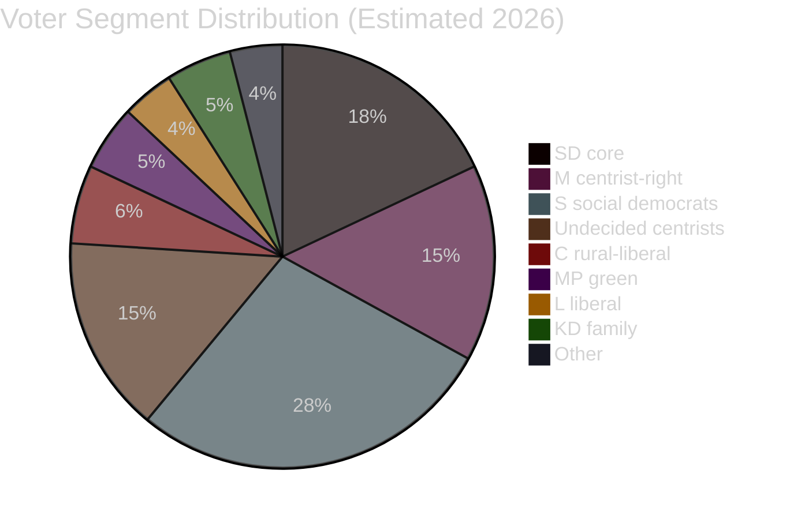

# Voter Segmentation Analysis — Realtime Pulse 2026-04-30

**Author**: James Pether Sörling | **Date**: 2026-04-30 | **Confidence**: MEDIUM [B3]

---

## Segment Response Matrix

| Segment | Size (est.) | HD03263-265 | HD03254 | HD03258 | HD03251 | Net Effect |
|---------|-------------|-------------|---------|---------|---------|-----------|
| SD core voters | ~18% | ++ Very positive | + Positive | 0 Neutral | 0 | Strong pull to SD |
| M centrist-right | ~15% | + Positive | + Positive | + Positive | 0 | Reinforces M choice |
| KD family voters | ~5% | 0 | + | 0 | ++ | Reinforces KD |
| L liberal voters | ~4% | -- Concerned | + | + | 0 | L internal tension |
| S social democrats | ~28% | -- Opposed | 0 | + | + | Splits S |
| C rural-liberal | ~6% | 0 | + | + | 0 | Mild pull to C/coalition |
| MP green | ~5% | --- Strongly opposed | -- | + | 0 | Energises opposition |
| Undecided centrists | ~15% | ? Ambivalent | + | ++ | + | Key swing target |

## Key Swing Segment: Undecided Centrists

The ~15% undecided centrist voters are the key battleground. This segment:
- Has historically switched between M, C, and S
- Is sensitive to governance quality signals (HD03258 transparency plays well)
- Is positively disposed toward NATO/defence (HD03254 plays well)
- Has mixed views on migration enforcement — HD03263+264 (conduct/return) broadly acceptable; HD03265 (detention) more divisive

**Inference**: Government's best swing-voter pitch is HD03254+258, not HD03263-265. The migration bills mobilise base voters on both sides (SD base: positive; MP/V base: negative) but are unlikely to shift undecided centrists.

