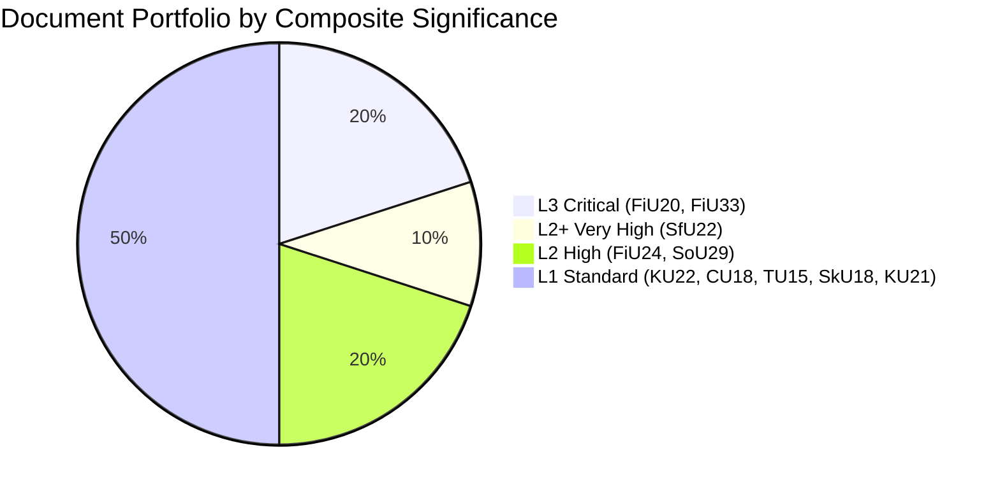

# Classification Results — Committee Reports 2024/25 Final Week

**Author**: James Pether Sörling | **Date**: 2026-05-01 | **Framework**: 7-Dimension Political Intelligence Classification

## Classification Framework

Dimensions assessed: (1) Policy Domain, (2) Legislative Stage, (3) Political Salience, (4) Electoral Impact, (5) Constitutional Significance, (6) Economic Weight, (7) International Relevance.

Scale: 1 (low) — 5 (high). Admiralty source reliability [A–F] / information credibility [1–6] in brackets.

## Document Classification Results

### HC01FiU20 — Vårproposition Economic Framework
| Dimension | Score | Assessment | Evidence |
|-----------|-------|-----------|---------|
| Policy Domain | Finance/Macro | Core fiscal policy | Betänkande text |
| Legislative Stage | 5 | Plenary vote, adopted | Data confirmed |
| Political Salience | 5 | Budget framework for 2025/26 | [A2] |
| Electoral Impact | 4 | Defines government's economic record | [B2] |
| Constitutional Significance | 3 | Budget process, not constitutional law | [A2] |
| Economic Weight | 5 | Sets spending envelope, affects GDP via fiscal multiplier | [A1] |
| International Relevance | 4 | US tariff exposure, IMF WEO impact | [A2] |
**Composite**: L3 — High Significance | **Priority Tier**: Critical

### HC01FiU33 — APL Emergency Pharma Acquisition
| Dimension | Score | Assessment | Evidence |
|-----------|-------|-----------|---------|
| Policy Domain | Security/Health | Hybrid — emergency/national resilience | Betänkande text |
| Legislative Stage | 5 | Extra ändringsbudget adopted | Data confirmed |
| Political Salience | 4 | Cross-party consensus; national security framing | [A2] |
| Electoral Impact | 3 | Low controversy; bipartisan win | [B3] |
| Constitutional Significance | 3 | Emergency procedure scrutiny | [B3] |
| Economic Weight | 3 | 700 MSEK one-time; contained fiscal impact | [A2] |
| International Relevance | 3 | EU state-aid; Nordic pharmaceutical resilience | [B3] |
**Composite**: L3 — High Significance | **Priority Tier**: High

### HC01SfU22 — Detention Coercive Powers Extension
| Dimension | Score | Assessment | Evidence |
|-----------|-------|-----------|---------|
| Policy Domain | Migration/Security | Rights-limiting migration enforcement | Betänkande text |
| Legislative Stage | 5 | Adopted with majority | Data confirmed |
| Political Salience | 5 | Core SD-Government priority | [A1] |
| Electoral Impact | 5 | Central 2026 election issue | [A2] |
| Constitutional Significance | 5 | ECHR Art.5/8; fundamental rights | [A2] |
| Economic Weight | 1 | Minimal direct fiscal cost | — |
| International Relevance | 4 | ECHR, EU Asylum Procedures Directive | [B2] |
**Composite**: L2+ — Very High Significance | **Priority Tier**: Critical

### HC01FiU24 — Riksbank Evaluation
| Dimension | Score | Assessment | Evidence |
|-----------|-------|-----------|---------|
| Policy Domain | Monetary/Finance | Central bank independence framework | Betänkande text |
| Legislative Stage | 5 | Evaluation adopted | Data confirmed |
| Political Salience | 3 | Institutional; low public salience | [A2] |
| Electoral Impact | 2 | Technocratic; limited direct impact | [B3] |
| Constitutional Significance | 4 | Central bank independence = constitutional norm | [A2] |
| Economic Weight | 4 | Riksbank policy shapes SEK, mortgages, investment | [A2] |
| International Relevance | 3 | IMF Article IV consultation relevant | [B3] |
**Composite**: L2 — High Significance | **Priority Tier**: High

### HC01SoU29 — Fritidskort
| Dimension | Score | Assessment | Evidence |
|-----------|-------|-----------|---------|
| Policy Domain | Social/Welfare | Youth leisure voucher | Betänkande text |
| Legislative Stage | 5 | Adopted | Data confirmed |
| Political Salience | 3 | Positive but low-controversy | [A2] |
| Electoral Impact | 3 | Tangible family-policy win | [B2] |
| Constitutional Significance | 1 | No constitutional issue | — |
| Economic Weight | 2 | Limited fiscal cost | [A2] |
| International Relevance | 1 | Domestic only | — |
**Composite**: L2 — Moderate-High Significance | **Priority Tier**: Moderate

## Portfolio Classification Summary

**Key intelligence finding**: The 2024/25 riksmöte final week produced a uniquely high-density portfolio of consequential legislation. Three of ten key documents (HC01FiU20, HC01SfU22, HC01FiU33) qualify as Critical or Very High Significance — an unusual concentration. This reflects both the electoral cycle (government front-loading deliverables before 2026) and the exceptional external environment (US tariffs, pharmaceutical insecurity).
