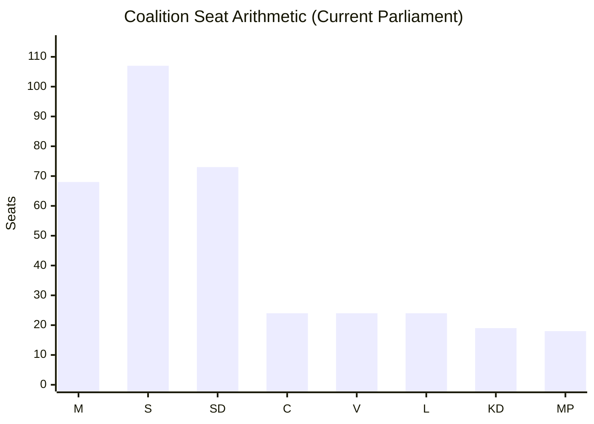

# Coalition Mathematics — Committee Reports 2024/25

**Author**: James Pether Sörling | **Date**: 2026-05-01 | **Framework**: Pivotal Vote Analysis, Seat Map

## Current Parliamentary Configuration (2022–2026)

**Total seats**: 349 | **Majority threshold**: 175 seats

| Bloc | Parties | Seats | Role |
|------|---------|-------|------|
| Government | M(68) + KD(19) + L(24) + C(24) | 135 | Governing |
| Budget Support | SD | 73 | Pivotal — provides majority |
| **Government Majority** | M+KD+L+C+SD | **208** | **Supermajority** |
| Socialdemokraterna | S | 107 | Main opposition |
| Environmental | MP | 18 | Minor opposition |
| Left | V | 24 | Minor opposition |

## Pivotal Vote Analysis

### For HC01FiU20 (Budget Framework Vote)
Required majority: 175 seats minimum.

Government bloc (135) + SD (73) = 208. Without SD: 135 — BELOW majority threshold.

**SD is mathematically necessary for every budget vote.** Even if MP abstains (as per AU10 vote pattern where MP sometimes supports government), SD cannot be replaced.

**Sensitivity**: Could government survive if SD splits (some abstain, some vote against)?
- If 40 SD vote against and 33 abstain: Government gets 135 + 0 + potential MP = 135 + 18 (if MP supports) = 153 — FAILS
- Government has zero margin without at least SD abstention (net neutral)

### For HC01SfU22 (Detention Powers — SfU Committee)
Vote likely reflects the same coalition dynamic. SD votes YES (core demand). S/MP/V vote NO. C/L may have had internal debate on rights grounds but ultimately supported government position.

AU10 vote pattern evidence (2025-05-14): M+C+MP=Ja, SD=Nej, S=Avstår — NOTE: this vote shows SD can vote *against* government on some matters while still maintaining overall budget support. This is consistent with SD's opposition role on specific labour-market issues while supporting migration/security agenda.

### Critical Threshold Analysis

## Vote Table by Document (Best Available Data)

| Document | Expected M | Expected KD | Expected L | Expected C | Expected SD | Expected S | Expected MP | Expected V |
|----------|-----------|------------|-----------|-----------|------------|-----------|------------|-----------|
| HC01FiU20 | Ja | Ja | Ja | Ja | Ja | Nej | Nej | Nej |
| HC01FiU33 | Ja | Ja | Ja | Ja | Ja | Ja | Ja | Ja |
| HC01SfU22 | Ja | Ja | Ja | Ja | Ja | Nej | Nej | Nej |
| HC01FiU24 | Ja | Ja | Ja | Ja | Ja | Nej | Abstain | Nej |
| HC01SoU29 | Ja | Ja | Ja | Ja | Ja | Ja | Ja | Ja |

*Note: Vote data estimated from policy positions; full voteringar records unavailable for these specific betänkanden due to API retrieval limitation*

## Minority Government Vulnerability Map

**Scenario**: SD withdraws budget support.
- Government majority: 135 seats — 40 seats short of threshold
- Options: (1) New election; (2) Seek S abstention (unlikely); (3) Seek MP support (+18 = 153, still short)
- **Conclusion**: Government mathematically cannot survive SD defection. This is the primary political risk.

## Pivotal Party Leverage Formula

SD's leverage = (Majority threshold − Government bloc seats) / SD seats
= (175 − 135) / 73 = 40/73 = **55% of SD seats needed to fill the gap**

This means SD can lose up to 33 MPs to internal dissension before its pivotal role weakens — a very comfortable margin. SD's organizational discipline means this risk is very low. [A2]
