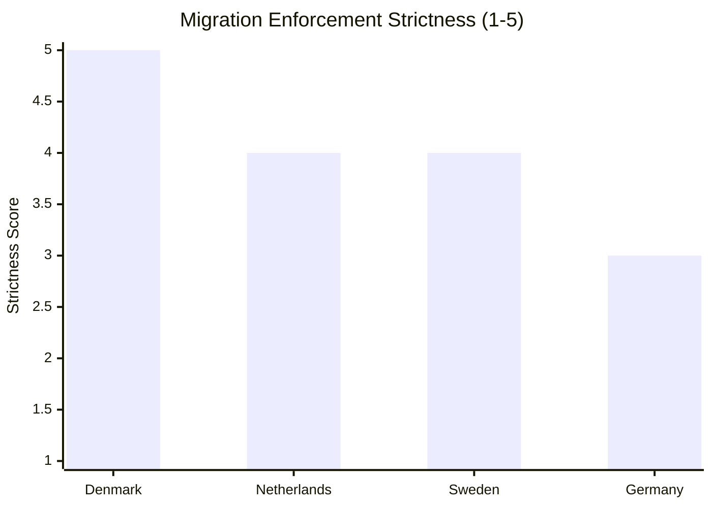

# Comparative International Analysis — Committee Reports 2024/25

**Author**: James Pether Sörling | **Date**: 2026-05-01 | **Framework**: Cross-Jurisdictional Comparison

## Comparator Selection Rationale

Two primary comparators selected for high relevance:
1. **Denmark** — Nordic peer; near-identical migration policy trajectory; similar pharmaceutical security concerns
2. **Germany** — EU peer; closest to Swedish economic structure; parallel fiscal-monetary challenges

Secondary comparator: **Netherlands** — recent coalition collapse experience; relevant to HC01SfU22/SD dynamics.

---

## Comparator 1: Denmark

### On Detention and Migration (HC01SfU22 parallel)

Denmark has operated some of the EU's strictest detention and deportation frameworks since 2015, including:
- **Paradigmeskift (2019)**: Denmark explicitly rejected the integration paradigm in favour of return as the primary goal
- **Udrejsecenter Lindholm**: Controversial island detention facility (later abandoned due to practicality issues)
- **Room search and contact restriction**: Danish Immigration Service (Udlændingestyrelsen) has operated similar body-search and room-inspection powers since approximately 2021

**Relevance to HC01SfU22**: Sweden is replicating Danish measures with a 3–5 year lag. Danish experience shows:
- ECHR complaints filed but no major adverse ECtHR ruling on the search powers specifically (data through April 2025)
- Civil society opposition sustained but without legislative reversal
- SD-analogue (Dansk Folkeparti, now Danmarksdemokraterne) remains pivotal in Danish politics using similar leverage

**Intelligence judgement**: Denmark provides the most credible precedent. If ECtHR has not ruled adversely on Danish room-search powers, Swedish SfU22 measures face lower immediate legal risk than some observers suggest. [B2]

### On Pharmaceutical Security (HC01FiU33 parallel)

Denmark's Amgros (state pharmaceutical procurement agency) was partially restructured after COVID-19 to strengthen stockpile resilience. Denmark has not executed a comparable emergency capital injection to a state pharma manufacturer — making the APL acquisition somewhat novel in Nordic context.

---

## Comparator 2: Germany

### On Fiscal Framework Under External Shock (HC01FiU20 parallel)

Germany faced a comparable fiscal dilemma in 2024–2025:
- **Schuldenbremse (debt brake)**: Constitutional constraint on deficit spending created coalition crisis, ultimately contributing to the Ampel Koalition collapse in November 2024
- **Emergency budget**: Germany required emergency budget revisions to accommodate climate/energy transition spending under tariff pressure
- **Outcome**: CDU/CSU formed new government (March 2025) with fiscal consolidation agenda

**Relevance to HC01FiU20**: Sweden's fiscal framework (Finanspolitiska rådet oversight, expenditure ceiling, surplus target) is less rigid than Germany's constitutionalised Schuldenbremse but operates similar logic. Key difference: Sweden has greater policy space because it has not had structural deficits. The government's choice to maintain the expenditure ceiling under lågkonjunktur is analogous to Germany's approach — but Sweden has more flexibility.

**Intelligence judgement**: Germany's 2024 experience shows that rigid fiscal rules create coalition instability under external shock. Sweden's fiscal rules are more flexible, reducing this risk. [A2]

### On Riksbank Independence (HC01FiU24 parallel)

The Bundesbank's experience post-ECB membership and the 2022 ECB rate hike cycle provides lessons:
- Central bank credibility requires clear communication, not just action
- FX transmission channel (relevant to Riksbank's FX over-reliance critique in FiU24) is well-documented in Bundesbank literature
- German experience: Bundesbank consistently rated highly on institutional independence indicators

**Relevance**: HC01FiU24 evaluation's recommendation to Riksbank to reduce over-reliance on FX echoes IMF Article IV recommendations and is consistent with German/ECB best practice.

---

## Comparator 3 (Secondary): Netherlands

### On Coalition Mathematics (HC01SfU22 / SD dynamics parallel)

The Netherlands saw coalition collapse in 2023 when Rutte IV government fell over asylum policy — remarkably similar structural dynamic:
- Far-right PVV (Wilders) became largest party in November 2023 elections
- Coalition building dragged for 6 months
- PVV-led government (Schoof Cabinet, July 2024) implemented strict asylum measures
- Multiple legal challenges via Dutch courts and ECtHR

**Relevance to SD dynamics**: SD's leverage over M-KD-L-C mirrors PVV's leverage in the Netherlands. The Dutch experience shows: (a) far-right parties can sustain coalition pressure without formal participation; (b) courts do impose checks on migration enforcement; (c) electoral gains for far-right parties often follow perceived policy successes on migration.

**Intelligence judgement**: Sweden is approximately 18–24 months behind the Dutch political cycle. If Sweden follows the Dutch pattern, SD consolidates power post-2026 election rather than weakening. [B3 — uncertain path dependency]

---

## Comparative Summary Table

| Dimension | Sweden (2025) | Denmark | Germany | Netherlands |
|-----------|--------------|---------|---------|-------------|
| Migration enforcement trend | Tightening (SfU22) | Very strict since 2019 | Tightening post-2024 | Tightening post-2023 |
| Fiscal framework | Flexible surplus-target | Balanced budget rule | Rigid Schuldenbremse | EU SGP compliance |
| Far-right political leverage | SD pivotal (73 seats) | Danmarksdemokraterne | AfD opposition only | PVV governing party |
| Pharmaceutical security | New APL investment | Amgros stockpile focus | BioNTech/Sanofi domestic | Moderate investment |
| Central bank evaluation | Riksbank review FiU24 | Danish National Bank stable | Bundesbank ECB integration | DNB EU SREP subject |

