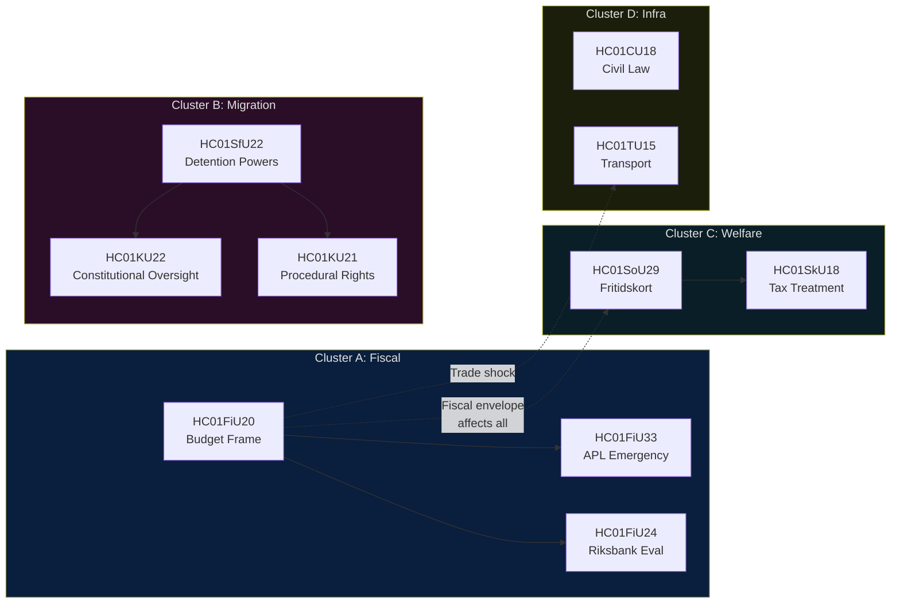

# Cross-Reference Map — Committee Reports 2024/25 Final Week

**Author**: James Pether Sörling | **Date**: 2026-05-01 | **Framework**: Policy Cluster / Legislative Chain Analysis

## Policy Clusters

### Cluster A: Fiscal Coherence (HC01FiU20 + HC01FiU33 + HC01FiU24)
All three FiU betänkanden form an integrated fiscal-monetary cluster:
- **HC01FiU20** (Vårproposition): Sets 2025/26 budget envelope; acknowledges lågkonjunktur; underpins all other spending decisions
- **HC01FiU33** (APL): Funded via extra ändringsbudget within the HC01FiU20 envelope; demonstrates government willingness to prioritise national security outside normal budget process
- **HC01FiU24** (Riksbank): Evaluates monetary policy effectiveness as complement to fiscal stance; highlights FX-over-reliance risk that could amplify R1 trade shock

**Chain**: FiU20 sets the frame → FiU33 emergency action within the frame → FiU24 evaluates the monetary complement

### Cluster B: Migration and Security (HC01SfU22 + HC01KU22 + HC01KU21)
- **HC01SfU22**: Core detention coercive powers — operational migration enforcement
- **HC01KU22**: Constitutional and rule-of-law committee betänkande (likely oversight of executive migration powers)
- **HC01KU21**: Constitutional committee on procedural rights (related oversight)

**Chain**: SfU22 extends enforcement powers → KU22/KU21 provide constitutional oversight mechanism

### Cluster C: Social Welfare (HC01SoU29 + HC01SkU18)
- **HC01SoU29**: Fritidskort — direct family welfare
- **HC01SkU18**: Skatteutskottet betänkande — likely tax treatment of welfare benefits or activity support

**Chain**: SoU29 creates benefit → SkU18 handles tax implications

### Cluster D: Infrastructure and Markets (HC01CU18 + HC01TU15)
- **HC01CU18**: Civil law committee — property, contract, consumer rights
- **HC01TU15**: Transport committee — infrastructure, logistics (potentially connected to supply chain resilience under tariff scenario)

## Legislative Chain Map

## Cross-Policy Tension Matrix

| Document A | Document B | Tension Type | Description |
|-----------|-----------|--------------|-------------|
| HC01FiU20 (fiscal restraint) | HC01SoU29 (new spending) | Fiscal vs. Social | Fritidskort adds recurrent cost in a lågkonjunktur budget |
| HC01FiU20 (external trade) | HC01TU15 (transport infra) | Supply chain | US tariff disruption may require infrastructure adaptation |
| HC01SfU22 (detention rights restriction) | HC01KU22 (constitutional oversight) | Executive vs. Parliament | Balance between enforcement power and judicial review |
| HC01FiU24 (Riksbank independence) | HC01FiU20 (fiscal intervention) | Monetary vs. Fiscal | Risk of fiscal dominance reducing monetary policy space |

## External Reference Connections

| Document | External References | Cross-Jurisdictional |
|----------|--------------------|--------------------|
| HC01SfU22 | ECHR Art.5, Art.8; EU Asylum Procedures Directive 2013/32/EU | Denmark, Germany detention law |
| HC01FiU33 | TFEU Art.107-108 state aid; NATO supply resilience | Nordic pharmaceutical cooperation |
| HC01FiU24 | IMF Article IV consultation; Riksbank Act 2022 | ECB independence framework, UK Bank of England |
| HC01FiU20 | IMF WEO Apr-2026; OECD Economic Outlook | Nordic fiscal frameworks, ESA 2010 |
