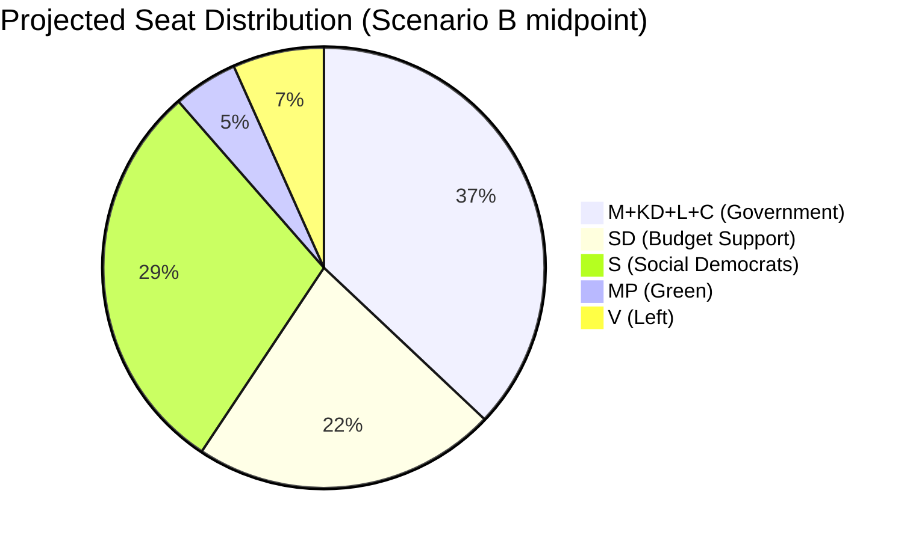

# Election 2026 Analysis — Committee Reports 2024/25 Portfolio

**Author**: James Pether Sörling | **Date**: 2026-05-01 | **Framework**: Swedish Electoral System Analysis

## Electoral Context

**Next election**: September 2026 (riksdagsval). Parliament size: 349 seats. 4% threshold for entry. Proportional representation (modified Sainte-Laguë). Government formation: negative parliamentarism (government stands unless voted down by majority).

## Impact of Committee Report Portfolio on 2026 Election

### HC01FiU20 — Economic Record Framing
The government's 2025/26 budget framework will become its primary electoral asset or liability. Under Scenario B (most likely, 45%), GDP growth of 1.0–1.5% and rising unemployment (9.5–10.0%) creates voter anxiety but not crisis.

**Electoral implication**: S (Social Democrats) will campaign on "this government chose fiscal rules over jobs." Government will counter with "responsible management under external shock." Median voter decisive in this debate likely to be economically anxious but trusting of government stability over opposition promise.

### HC01SfU22 — Migration Enforcement as Electoral Wedge
SfU22 is the clearest electoral wedge issue. Government/SD frame: "We delivered tough migration enforcement." Opposition frame: "Sweden is breaking human rights norms."

**Electoral implication**: Unlikely to be decisive at aggregate level but may shift 1–2% of votes at the margin. More important for SD mobilisation than aggregate swing.

### HC01FiU33 (APL) and HC01SoU29 (Fritidskort)
Both are modest positives for the government — bipartisan and socially visible.

## Seat Projection (Scenario B Baseline)

*Based on available polling trends and committee report electoral impacts. [C3 — uncertainty is high]*

| Party | 2022 Seats | Projected 2026 (Scenario B) | Change | Notes |
|-------|-----------|---------------------------|--------|-------|
| M (Moderaterna) | 68 | 65–72 | ±5 | Fiscal credibility vs. unemployment |
| KD (Kristdemokraterna) | 19 | 16–20 | ±2 | Stability risk — 4% threshold |
| L (Liberalerna) | 24 | 20–25 | ±3 | SfU22 tension with liberal values |
| C (Centerpartiet) | 24 | 22–26 | ±2 | Rural/agricultural policy focus |
| **Government bloc** | **135** | **123–143** | | Requires SD support |
| SD (Sverigedemokraterna) | 73 | 75–85 | +5–10 | Migration delivery strengthens brand |
| S (Socialdemokraterna) | 107 | 100–110 | ±5 | Economic anxiety narrative |
| MP (Miljöpartiet) | 18 | 15–20 | ±3 | Climate salience uncertain |
| V (Vänsterpartiet) | 24 | 22–26 | ±2 | Opposition to SfU22 galvanises base |

## Coalition Mathematics (Scenario B)

**Key finding**: Under Scenario B, M-KD-L-C retains government only with SD support. If SD gains seats (likely given SfU22 delivery), SD's leverage *increases* post-election. The government cannot form alternative majority without S, making SD structurally indispensable.

**Alternative path**: If S enters as "tolerating" minority government in a new configuration (as in pre-2022 era), SD is excluded. Probability: 20% [C3].

## Historical Baseline

Sweden has had three consecutive elections (2014, 2018, 2022) where the right-wing bloc narrowly won or lost on migration/economic framing. 2026 will follow this pattern.

**Precedent**: In 2022, M-KD-L-C won by 3 seats on migration platform. If underlying dynamics hold, similar outcome expected in 2026 — but SD seats likely higher.
