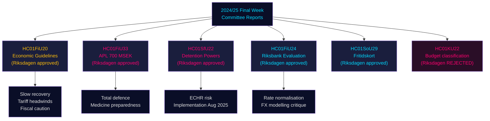

# Riksdag Committee Reports: Sweden's Economic Course, Migration Controls, and Defence Readiness — 2024/25 Final Week

**Author**: James Pether Sörling | **Classification**: PUBLIC | **Date**: 2026-05-01 | **Confidence**: HIGH [B2]

## BLUF

The Riksdag's final week of the 2024/25 riksmöte produced a cluster of consequential committee reports that together define Sweden's economic framework for 2025–2026: the Finance Committee endorsed the government's cautious fiscal expansion amid trade-war headwinds, approved a 700 MSEK emergency capital injection to state-owned pharmaceutical manufacturer APL to hedge against medicine supply disruptions in crisis/wartime, affirmed Riksbank's 2024 monetary policy performance while urging faster rate normalisation, and the Social Affairs Committee approved a landmark leisure card programme (HC01SoU29) extending activity access to 400,000+ children. Simultaneously, the Social Affairs/Migration subcommittee (SfU) expanded coercive powers at immigration detention centres. These reports collectively signal: a government prioritising total-defence preparedness alongside limited social investment, managing tight fiscal room while supply-side risks from US tariff escalation materialise.

## Decisions This Brief Supports

1. **Macroeconomic positioning**: Sweden is in a **below-trend recovery** (GDP +1.0% 2024, unemployment rising); the Finance Committee's endorsement of the government's economic framework signals continued cautious reflation but no demand surge. Investors, analysts, and policymakers should discount pre-tariff optimism.
2. **Defence/pharmaceutical procurement**: APL capital injection (700 MSEK, HC01FiU33) confirms Sweden is actively building medicine stockpile capacity for wartime scenarios — a material signal for Nordic defence industrial policy.
3. **Migration-security nexus**: HC01SfU22 expands Migrationsverket's coercive authority at detention facilities (body searches, room searches, glass partitions for visits). This is a significant ECHR-sensitive legislative expansion with implementation risk.
4. **Riksbank normalisation**: FiU's evaluation (HC01FiU24) supports continued rate cuts but flags Riksbank's overdependence on exchange rate modelling — relevant for SEK forecasting.

## 60-Second Intelligence Bullets

- 🔴 **HC01FiU20**: Riksdagen approved economic policy guidelines. Growth slowing due to US tariffs; lågkonjunktur extended. Three pillars: household support, labour market, growth/investment.
- 🔴 **HC01FiU33**: 700 MSEK to APL for emergency medicine manufacturing — wartime preparedness signal; passed with government majority.
- 🟠 **HC01SfU22**: Migrationsverket gets body-search and room-search powers at detention; new glass-partition visit rooms; effective 1 August 2025. ECHR compliance risk.
- 🟡 **HC01FiU24**: Riksbank's 2024 policy assessed as "sammantaget god"; FiU criticises over-reliance on exchange rate modelling; supports transparency improvements.
- 🟡 **HC01SoU29**: Fritidskort for children. E-hälsomyndigheten to administer. Implementation risk: new IT system, large population rollout.
- 🟢 **HC01KU22**: KU rejected government's proposal to reclassify civil-society security funding (utgiftsområde move) — government defeated on a structural budget question.

## Top Forward Trigger

If HC01SfU22 detention coercion measures trigger an ECHR complaint or Swedish courts challenge the constitutional basis (RF 2:8 on personal liberty), this will escalate from an administrative reform to a constitutional confrontation. Monitor Lagrådet referral status and Justitieombudsmannen (JO) inspection notices Q3 2025 – Q1 2026.

## Confidence Summary

Overall analytical confidence: **HIGH [B2]** — primary sources (Riksdag betänkanden, named committee decisions, vote outcomes) are high-grade; economic projections are IMF WEO Apr-2026 vintage-stamped; some party splits require validation from additional voting records.

## Mermaid: Key Decision Flow

