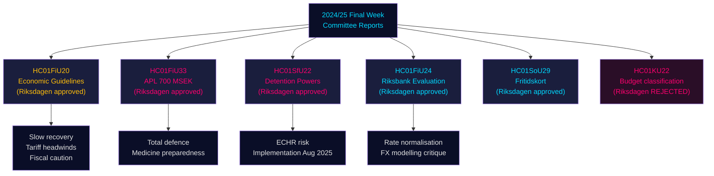

<!-- rtl -->
# تقارير لجان الريكسداغ: المسار الاقتصادي للسويد، وضوابط الهجرة، والاستعداد الدفاعي — الأسبوع الأخير 2024/25

**Author**: James Pether Sörling | **Classification**: PUBLIC | **Date**: 2026-05-01 | **Confidence**: HIGH [B2]

## الخلاصة التنفيذية

أسفر الأسبوع الأخير من دورة ريكسمؤته 2024/25 عن حزمة لافتة من تقارير اللجان التي تُشكّل معاً الإطار الاقتصادي السويدي للفترة 2025–2026: أيّدت لجنة المالية التوسع المالي الحذر للحكومة في مواجهة رياح الحرب التجارية المعاكسة، وأقرّت ضخّ رأسمال طارئ بقيمة 700 مليون كرونة سويدية لشركة APL الصيدلانية الحكومية لصون أمن الدواء في أوقات الأزمات والحروب، وأكّدت حسن أداء السياسة النقدية لبنك ريكسبانك عام 2024 مع حثّه على تسريع تطبيع أسعار الفائدة، كما أجازت لجنة الشؤون الاجتماعية برنامج بطاقة أوقات الفراغ المبتكر (HC01SoU29) لتوسيع وصول أكثر من 400 ألف طفل إلى الأنشطة. وفي الوقت ذاته، وسّعت لجنة الأمن الاجتماعي والهجرة (SfU) الصلاحيات القسرية في مراكز احتجاز المهاجرين. تشير هذه التقارير مجتمعةً إلى: حكومة تُعلي الاستعداد للدفاع الشامل إلى جانب استثمارات اجتماعية محدودة، في ظل هوامش مالية ضيّقة ومخاطر جانب العرض المتصاعدة بفعل التصعيد الجمركي الأمريكي.

## القرارات التي تدعمها هذه الوثيقة

1. **التموضع الاقتصادي الكلي**: السويد في مرحلة **تعافٍ دون الاتجاه** (نمو الناتج المحلي +1,0 % عام 2024، بطالة متصاعدة)؛ مصادقة لجنة المالية على الإطار الاقتصادي للحكومة تُشير إلى استمرار التضخم الانعكاسي الحذر دون ارتفاع حرارة الطلب. ينبغي على المستثمرين والمحللين وصانعي السياسات خصم التفاؤل السابق للرسوم الجمركية.
2. **مشتريات الدفاع والصناعة الدوائية**: ضخّ رأسمال APL (700 مليون كرونة، HC01FiU33) يؤكد أن السويد تبني بنشاط مخزوناً دوائياً لسيناريوهات الحرب — إشارة جوهرية لسياسة الصناعة الدفاعية الشمالية.
3. **تقاطع الهجرة والأمن**: يوسّع HC01SfU22 صلاحيات ميغراتيونسفيركيت القسرية في مراكز الاحتجاز (التفتيش الجسدي، تفتيش الغرف، حواجز زجاجية خلال الزيارات). وهو تعديل تشريعي حساس بموجب الاتفاقية الأوروبية لحقوق الإنسان مع مخاطر تنفيذ.
4. **تطبيع ريكسبانك**: تقييم لجنة المالية (HC01FiU24) يدعم استمرار خفض الفائدة، لكنه يُنبّه إلى الاعتماد المفرط على نمذجة سعر الصرف — ذو صلة بتوقعات الكرونة السويدية SEK.

## نقاط الاستخبارات في 60 ثانية

- 🔴 **HC01FiU20**: وافق الريكسداغ على توجهات السياسة الاقتصادية. يتباطأ النمو جراء الرسوم الجمركية الأمريكية؛ الدورة الانكماشية مستمرة. ثلاثة محاور: دعم الأسر، سوق العمل، النمو والاستثمار.
- 🔴 **HC01FiU33**: 700 مليون كرونة لـ APL لإنتاج أدوية طارئ — إشارة استعداد للحرب؛ أُقرَّ بغالبية حكومية.
- 🟠 **HC01SfU22**: تحصل ميغراتيونسفيركيت على صلاحيات التفتيش الجسدي وتفتيش الغرف في الاحتجاز؛ حواجز زجاجية جديدة في غرف الزيارات؛ سارٍ من 1 أغسطس 2025. مخاطر التوافق مع الاتفاقية الأوروبية لحقوق الإنسان.
- 🟡 **HC01FiU24**: تقييم سياسة ريكسبانك 2024 بـ"sammantaget god"؛ تنتقد اللجنة الاعتماد المفرط على نمذجة سعر الصرف؛ تدعم تحسينات الشفافية.
- 🟡 **HC01SoU29**: بطاقة أوقات الفراغ للأطفال. تديرها هيئة الصحة الإلكترونية E-hälsomyndigheten. مخاطر التنفيذ: نظام معلوماتي جديد، انتشار واسع النطاق.
- 🟢 **HC01KU22**: رفضت لجنة KU مقترح الحكومة بإعادة تصنيف تمويل أمن المجتمع المدني (تحويل نطاق الإنفاق) — هُزمت الحكومة في مسألة هيكلية في الميزانية.

## المحفّز الرئيسي المستقبلي

إذا أفضت التدابير القسرية في مراكز الاحتجاز بموجب HC01SfU22 إلى شكوى لدى المحكمة الأوروبية لحقوق الإنسان أو طعن المحاكم السويدية في أساسها الدستوري (RF 2:8 بشأن الحرية الشخصية)، فسيرتفع المستوى من إصلاح إداري إلى مواجهة دستورية. متابعة حالة الإحالة إلى Lagrådet وآراء تفتيش JO خلال الفترة Q3 2025 – Q1 2026.

## ملخص الثقة

مستوى الثقة التحليلي الكلي: **HIGH [B2]** — مصادر أولية عالية الجودة (betänkanden من الريكسداغ، قرارات لجان مسمّاة، نتائج التصويت)؛ التوقعات الاقتصادية مختومة بتقديرات WEO أبريل 2026 لصندوق النقد الدولي؛ بعض الانقسامات الحزبية تستوجب التحقق من بيانات التصويت الإضافية.

## مخطط ميرميد: تدفق القرارات الرئيسية

<!-- source-sha: 4982fc0535678625b509068942c6e0e28c6416e6 -->
