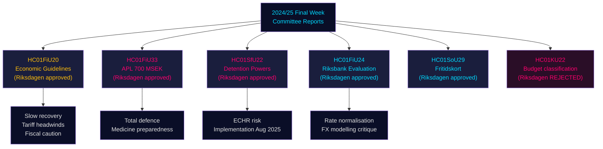

# Riksdagens udvalgsrapporter: Sveriges økonomiske kurs, migrationskontroller og forsvarsparathed — Slutugen 2024/25

**Author**: James Pether Sörling | **Classification**: PUBLIC | **Date**: 2026-05-01 | **Confidence**: HIGH [B2]

## BLUF

Riksdagens slutuge af riksmötet 2024/25 producerede en klynge af konsekvente udvalgsrapporter, der tilsammen definerer Sveriges økonomiske ramme for 2025–2026: Finansudvalget godkendte regeringens forsigtige finanspolitiske ekspansion midt i handelskrigens modvind, godkendte en nødkapitalindsprøjtning på 700 MSEK til det statsejede lægemiddelselskab APL for at sikre sig mod forstyrrelser i medicin­leverancerne i krise/krigstid, bekræftede Riksbankens pengepolitiske resultater i 2024 med opfordring til hurtigere rentenormalisering, og Socialudvalget godkendte et banebrydende fritidskortprogram (HC01SoU29), der udvider aktivitetsadgangen for 400.000+ børn. Sideløbende udvidede SfU (Social­forsikrings-/Migrationsudvalget) tvangsbeføjelserne ved immigrationsfængsler. Disse rapporter signalerer samlet: en regering, der prioriterer totalforsvarsberedskab sideløbende med begrænsede sociale investeringer, og som håndterer snævre finanspolitiske råderum, mens udbudsrisici fra amerikanske toldforhøjelser materialiserer sig.

## Beslutninger som dette underlag understøtter

1. **Makroøkonomisk positionering**: Sverige befinder sig i en **undertrendsmæssig genopretning** (BNP +1,0 % 2024, stigende ledighed); Finansudvalgets godkendelse af regeringens økonomiske ramme signalerer fortsat forsigtig reflation, men intet efterspørgselsboom. Investorer, analytikere og beslutningstagere bør rabattere pre-told-optimisme.
2. **Forsvars-/lægemiddelindkøb**: APL-kapitalindsprøjtning (700 MSEK, HC01FiU33) bekræfter, at Sverige aktivt opbygger medicinlagerkapacitet til krigstidsscenarier — et materielt signal for nordisk forsvarsindustriel politik.
3. **Migrations-sikkerhedsneksus**: HC01SfU22 udvider Migrationsverkets tvangsbeføjelser ved tilbageholdelsescentre (kropsvisitation, rumsvisitation, glaspartitioner ved besøg). Dette er en betydelig ECHR-sensitiv lovgivningsudvidelse med implementeringsrisiko.
4. **Riksbanksnormalisering**: FiU's evaluering (HC01FiU24) støtter fortsat rentenedsættelser, men markerer Riksbankens overafhængighed af valutakursmodellering — relevant for SEK-prognoser.

## 60-sekunders efterretningspunkter

- 🔴 **HC01FiU20**: Riksdagen godkendte retningslinjer for økonomisk politik. Væksten bremsas af amerikanske toldsatser; lågkonjunktur forlænges. Tre søjler: husholdningsstøtte, arbejdsmarked, vækst/investering.
- 🔴 **HC01FiU33**: 700 MSEK til APL til nødproduktion af medicin — krigsberedskabssignal; vedtaget med regeringsflertal.
- 🟠 **HC01SfU22**: Migrationsverket får kropsvisitations- og rumsvisitationsbeføjelser ved tilbageholdelse; nye glaspartitioner i besøgsrum; gælder fra 1. august 2025. ECHR-overholdelses­risiko.
- 🟡 **HC01FiU24**: Riksbankens politik i 2024 vurderes som "sammantaget god"; FiU kritiserer overafhængighed af valutakursmodellering; støtter transparensforbedringer.
- 🟡 **HC01SoU29**: Fritidskort til børn. E-hälsomyndigheten administrerer. Implementeringsrisiko: nyt IT-system, stor befolkningsudrulning.
- 🟢 **HC01KU22**: KU afviste regeringens forslag om at omklassificere civilsamfundets sikkerhedsfinansiering (udgiftsområdeflytning) — regeringen led nederlag på et strukturelt budgetspørgsmål.

## Top fremadudløser

Hvis HC01SfU22's tvangsforanstaltninger ved tilbageholdelse udløser en ECHR-klage, eller svenske domstole anfægter det konstitutionelle grundlag (RF 2:8 om personlig frihed), vil dette eskalere fra en administrativ reform til en konstitutionel konfrontation. Overvåg Lagrådets høringstatus og Justitieombudsmannens (JO) inspektionsmeddelelser Q3 2025 – Q1 2026.

## Sikkerhedssammenfatning

Samlet analytisk sikkerhed: **HIGH [B2]** — primære kilder (Riksdagens betænkninger, navngivne udvalgsbeslutninger, afstemningsresultater) er af høj kvalitet; økonomiske prognoser er stemplet med IMF WEO april 2026-vintage; nogle partiopsplitninger kræver validering med yderligere stemmeregistreringer.

## Mermaid: Nøglebeslutningsflow

<!-- source-sha: 4982fc0535678625b509068942c6e0e28c6416e6 -->
