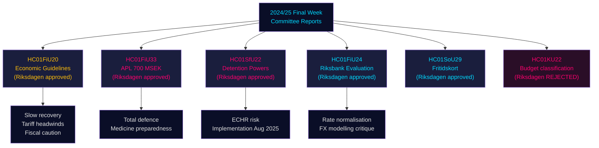

# Riksdag-Ausschussberichte: Schwedens Wirtschaftskurs, Migrationskontrollen und Verteidigungsbereitschaft — Schlusswoche 2024/25

**Author**: James Pether Sörling | **Classification**: PUBLIC | **Date**: 2026-05-01 | **Confidence**: HIGH [B2]

## BLUF

Die Schlusswoche des Riksmöte 2024/25 brachte eine Reihe folgenreicher Ausschussberichte hervor, die zusammen den schwedischen Wirtschaftsrahmen für 2025–2026 definieren: Der Finanzausschuss befürwortete die vorsichtige Haushaltserweiterung der Regierung inmitten der Handelskriegswiderstände, genehmigte eine Notkapitalspritze von 700 MSEK für den staatseigenen Pharmahersteller APL zur Absicherung gegen Medikamentenlieferausfälle in Krisen-/Kriegszeiten, bescheinigte der Riksbank eine gute Geldpolitik 2024 unter Forderung nach rascherer Normalisierung, und der Sozialausschuss verabschiedete ein wegweisendes Freizeitkarteuprogramm (HC01SoU29) für 400.000+ Kinder. Gleichzeitig erweiterte der SfU (Sozialversicherungs-/Migrationsausschuss) die Zwangsbefugnisse in Migrationsabschiebezentren. Diese Berichte signalisieren insgesamt: eine Regierung, die Gesamtverteidigungsbereitschaft neben begrenzten sozialen Investitionen priorisiert und enge Haushaltsspielräume managt, während sich Angebotsrisiken durch US-Zollerhöhungen materialisieren.

## Entscheidungen, die dieses Dokument unterstützt

1. **Makroökonomische Positionierung**: Schweden befindet sich in einer **Erholung unter Trendniveau** (BIP +1,0 % 2024, steigende Arbeitslosigkeit); die Zustimmung des Finanzausschusses zum Wirtschaftsrahmen der Regierung signalisiert eine anhaltende vorsichtige Reflation, aber keinen Nachfrageboom. Investoren, Analysten und Entscheidungsträger sollten vor-Zoll-Optimismus diskontieren.
2. **Verteidigungs-/Pharmabeschaffung**: APL-Kapitalspritze (700 MSEK, HC01FiU33) bestätigt, dass Schweden aktiv Medikamentenlagerkapazitäten für Kriegsszenarien aufbaut — ein materielles Signal für die nordische Verteidigungsindustriepolitik.
3. **Migrations-Sicherheitsnexus**: HC01SfU22 erweitert die Zwangsbefugnisse von Migrationsverket in Abschiebezentren (Körpervisitation, Raumvisitation, Glastrennwände für Besuche). Dies ist eine erhebliche EGMR-sensible Gesetzgebungsausweitung mit Umsetzungsrisiko.
4. **Riksbank-Normalisierung**: Die Bewertung des FiU (HC01FiU24) unterstützt weitere Zinssenkungen, flaggt aber die Überabhängigkeit der Riksbank von Wechselkursmodellen — relevant für SEK-Prognosen.

## 60-Sekunden-Nachrichten

- 🔴 **HC01FiU20**: Riksdagen verabschiedete wirtschaftspolitische Leitlinien. Wachstum bremst sich durch US-Zölle; Konjunkturtief verlängert sich. Drei Säulen: Haushaltsstützung, Arbeitsmarkt, Wachstum/Investitionen.
- 🔴 **HC01FiU33**: 700 MSEK an APL für Notfallmedikamentenproduktion — Kriegsvorbereitungssignal; verabschiedet mit Regierungsmehrheit.
- 🟠 **HC01SfU22**: Migrationsverket erhält Körper- und Raumvisitationsbefugnisse in Abschiebezentren; neue Glastrennwände in Besuchsräumen; wirksam ab 1. August 2025. EGMR-Konformitätsrisiko.
- 🟡 **HC01FiU24**: Riksbanks Politik 2024 als "sammantaget god" bewertet; FiU kritisiert Überabhängigkeit von Wechselkursmodellierung; unterstützt Transparenzverbesserungen.
- 🟡 **HC01SoU29**: Freizeitkarte für Kinder. E-hälsomyndigheten verwaltet. Umsetzungsrisiko: neues IT-System, große Bevölkerungsrollout.
- 🟢 **HC01KU22**: KU lehnte den Regierungsvorschlag zur Umklassifizierung der Zivilgesellschafts-Sicherheitsfinanzierung ab (Ausgabenbereichsverschiebung) — Regierung unterlag in einer strukturellen Haushaltsfrage.

## Wichtigster Vorwärtsauslöser

Wenn HC01SfU22-Zwangsmaßnahmen in Abschiebezentren eine EGMR-Klage auslösen oder schwedische Gerichte die Verfassungsgrundlage (RF 2:8 zur persönlichen Freiheit) anfechten, eskaliert dies von einer Verwaltungsreform zu einer Verfassungskonfrontation. Lagrådet-Verweisungsstatus und JO-Inspektionsmitteilungen Q3 2025 – Q1 2026 beobachten.

## Konfidenzübersicht

Gesamtanalytisches Vertrauen: **HIGH [B2]** — Primärquellen (Riksdag-Ausschussberichte, benannte Ausschussentscheidungen, Abstimmungsergebnisse) von hoher Qualität; Wirtschaftsprognosen mit IMF-WEO-April-2026-Vintage gestempelt; einige Parteiaufteilungen erfordern Validierung mit weiteren Abstimmungsprotokollen.

## Mermaid: Wichtiger Entscheidungsfluss

<!-- source-sha: 4982fc0535678625b509068942c6e0e28c6416e6 -->
