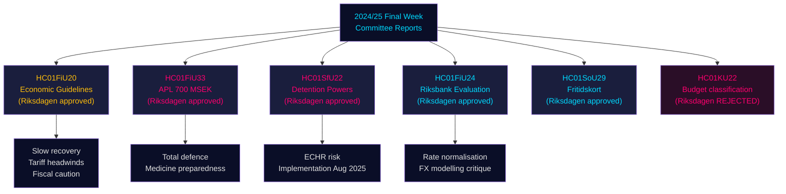

# Informes de las comisiones del Riksdag: Trayectoria económica de Suecia, controles migratorios y preparación para la defensa — Última semana 2024/25

**Author**: James Pether Sörling | **Classification**: PUBLIC | **Date**: 2026-05-01 | **Confidence**: HIGH [B2]

## BLUF

La última semana del riksmöte 2024/25 produjo un conjunto de informes de comisiones con consecuencias notables que, en conjunto, definen el marco económico de Suecia para 2025–2026: la Comisión de Finanzas refrendó la expansión presupuestaria prudente del gobierno ante los vientos en contra de la guerra comercial, aprobó una inyección de capital de emergencia de 700 MSEK para el fabricante farmacéutico estatal APL con el fin de protegerse contra las perturbaciones del suministro de medicamentos en crisis/guerra, confirmó el buen desempeño de la política monetaria del Riksbank en 2024 al tiempo que lo instaba a acelerar la normalización de los tipos, y la Comisión de Asuntos Sociales aprobó un innovador programa de tarjeta de ocio (HC01SoU29) que amplía el acceso a actividades para más de 400 000 niños. Simultáneamente, la SfU (Comisión de Seguridad Social/Migración) amplió los poderes coercitivos en los centros de detención de migrantes. Estos informes señalan colectivamente: un gobierno que prioriza la preparación para la defensa total junto con inversiones sociales limitadas, gestionando márgenes fiscales estrechos mientras se materializan los riesgos de oferta derivados de la escalada arancelaria estadounidense.

## Decisiones que este documento apoya

1. **Posicionamiento macroeconómico**: Suecia está en una **recuperación por debajo de la tendencia** (PIB +1,0 % 2024, desempleo en aumento); el respaldo de la Comisión de Finanzas al marco económico del gobierno señala una reflación cautelosa continuada, pero sin sobrecalentamiento de la demanda. Inversores, analistas y responsables de políticas deben descontar el optimismo previo a los aranceles.
2. **Adquisiciones defensa/farmacia**: La inyección de capital a APL (700 MSEK, HC01FiU33) confirma que Suecia está constituyendo activamente reservas de medicamentos para escenarios de guerra — señal material para la política industrial de defensa nórdica.
3. **Nexo migración-seguridad**: HC01SfU22 amplía los poderes coercitivos de Migrationsverket en los centros de detención (cacheos corporales, registros de habitaciones, mamparas de vidrio en las visitas). Se trata de una extensión legislativa sensible al CEDH con riesgo de implementación.
4. **Normalización Riksbank**: La evaluación de la FiU (HC01FiU24) respalda la continuación de las bajadas de tipos, pero señala la dependencia excesiva del Riksbank en la modelización del tipo de cambio — relevante para las previsiones de la SEK.

## Puntos de inteligencia en 60 segundos

- 🔴 **HC01FiU20**: El Riksdagen aprobó las orientaciones de política económica. El crecimiento se ralentiza por los aranceles estadounidenses; la coyuntura baja se prolonga. Tres pilares: apoyo a los hogares, mercado laboral, crecimiento/inversión.
- 🔴 **HC01FiU33**: 700 MSEK a APL para producción de emergencia de medicamentos — señal de preparación para la guerra; adoptado con mayoría gubernamental.
- 🟠 **HC01SfU22**: Migrationsverket obtiene poderes de cacheo corporal y registro de habitaciones en detención; nuevas mamparas de vidrio en salas de visitas; en vigor desde el 1 de agosto de 2025. Riesgo de conformidad con el CEDH.
- 🟡 **HC01FiU24**: La política 2024 del Riksbank evaluada como "sammantaget god"; la FiU critica la dependencia excesiva en la modelización del tipo de cambio; respalda mejoras de transparencia.
- 🟡 **HC01SoU29**: Tarjeta de ocio para niños. E-hälsomyndigheten la gestiona. Riesgo de implementación: nuevo sistema informático, despliegue a gran escala.
- 🟢 **HC01KU22**: La KU rechazó la propuesta del gobierno de reclasificar la financiación de seguridad de la sociedad civil (desplazamiento de dominio de gasto) — el gobierno fue derrotado en una cuestión presupuestaria estructural.

## Principal catalizador prospectivo

Si las medidas coercitivas en los centros de detención de HC01SfU22 desencadenan una denuncia ante el CEDH o los tribunales suecos impugnan la base constitucional (RF 2:8 sobre la libertad personal), esto escalará de una reforma administrativa a un enfrentamiento constitucional. Seguir el estado de la remisión al Lagrådet y los dictámenes de inspección del Justitieombudsmannen (JO) T3 2025 – T1 2026.

## Resumen de confianza

Confianza analítica global: **HIGH [B2]** — fuentes primarias (betänkanden del Riksdag, decisiones de comisiones nombradas, resultados de votaciones) de alta calidad; proyecciones económicas estampilladas con el vintage IMF WEO abril 2026; algunas divisiones partidistas requieren validación con datos adicionales de votación.

## Mermaid: Flujo de decisiones clave

<!-- source-sha: 4982fc0535678625b509068942c6e0e28c6416e6 -->
