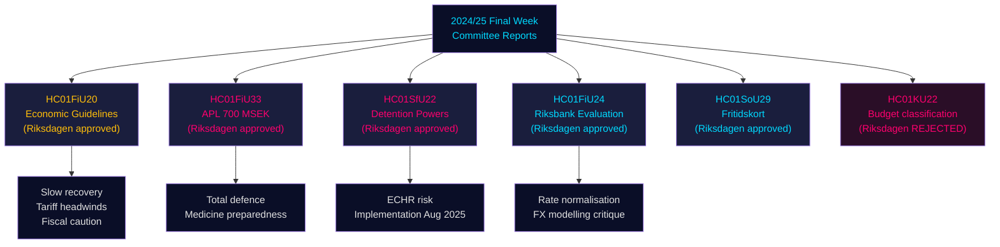

# Riksdagin valiokunnan raportit: Ruotsin talouskurssi, maahanmuuttokontrollit ja puolustusvalmiudet — 2024/25 loppuviikko

**Author**: James Pether Sörling | **Classification**: PUBLIC | **Date**: 2026-05-01 | **Confidence**: HIGH [B2]

## BLUF

Riksdagin riksmöten 2024/25 viimeinen viikko tuotti joukon merkittäviä valiokuntaraportteja, jotka yhdessä määrittävät Ruotsin taloudellisen kehyksen vuosille 2025–2026: Valtiovarainvaliokunta tuki hallituksen varovaista finanssipoliittista laajentumista kauppasodan vastaisessa tuulessa, hyväksyi hätäpääomainjektion 700 MSEK valtion omistamalle lääkevalmistaja APL:lle lääketoimitushäiriöiden varalle kriisi-/sotatilaan, vahvisti Riksbankin rahapoliittisen tuloksen vuodelta 2024 kehottaen nopeampaan korkonormalisointiin, ja Sosiaaliasioiden valiokunta hyväksyi merkittävän vapaa-aikakorttiohjelman (HC01SoU29), joka laajentaa 400 000+ lapsen aktiviteettimahdollisuuksia. Samanaikaisesti SfU (Sosiaaliturva-/Maahanmuuttovaliokunta) laajensi pakkotoimivaltuuksia maahanmuuttajien säilöönottokeskuksissa. Nämä raportit signaloivat yhteisesti: hallitusta, joka priorisoi kokonaismaanpuolustuksen valmiutta rajallisten sosiaalisten investointien rinnalla halliten tiukkaa finanssipoliittista liikkumavaraa, kun tarjontariskit Yhdysvaltojen tullien eskaloimisesta toteutuvat.

## Päätökset, joita tämä analyysi tukee

1. **Makrotaloudellinen asemointi**: Ruotsi on **trendin alittavassa elpymisessä** (BKT +1,0 % 2024, nouseva työttömyys); Valtiovarainvaliokunnan hyväksyntä hallituksen talouspoliittiselle kehykselle signaloi jatkuvaa varovaista reflatiota mutta ei kysyntäryntäystä. Sijoittajien, analyytikkojen ja päättäjien tulisi diskontata ennen-tullit-optimismia.
2. **Puolustus-/lääkehankinta**: APL-pääomainjektion (700 MSEK, HC01FiU33) vahvistaa, että Ruotsi rakentaa aktiivisesti lääkevarastointikapasiteettia sotatilaskenaarioita varten — merkittävä signaali Pohjoismaiden puolustus­teollisuuden politiikalle.
3. **Maahanmuutto-turvallisuusneksus**: HC01SfU22 laajentaa Migrationsverketin pakkokeinovaltuuksia säilöönottotiloissa (henkilötarkastukset, tilatarkastukset, lasipartitiojärjestelyt vierailuja varten). Tämä on merkittävä ECHR-herkkä lainsäädäntölaajennus, johon liittyy toimeenpanoriski.
4. **Riksbank-normalisointi**: FiU:n arviointi (HC01FiU24) tukee jatkuvia koronlaskuja mutta liputtaa Riksbankin liiallisen riippuvuuden valuuttakurssimalleista — merkityksellinen SEK-ennustukselle.

## 60 sekunnin tiedustelupisteet

- 🔴 **HC01FiU20**: Riksdagen hyväksyi talouspolitiikan suuntaviivat. Kasvu hidastuu Yhdysvaltojen tullien takia; lågkonjunktur jatkuu. Kolme pilaria: kotitalouksien tuki, työmarkkinat, kasvu/investoinnit.
- 🔴 **HC01FiU33**: 700 MSEK APL:lle hätälääkevalmistukseen — sotavalmiussignaali; hyväksyttiin hallitusenemmistöllä.
- 🟠 **HC01SfU22**: Migrationsverket saa henkilötarkastus- ja tilatarkastusoikeudet säilöönottotiloissa; uudet lasipartitiot vierailutiloihin; voimaan 1. elokuuta 2025. ECHR-vaatimustenmukaisuusriski.
- 🟡 **HC01FiU24**: Riksbankin 2024-politiikka arvioitu "sammantaget god"; FiU kritisoi liiallista riippuvuutta valuuttakurssi­mallinnuksesta; tukee läpinäkyvyysparannuksia.
- 🟡 **HC01SoU29**: Fritidskort lapsille. E-hälsomyndigheten hallinnoi. Toimeenpanoriski: uusi IT-järjestelmä, laaja väestöllinen käyttöönotto.
- 🟢 **HC01KU22**: KU hylkäsi hallituksen ehdotuksen kansalaisyhteiskunnan turvallisuusrahoituksen uudelleenluokittelusta (menoaluesiirto) — hallitus hävisi rakenteellisessa budjettikysymyksessä.

## Tärkein tulevaisuuden laukaisija

Jos HC01SfU22:n pakkokeinot säilöönottotiloissa laukaisevat ECHR-valituksen tai Ruotsin tuomioistuimet haastavat perustuslaillisen perustan (RF 2:8 henkilökohtaisesta vapaudesta), tämä eskaloi hallinnollisesta uudistuksesta perustuslailliseksi konfrontaatioksi. Seuraa Lagrådetin lausuntovaiheistusta sekä Justitieombudsmannin (JO) tarkastusilmoituksia Q3 2025 – Q1 2026.

## Luottamustason yhteenveto

Kokonaisanalyyttinen luottamus: **HIGH [B2]** — ensisijaiset lähteet (Riksdagenin betänkanden, nimetyt valiokuntapäätökset, äänestystulokset) ovat korkealaatuisia; taloudelliset ennusteet on leimattu IMF WEO huhtikuu 2026 -vintage-merkinnällä; jotkut puoluejakaumat vaativat validointia lisääänestysdatalla.

## Mermaid: Keskeinen päätösvirtakaavio

<!-- source-sha: 4982fc0535678625b509068942c6e0e28c6416e6 -->
