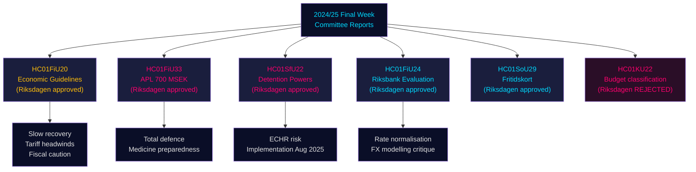

# Rapports des commissions du Riksdag : Trajectoire économique de la Suède, contrôles migratoires et préparation à la défense — Dernière semaine 2024/25

**Author**: James Pether Sörling | **Classification**: PUBLIC | **Date**: 2026-05-01 | **Confidence**: HIGH [B2]

## BLUF

La dernière semaine du riksmöte 2024/25 a produit un ensemble de rapports de commissions aux conséquences notables qui, ensemble, définissent le cadre économique de la Suède pour 2025–2026 : la Commission des finances a entériné l'expansion budgétaire prudente du gouvernement face aux vents contraires de la guerre commerciale, approuvé une injection de capital d'urgence de 700 MSEK au profit du fabricant pharmaceutique d'État APL pour se prémunir contre les perturbations de l'approvisionnement en médicaments en cas de crise/guerre, confirmé la bonne performance de la politique monétaire de la Riksbank en 2024 en l'invitant à accélérer la normalisation des taux, et la Commission des affaires sociales a approuvé un programme novateur de carte de loisirs (HC01SoU29) élargissant l'accès aux activités pour plus de 400 000 enfants. Simultanément, la SfU (Commission de la sécurité sociale/migration) a élargi les pouvoirs coercitifs dans les centres de rétention pour migrants. Ces rapports signalent collectivement : un gouvernement qui priorise la préparation à la défense totale parallèlement à des investissements sociaux limités, gérant des marges budgétaires étroites alors que les risques du côté offre liés à l'escalade des tarifs américains se matérialisent.

## Décisions que ce document appuie

1. **Positionnement macroéconomique** : La Suède est dans une **reprise sous la tendance** (PIB +1,0 % 2024, chômage en hausse) ; l'endorsement du cadre économique du gouvernement par la Commission des finances signale une réflation prudente continuée, mais pas de surchauffe de la demande. Les investisseurs, analystes et décideurs devraient escompter l'optimisme pré-tarifs.
2. **Acquisition défense/pharmacie** : L'injection de capital APL (700 MSEK, HC01FiU33) confirme que la Suède constitue activement des stocks de médicaments pour des scénarios de guerre — signal matériel pour la politique industrielle de défense nordique.
3. **Nexus migration-sécurité** : HC01SfU22 élargit les pouvoirs coercitifs de Migrationsverket dans les centres de rétention (fouilles corporelles, fouilles de chambres, cloisons en verre pour les visites). Il s'agit d'une extension législative sensible à la CEDH avec un risque de mise en œuvre.
4. **Normalisation Riksbank** : L'évaluation de la FiU (HC01FiU24) soutient la poursuite des baisses de taux, mais signale la dépendance excessive de la Riksbank à la modélisation des taux de change — pertinent pour les prévisions SEK.

## Points de renseignement en 60 secondes

- 🔴 **HC01FiU20** : Le Riksdagen a approuvé les orientations de politique économique. La croissance ralentit en raison des tarifs américains ; la conjoncture basse se prolonge. Trois piliers : soutien aux ménages, marché du travail, croissance/investissement.
- 🔴 **HC01FiU33** : 700 MSEK à APL pour la production d'urgence de médicaments — signal de préparation à la guerre ; adopté avec la majorité gouvernementale.
- 🟠 **HC01SfU22** : Migrationsverket obtient des pouvoirs de fouille corporelle et de chambre en rétention ; nouvelles cloisons en verre dans les salles de visite ; effectif au 1er août 2025. Risque de conformité à la CEDH.
- 🟡 **HC01FiU24** : La politique 2024 de la Riksbank évaluée comme "sammantaget god" ; la FiU critique la dépendance excessive à la modélisation des taux de change ; soutient des améliorations de transparence.
- 🟡 **HC01SoU29** : Carte de loisirs pour les enfants. E-hälsomyndigheten gère. Risque de mise en œuvre : nouveau système informatique, déploiement à grande échelle.
- 🟢 **HC01KU22** : La KU a rejeté la proposition du gouvernement de reclassifier le financement de sécurité de la société civile (déplacement de domaine de dépenses) — le gouvernement a été battu sur une question budgétaire structurelle.

## Principal déclencheur prospectif

Si les mesures coercitives en rétention de HC01SfU22 déclenchent une plainte auprès de la CEDH ou si des tribunaux suédois contestent la base constitutionnelle (RF 2:8 sur la liberté personnelle), cela escalera d'une réforme administrative à une confrontation constitutionnelle. Surveiller le statut du renvoi au Lagrådet et les avis d'inspection du Justitieombudsmannen (JO) T3 2025 – T1 2026.

## Résumé de confiance

Confiance analytique globale : **HIGH [B2]** — sources primaires (betänkanden du Riksdag, décisions de commissions nommées, résultats de votes) de haute qualité ; projections économiques estampillées avec le millésime IMF WEO avril 2026 ; certaines divisions partisanes nécessitent validation avec des données de vote supplémentaires.

## Mermaid : Flux de décision clé

<!-- source-sha: 4982fc0535678625b509068942c6e0e28c6416e6 -->
