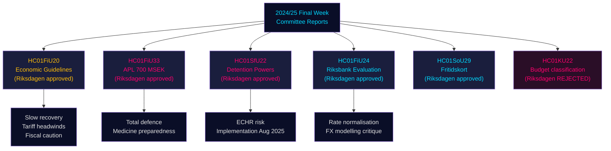

<!-- rtl -->
# דוחות ועדות הריקסדאג: המסלול הכלכלי של שוודיה, פיקוח על הגירה והכנה לביטחון לאומי — השבוע האחרון 2024/25

**Author**: James Pether Sörling | **Classification**: PUBLIC | **Date**: 2026-05-01 | **Confidence**: HIGH [B2]

## סיכום מנהלים

השבוע האחרון של ריקסמוטה 2024/25 הניב קבוצה בולטת של דוחות ועדות שמגדירים יחד את המסגרת הכלכלית של שוודיה לשנים 2025–2026: ועדת הכספים אישרה את ההרחבה התקציבית הזהירה של הממשלה מול רוחות הנגד של מלחמת הסחר, אישרה הזרמת הון חירום של 700 מיליון כ"ש ליצרן התרופות הממשלתי APL לשמירה על היצע התרופות בעת משבר/מלחמה, אישרה את ביצועי המדיניות המוניטרית של ריקסבנק ב-2024 תוך קריאה לזרז את נורמליזציית הריבית, וועדת הענינים החברתיים אישרה תוכנית חדשנית של "כרטיס פנאי" (HC01SoU29) המרחיבה גישה לפעילויות עבור יותר מ-400,000 ילדים. במקביל, הרחיבה ועדת הביטחון הסוציאלי/ההגירה (SfU) את סמכויות הכפייה במרכזי מעצר מהגרים. דוחות אלה מצביעים במשותף על: ממשלה המעדיפה היערכות לביטחון לאומי כולל לצד השקעות חברתיות מוגבלות, תוך ניהול מרווחים תקציביים צרים בזמן שמתגשמים סיכוני ההיצע מהסלמת המכסים האמריקאיים.

## ההחלטות שמסמך זה תומך בהן

1. **מיצוב מאקרו-כלכלי**: שוודיה נמצאת ב**התאוששות מתחת לטרנד** (תמ"ג +1.0% ב-2024, אבטלה עולה); אישור ועדת הכספים למסגרת הכלכלית של הממשלה מסמן המשך רפלציה זהירה, אך ללא התחממות יתר של הביקוש. משקיעים, אנליסטים וקובעי מדיניות צריכים לנכות את האופטימיות שקדמה למכסים.
2. **רכש ביטחוני/תרופתי**: הזרמת ההון ל-APL (700 מיליון כ"ש, HC01FiU33) מאשרת שוודיה בונה אקטיבית מלאי תרופות לתרחישי מלחמה — אות מהותי למדיניות תעשיית הביטחון הסקנדינבית.
3. **צומת הגירה-ביטחון**: HC01SfU22 מרחיב את סמכויות הכפייה של Migrationsverket במרכזי מעצר (חיפוש גופני, חיפוש חדרים, מחיצות זכוכית בביקורים). זהו הרחבת חקיקה הרגישה לאמנה האירופית לזכויות האדם עם סיכוני יישום.
4. **נורמליזציית ריקסבנק**: הערכת ועדת הכספים (HC01FiU24) תומכת בהמשך הפחתות ריבית, אך מסמנת תלות יתר של ריקסבנק במידול שערי חליפין — רלוונטי לתחזיות ה-SEK.

## נקודות מידע ב-60 שניות

- 🔴 **HC01FiU20**: הריקסדאג אישר את קווי מדיניות הכלכלה. הצמיחה מאטה בגלל המכסים האמריקאיים; המיתון נמשך. שלושה עמודים: תמיכה במשקי בית, שוק עבודה, צמיחה/השקעות.
- 🔴 **HC01FiU33**: 700 מיליון כ"ש ל-APL לייצור תרופות חירום — אות היערכות למלחמה; אושר ברוב ממשלתי.
- 🟠 **HC01SfU22**: Migrationsverket מקבל סמכויות חיפוש גופני וחיפוש חדרים במעצר; מחיצות זכוכית חדשות בחדרי ביקורים; בתוקף מ-1 באוגוסט 2025. סיכון ציות לאמנה האירופית לזכויות האדם.
- 🟡 **HC01FiU24**: מדיניות ריקסבנק 2024 הוערכה "sammantaget god"; ועדת הכספים מבקרת תלות יתר במידול שערי חליפין; תומכת בשיפורי שקיפות.
- 🟡 **HC01SoU29**: כרטיס פנאי לילדים. E-hälsomyndigheten מנהלת. סיכון יישום: מערכת IT חדשה, פריסה רחבת היקף.
- 🟢 **HC01KU22**: ועדת KU דחתה את הצעת הממשלה לסיווג מחדש של מימון ביטחון החברה האזרחית (העברת תחום הוצאה) — הממשלה הובסה בשאלה תקציבית מבנית.

## המזרז המרכזי לעתיד

אם אמצעות הכפייה במעצר של HC01SfU22 יעוררו תלונה לבית הדין האירופי לזכויות האדם או שבתי המשפט השוודיים יערערו על הבסיס החוקתי (RF 2:8 בנוגע לחירות האישית), זה יסלים מרפורמה מינהלית לעימות חוקתי. לעקוב אחר מצב ההפניה ל-Lagrådet וחוות הדעת של JO בין Q3 2025 ל-Q1 2026.

## סיכום אמינות

אמינות אנליטית כוללת: **HIGH [B2]** — מקורות ראשוניים (betänkanden של הריקסדאג, החלטות ועדות מוגדרות, תוצאות הצבעות) באיכות גבוהה; תחזיות כלכליות מתוייגות עם ויניטאג' IMF WEO אפריל 2026; חלק מהפילוגים המפלגתיים דורשים אימות עם נתוני הצבעה נוספים.

## מדיאגרמת מרמייד: זרימת ההחלטות המרכזית

<!-- source-sha: 4982fc0535678625b509068942c6e0e28c6416e6 -->
