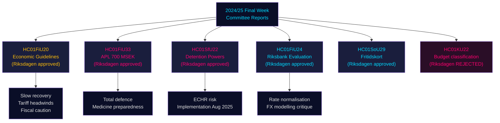

# 国会委員会報告書：スウェーデンの経済軌道、移民管理、防衛準備態勢 — 2024/25年度最終週

**Author**: James Pether Sörling | **Classification**: PUBLIC | **Date**: 2026-05-01 | **Confidence**: HIGH [B2]

## 要点（BLUF）

2024/25年度リクスメッテの最終週は、2025–2026年のスウェーデン経済枠組みを総体的に規定する注目すべき委員会報告書群を生み出した。財務委員会は、貿易戦争の逆風に直面した政府の慎重な財政拡大を承認し、危機・戦時の医薬品供給混乱を防ぐため国営製薬会社APLへの7億クローナの緊急資本注入を可決し、リクスバンクの2024年金融政策を評価した上で金利正常化の加速を促し、さらに社会問題委員会は40万人以上の子どもの活動アクセスを拡大する画期的な余暇カードプログラム（HC01SoU29）を可決した。同時に、社会保険・移民委員会（SfU）は移民収容施設における強制的権限を拡大した。これらの報告書は、アメリカの関税エスカレーションに伴う供給サイドリスクが顕在化する中、限られた財政余地を管理しながら、総合防衛準備態勢を優先しつつ限定的な社会投資を行う政府像を集約的に示している。

## 本文書が支持する意思決定

1. **マクロ経済的位置づけ**: スウェーデンは**トレンド未満の回復**局面（GDP +1.0% 2024年、失業率上昇）にある。財務委員会による政府経済枠組みの承認は、需要過熱を伴わない慎重な緩やかな回復傾向が継続することを示唆する。投資家・アナリスト・政策立案者は関税前の楽観論を割り引くべきである。
2. **防衛・製薬調達**: APLへの資本注入（7億クローナ、HC01FiU33）は、スウェーデンが戦時シナリオに向けて医薬品備蓄を積極的に構築していることを確認するもの — 北欧の防衛産業政策にとって重要なシグナルである。
3. **移民・安全保障の接点**: HC01SfU22はMigrationsverketの収容施設における強制権限（身体検査、居室捜索、面会時のガラス仕切り）を拡大する。これはECHRへの配慮が必要な立法拡張であり、実施上のリスクが伴う。
4. **リクスバンク正常化**: 財務委員会評価（HC01FiU24）はさらなる利下げを支持するが、リクスバンクの為替レートモデリングへの過度な依存を指摘している — スウェーデンクローナSEK見通しに関連する。

## 60秒でわかる情報ポイント

- 🔴 **HC01FiU20**: リクスダーゲンが経済政策の方向性を承認。アメリカの関税により成長は鈍化。景気低迷局面が続く。3つの柱：家庭支援、労働市場、成長・投資。
- 🔴 **HC01FiU33**: APLへ7億クローナ（緊急医薬品生産のため）— 戦時準備シグナル。与党多数で採択。
- 🟠 **HC01SfU22**: Migrationsverketが収容施設での身体検査・居室捜索権限を取得。面会室に新たなガラス仕切り設置。2025年8月1日施行。ECHR適合リスクあり。
- 🟡 **HC01FiU24**: リクスバンク2024年政策が「sammantaget god」と評価。財務委員会は為替レートモデリングへの過度な依存を批判。透明性向上を支持。
- 🟡 **HC01SoU29**: 子ども向け余暇カード。E-hälsomyndigheten（電子保健庁）が管理。実施リスク：新ITシステム、大規模展開。
- 🟢 **HC01KU22**: KU委員会が市民社会の安全保障資金の再分類に関する政府提案を否決（支出領域の移動）— 政府が構造的予算問題で敗北。

## 主要な先行触媒

HC01SfU22の収容施設における強制措置がECHRへの申し立てを誘発、またはスウェーデン裁判所が憲法的根拠（RF 2:8個人の自由に関する条項）に異議を申し立てた場合、行政改革から憲法的対立へとエスカレートする可能性がある。ラーグローデットへの付託状況とJO（法務監察官）の2025年Q3–2026年Q1の監査意見を追跡すること。

## 信頼性の要約

全体的な分析上の信頼性：**HIGH [B2]** — 高品質な一次資料（国会のbetänkanden、指名委員会の決定、投票結果）。経済予測はIMF WEO 2026年4月版でスタンプ済み。一部の政党内分裂は追加の投票データで検証が必要。

## マーメイド図：主要意思決定フロー

<!-- source-sha: 4982fc0535678625b509068942c6e0e28c6416e6 -->
