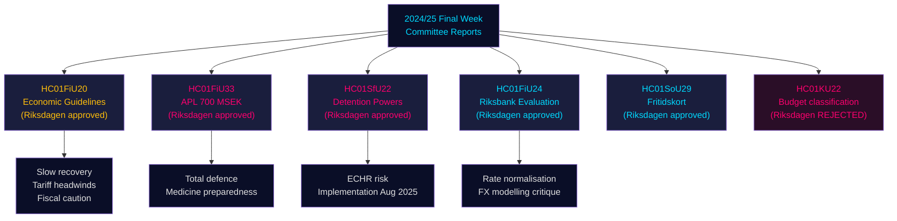

# 국회 위원회 보고서: 스웨덴 경제 궤도, 이민 통제, 국방 준비태세 — 2024/25년도 최종 주

**Author**: James Pether Sörling | **Classification**: PUBLIC | **Date**: 2026-05-01 | **Confidence**: HIGH [B2]

## 핵심 요약(BLUF)

2024/25년도 릭스메테의 마지막 주는 2025–2026년 스웨덴 경제 프레임워크를 총체적으로 규정하는 주목할 만한 위원회 보고서 묶음을 생산했다. 재정위원회는 무역 전쟁 역풍에 맞선 정부의 신중한 재정 확대를 승인하고, 위기·전시 시 의약품 공급 차질을 막기 위해 국영 제약사 APL에 7억 크로나의 긴급 자본 주입을 승인했으며, 릭스방크의 2024년 통화정책이 양호했음을 확인하면서 금리 정상화 가속을 촉구했다. 또한 사회문제위원회는 40만 명 이상의 어린이 활동 접근성을 넓히는 혁신적인 여가 카드 프로그램(HC01SoU29)을 승인했다. 동시에 사회보험·이민위원회(SfU)는 이민자 수용 시설의 강제 권한을 확대했다. 이 보고서들은 집합적으로 다음을 시사한다: 미국 관세 에스컬레이션으로 인한 공급 측 리스크가 현실화되는 가운데, 좁은 재정 여유를 관리하면서 총체적 국방 준비태세를 우선시하고 제한적 사회 투자를 병행하는 정부.

## 이 문서가 지원하는 의사결정

1. **거시경제적 위치 설정**: 스웨덴은 **추세 이하 회복** 국면(GDP +1.0% 2024, 실업률 상승)에 있다. 재정위원회의 정부 경제 프레임워크 승인은 수요 과열 없이 신중한 완만한 회복이 지속됨을 시사한다. 투자자·애널리스트·정책 입안자는 관세 전 낙관론을 할인해야 한다.
2. **국방·제약 조달**: APL 자본 주입(7억 크로나, HC01FiU33)은 스웨덴이 전시 시나리오를 위해 적극적으로 의약품 비축물을 구축 중임을 확인한다 — 북유럽 방위 산업 정책에 대한 중요한 신호다.
3. **이민-안보 넥서스**: HC01SfU22는 수용 시설에서 Migrationsverket의 강제 권한(신체 수색, 방 수색, 면회 시 유리 칸막이)을 확대한다. 이것은 유럽인권협약에 민감한 입법 확대로 이행 리스크가 있다.
4. **릭스방크 정상화**: 재정위원회 평가(HC01FiU24)는 추가 금리 인하를 지지하지만 릭스방크의 환율 모델링 과다 의존을 지적한다 — SEK 전망에 관련된다.

## 60초 인텔리전스 포인트

- 🔴 **HC01FiU20**: 릭스다겐이 경제정책 방향을 승인. 미국 관세로 성장 둔화. 경기 침체 국면 지속. 3대 축: 가계 지원, 노동시장, 성장·투자.
- 🔴 **HC01FiU33**: APL에 7억 크로나(긴급 의약품 생산) — 전시 준비 신호. 여당 과반으로 채택.
- 🟠 **HC01SfU22**: Migrationsverket이 수용 시설 신체 수색·방 수색 권한 획득. 면회실 유리 칸막이 신설. 2025년 8월 1일 발효. 유럽인권협약 준수 리스크.
- 🟡 **HC01FiU24**: 릭스방크 2024년 정책 "sammantaget god" 평가. 재정위원회는 환율 모델링 과다 의존 비판. 투명성 개선 지지.
- 🟡 **HC01SoU29**: 아동 여가 카드. E-hälsomyndigheten 관리. 이행 리스크: 새 IT 시스템, 대규모 배포.
- 🟢 **HC01KU22**: KU위원회가 시민사회 보안 자금 재분류에 관한 정부 제안 부결(지출 영역 이전) — 정부가 구조적 예산 문제에서 패배.

## 주요 전향적 촉매제

HC01SfU22의 수용 시설 강제 조치가 유럽인권법원에 제소를 유발하거나 스웨덴 법원이 헌법적 근거(RF 2:8 개인 자유 조항)에 이의를 제기할 경우, 행정 개혁에서 헌법적 대결로 에스컬레이션된다. 라그로오데트 회부 상태와 JO 감사 의견 2025년 Q3–2026년 Q1을 추적할 것.

## 신뢰도 요약

전체 분석 신뢰도: **HIGH [B2]** — 고품질 1차 자료(국회 betänkanden, 지명 위원회 결정, 투표 결과). 경제 전망은 IMF WEO 2026년 4월 빈티지로 스탬프됨. 일부 정당 내 분열은 추가 투표 데이터로 검증 필요.

## 머메이드 다이어그램: 핵심 의사결정 흐름

<!-- source-sha: 4982fc0535678625b509068942c6e0e28c6416e6 -->
