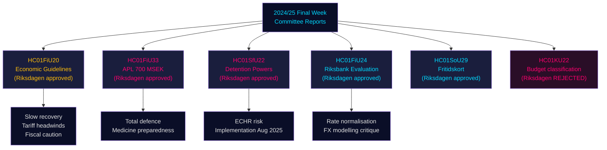

# Rapporten van de Riksdag-commissies: Economische koers van Zweden, migratiecontroles en defensiegereedheid — Laatste week 2024/25

**Author**: James Pether Sörling | **Classification**: PUBLIC | **Date**: 2026-05-01 | **Confidence**: HIGH [B2]

## BLUF

De laatste week van het riksmöte 2024/25 leverde een opmerkelijk pakket commissierapporten op dat samen het economische kader van Zweden voor 2025–2026 definieert: de Financiële commissie bekrachtigde de voorzichtige begrotingsuitbreiding van de regering tegenover de handelsoorlogtegenwind, keurde een noodinjectie van 700 MSEK goed voor de staatsfarmaceutische fabrikant APL om medicijntekorten bij crisis/oorlog te voorkomen, bevestigde het goede beleidsprestaties van de Riksbank in 2024 terwijl ze werd aangespoord het renteherstel te versnellen, en de Commissie voor Sociale Zaken keurde een innovatief fritidskort-programma goed (HC01SoU29) dat toegang tot activiteiten vergroot voor meer dan 400 000 kinderen. Tegelijkertijd breidde de SfU (Commissie voor Sociale Zekerheid/Migratie) de dwangbevoegdheden in migratiedetentiecentra uit. Deze rapporten geven gezamenlijk aan: een regering die prioriteit geeft aan totale defensiegereedheid naast beperkte sociale investeringen, terwijl ze smalle fiscale marges beheert terwijl aanbodrisico's door de escalerende Amerikaanse tarieven zich materialiseren.

## Beslissingen die dit document onderbouwt

1. **Macro-economische positionering**: Zweden bevindt zich in een **herstel onder trend** (bbp +1,0 % 2024, oplopende werkloosheid); de goedkeuring van het economische kader van de regering door de Financiële commissie signaleert voortgaande voorzichtige reflatie, maar geen oververhitting van de vraag. Beleggers, analisten en beleidsmakers dienen pre-tarievenoptimisme te verdisconteren.
2. **Defensie/farma-aanschaffingen**: De APL-kapitaalinjectie (700 MSEK, HC01FiU33) bevestigt dat Zweden actief geneesmiddelenvoorraden opbouwt voor oorlogsscenario's — een materieel signaal voor het Noordse defensie-industriebeleid.
3. **Migratie-veiligheidsnexus**: HC01SfU22 vergroot de dwangbevoegdheden van Migrationsverket in detentiecentra (lichamelijke fouillering, kamerfouillering, glasschermen bij bezoeken). Dit is een EVRM-gevoelige wetgevingsuitbreiding met implementatierisico.
4. **Riksbank-normalisering**: De FiU-evaluatie (HC01FiU24) steunt verdere renteverlagingen, maar signaleert overmatige afhankelijkheid van de Riksbank van wisselkoersmodellering — relevant voor SEK-prognoses.

## Inlichtingenpunten in 60 seconden

- 🔴 **HC01FiU20**: Riksdagen keurde de economische beleidslijnen goed. Groei vertraagt door Amerikaanse tarieven; laagconjunctuur houdt aan. Drie pijlers: huishoudenssteun, arbeidsmarkt, groei/investeringen.
- 🔴 **HC01FiU33**: 700 MSEK aan APL voor noodgeneesmiddelenproductie — oorlogsgereedheidssignaal; aangenomen met regeringsmeerderheid.
- 🟠 **HC01SfU22**: Migrationsverket krijgt lichamelijke fouilleer- en kamerzoekmacht in detentie; nieuwe glasschermen in bezoekruimten; van kracht per 1 augustus 2025. EVRM-conformiteitsrisico.
- 🟡 **HC01FiU24**: Riksbank-beleid 2024 beoordeeld als "sammantaget god"; FiU bekritiseert overmatige afhankelijkheid van wisselkoersmodellering; steunt transparantieverbeteringen.
- 🟡 **HC01SoU29**: Fritidskort voor kinderen. E-hälsomyndigheten beheert het. Implementatierisico: nieuw IT-systeem, grootschalige uitrol.
- 🟢 **HC01KU22**: KU verwierp het voorstel van de regering om de financieringsclassificatie van maatschappelijke organisaties te wijzigen (budgetdomeindiscrepantie) — de regering werd verslagen op een structurele begrotingskwestie.

## Voornaamste vooruitblikkende katalysator

Als de dwangmaatregelen in detentie van HC01SfU22 een EVRM-klacht uitlokken of Zweedse rechtbanken de constitutionele grondslag betwisten (RF 2:8 over persoonlijke vrijheid), escaleert dit van administratieve hervorming naar constitutionele confrontatie. Het remissiestatus naar de Lagrådet en de JO-inspectieopinies Q3 2025 – Q1 2026 bijhouden.

## Betrouwbaarheidssamenvatting

Algehele analytische betrouwbaarheid: **HIGH [B2]** — primaire bronnen (Riksdag betänkanden, benoemde commissiebeslissingen, stemresultaten) van hoge kwaliteit; economische projecties gestempeld met IMF WEO april 2026-vintage; sommige partijscheidingen vereisen validatie met aanvullende stemdata.

## Mermaid: Sleutelbeslissingsstroom

<!-- source-sha: 4982fc0535678625b509068942c6e0e28c6416e6 -->
