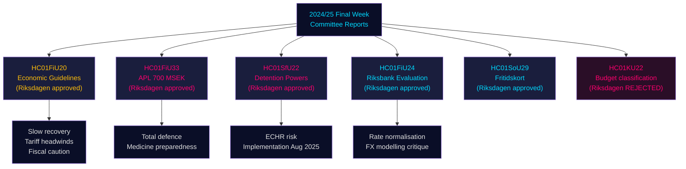

# Riksdagens komitérapporter: Sveriges økonomiske kurs, migrasjonskontroller og forsvarsberedskap — Sluttuken 2024/25

**Author**: James Pether Sörling | **Classification**: PUBLIC | **Date**: 2026-05-01 | **Confidence**: HIGH [B2]

## BLUF

Riksdagens siste uke av riksmötet 2024/25 produserte en klynge av konsekvente komitérapporter som til sammen definerer Sveriges økonomiske rammeverk for 2025–2026: Finanskomiteen godkjente regjeringens forsiktige finanspolitiske ekspansjon midt i handelskrigens motvind, godkjente en nødkapitalinjeksjon på 700 MSEK til det statseide legemiddelprodusenten APL for å sikre seg mot forstyrrelser i medisinleveransene i krise/krigstid, bekreftet Riksbankens pengepolitiske resultater i 2024 og oppfordret til raskere rentenormalisering, og Sosialkomiteen godkjente et banebrytende fritidskortprogram (HC01SoU29) som utvider aktivitetstilgangen for 400 000+ barn. Samtidig utvidet SfU (Trygde-/Migrasjonskomiteen) tvangsbeføyelsene ved immigrasjonsinterneringssentre. Disse rapportene signaliserer samlet: en regjering som prioriterer totalforsvarsberedskap ved siden av begrensede sosiale investeringer, og som håndterer trange finanspolitiske rammer mens tilbudsrisiki fra amerikanske tollavgifter materialiserer seg.

## Beslutninger dette underlaget støtter

1. **Makroøkonomisk posisjonering**: Sverige er i en **undertrendsmessig gjenopphenting** (BNP +1,0 % 2024, stigende arbeidsledighet); Finanskomiteens godkjenning av regjeringens økonomiske rammeverk signaliserer fortsatt forsiktig reflasjon, men ingen etterspørselsoppsving. Investorer, analytikere og beslutningstakere bør rabattere pre-toll-optimisme.
2. **Forsvars-/legemiddelanskaffelse**: APL-kapitalinjeksjon (700 MSEK, HC01FiU33) bekrefter at Sverige aktivt bygger opp medisinlagerkapasitet for krigstidsscenarier — et materielt signal for nordisk forsvarsindustriell politikk.
3. **Migrasjons-sikkerhetsneksus**: HC01SfU22 utvider Migrationsverkets tvangsbeføyelser ved interneringsfasiliteter (kroppsvisitasjon, romsvisitasjon, glassklesvegger for besøk). Dette er en betydelig ECHR-sensitiv lovgivningsutvidelse med implementeringsrisiko.
4. **Riksbanknormalisering**: FiU's evaluering (HC01FiU24) støtter fortsatte rentekutt, men flagger Riksbankens overhengighet på valutakursmodellering — relevant for SEK-prognoser.

## 60-sekunders etterretningspunkter

- 🔴 **HC01FiU20**: Riksdagen godkjente retningslinjer for økonomisk politikk. Veksten bremses av amerikanske tollavgifter; lågkonjunktur forlenges. Tre pilarer: husholdningsstøtte, arbeidsmarked, vekst/investering.
- 🔴 **HC01FiU33**: 700 MSEK til APL for akutt medisinproduksjon — krigsbereds­kapssignal; vedtatt med regjeringsflertall.
- 🟠 **HC01SfU22**: Migrationsverket får kroppsvisitasjons- og romsvisitasjonsbeføyelser ved internering; nye glassklesvegger i besøksrom; gjelder fra 1. august 2025. ECHR-overholdelses­risiko.
- 🟡 **HC01FiU24**: Riksbankens politikk i 2024 vurdert som "sammantaget god"; FiU kritiserer overhengighet på valutakursmodellering; støtter transparensforbedringer.
- 🟡 **HC01SoU29**: Fritidskort til barn. E-hälsomyndigheten administrerer. Implementeringsrisiko: nytt IT-system, stor befolkningsrullering.
- 🟢 **HC01KU22**: KU avviste regjeringens forslag om å reklassifisere sivilsamfunnets sikkerhetsfinansiering (utgiftsområdeflytting) — regjeringen ble beseiret på et strukturelt budsjettspørsmål.

## Topp fremtidsutløser

Hvis HC01SfU22's tvangsinngrep ved internering utløser en ECHR-klage eller svenske domstoler utfordrer det konstitusjonelle grunnlaget (RF 2:8 om personlig frihet), vil dette eskalere fra en administrativ reform til en konstitusjonell konfrontasjon. Overvåk Lagrådets høringsstatus og Justitieombudsmannens (JO) inspeksjonsmeldinger kvartal 3 2025 – kvartal 1 2026.

## Sikker­hetssammendrag

Samlet analytisk sikkerhet: **HIGH [B2]** — primære kilder (Riksdagens betenkninger, navngitte komitébeslutninger, stemmeresultater) er av høy kvalitet; økonomiske prognoser er stemplet med IMF WEO april 2026-vintage; noen partisplittinger krever validering med ytterligere stemmeregistreringer.

## Mermaid: Nøkkelbeslutningsflyt

<!-- source-sha: 4982fc0535678625b509068942c6e0e28c6416e6 -->
