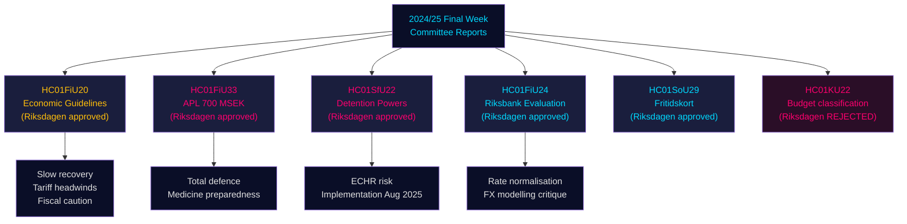

# Riksdagens utskottsbetänkanden: Sveriges ekonomiska kurs, migrationskontroller och försvarsförmåga — Slutveckan 2024/25

**Author**: James Pether Sörling | **Classification**: PUBLIC | **Date**: 2026-05-01 | **Confidence**: HIGH [B2]

## BLUF

Riksdagens sista vecka av riksmötet 2024/25 producerade ett kluster av konsekventa utskottsbetänkanden som tillsammans definierar Sveriges ekonomiska ramverk för 2025–2026: Finansutskottet godkände regeringens försiktiga finanspolitiska expansion mitt i handelskonfliktens motvind, godkände en nödinjektion av kapital på 700 miljoner SEK till statligt ägda läkemedelstillverkaren APL för att gardera sig mot störningar i läkemedelsleveranserna i kris/krigstid, bekräftade Riksbankens penningpolitiska prestanda under 2024 med uppmaning om snabbare ränteinormalisering, och Socialutskottet godkände ett banbrytande fritidskortsprogram (HC01SoU29) som utökar aktivitetstillgången för 400 000+ barn. Simultaneously utvidgade SfU (Socialförsäkrings-/Migrationsutskottet) tvångsmedel vid förvaringsenheterna för migranter. Dessa betänkanden signalerar sammantaget: en regering som prioriterar totalförsvarsförberedelse vid sidan av begränsade sociala investeringar, och som hanterar ett snävt finanspolitiskt handlingsutrymme när utbudsrisker från amerikanska tullhöjningar materialiserar sig.

## Beslut som detta underlag stöder

1. **Makroekonomisk positionering**: Sverige befinner sig i en **undertrendsmässig återhämtning** (BNP +1,0 % 2024, stigande arbetslöshet); Finansutskottets godkännande av regeringens ekonomiska ramverk signalerar fortsatt försiktig reflation men ingen efterfrågesurge. Investerare, analytiker och beslutsfattare bör rabatera pre-tulloptimism.
2. **Försvars-/läkemedelsinköp**: APL-kapitalinjektion (700 MSEK, HC01FiU33) bekräftar att Sverige aktivt bygger upp läkemedelslagringskapacitet för krigstidsscenarier — en materiell signal för nordisk försvarsindustriell policy.
3. **Migrations-säkerhetsnexus**: HC01SfU22 utvidgar Migrationsverkets tvångsbefogenheter vid förvaringsenheterna (kroppsvisitation, rumsvisitation, glaspartitioner vid besök). Detta är en betydande ECHR-känslig lagstiftningsutvidgning med genomföranderisk.
4. **Riksbanksnormalisering**: FiU:s utvärdering (HC01FiU24) stöder fortsatta räntesänkningar men flaggar för Riksbankens överberoende av växelkursmodellering — relevant för SEK-prognostisering.

## 60-sekunders underrättelsepunkter

- 🔴 **HC01FiU20**: Riksdagen godkände riktlinjer för ekonomisk politik. Tillväxten bromsas av amerikanska tullar; lågkonjunkturen förlängs. Tre pelare: hushållsstöd, arbetsmarknad, tillväxt/investering.
- 🔴 **HC01FiU33**: 700 MSEK till APL för akut läkemedelstillverkning — signal om krigsförberedelse; antogs med regeringsmajoritet.
- 🟠 **HC01SfU22**: Migrationsverket får kroppsvisitering och rumsvisitering vid förvar; nya glaspartitioner i besöksrum; gäller från 1 augusti 2025. ECHR-efterlevnadsrisk.
- 🟡 **HC01FiU24**: Riksbankens policy 2024 bedöms som "sammantaget god"; FiU kritiserar överberoende av växelkursmodellering; stöder transparensförbättringar.
- 🟡 **HC01SoU29**: Fritidskort för barn. E-hälsomyndigheten administrerar. Genomföranderisk: nytt IT-system, stor befolkningsrollout.
- 🟢 **HC01KU22**: KU avvisade regeringens förslag att omklassificera civilsamhällets säkerhetsfinansiering (utgiftsområdesflytt) — regeringen besegrades i en strukturell budgetfråga.

## Topp framåtutlösare

Om HC01SfU22:s tvångsmedelsdomar vid förvar utlöser ett ECHR-klagomål eller svenska domstolar ifrågasätter den konstitutionella grunden (RF 2:8 om personlig frihet), eskalerar detta från en administrativ reform till en konstitutionell konfrontation. Bevaka Lagrådets remissstatus och Justitieombudsmannens (JO) inspektionsmeddelanden kvartal 3 2025 – kvartal 1 2026.

## Säkerhetssammanfattning

Sammanlagd analytisk säkerhet: **HIGH [B2]** — primära källor (Riksdagens betänkanden, namngivna utskottsbeslut, omröstningsutfall) är av hög kvalitet; ekonomiska prognoser är stämplade med IMF WEO april 2026-vintage; en del partiuppdelningar kräver validering med fler voteringsuppgifter.

## Mermaid: Nyckelbeslutsflöde

<!-- source-sha: 4982fc0535678625b509068942c6e0e28c6416e6 -->
