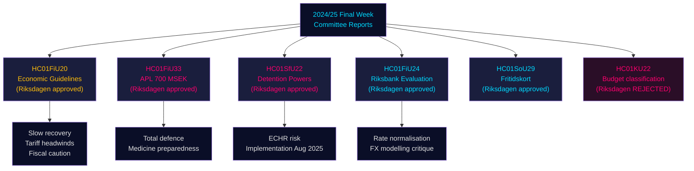

# 瑞典国会委员会报告：经济轨道、移民管控与国防准备 — 2024/25年度最终周

**Author**: James Pether Sörling | **Classification**: PUBLIC | **Date**: 2026-05-01 | **Confidence**: HIGH [B2]

## 核心摘要（BLUF）

2024/25年度议会会期的最终一周产出了一批引人注目的委员会报告，共同界定了瑞典2025–2026年的经济框架：财政委员会批准了政府在贸易战逆风下的审慎财政扩张，批准向国有制药商APL注入7亿瑞典克朗紧急资本以防范危机/战争期间的药品供应中断，确认了瑞典央行（Riksbank）2024年货币政策表现良好，同时敦促加速利率正常化；社会事务委员会批准了创新性休闲卡计划（HC01SoU29），为超过40万名儿童扩大了活动获取渠道。与此同时，社会保险/移民委员会（SfU）扩大了移民拘留设施的强制权力。这些报告共同指向：一个在美国关税升级导致供给侧风险显现的背景下，以总体防卫准备为优先、兼顾有限社会投资、管理狭窄财政空间的政府。

## 本文件支持的决策

1. **宏观经济定位**：瑞典处于**低于趋势的复苏**阶段（2024年GDP +1.0%，失业率上升）；财政委员会背书政府经济框架，表明将继续审慎回升，但不存在需求过热。投资者、分析师和政策制定者应对关税前的乐观情绪予以折扣。
2. **国防/制药采购**：APL资本注入（7亿克朗，HC01FiU33）证实瑞典正在积极为战争情景构建药品储备——这是北欧国防工业政策的实质性信号。
3. **移民-安全关联**：HC01SfU22扩大了Migrationsverket在拘留设施的强制权力（人身搜查、房间搜查、探视时的玻璃隔板）。这是一项需顾及《欧洲人权公约》的立法扩展，具有执行风险。
4. **Riksbank正常化**：财政委员会评估（HC01FiU24）支持继续降息，但指出Riksbank过度依赖汇率建模——与瑞典克朗SEK预测密切相关。

## 60秒情报要点

- 🔴 **HC01FiU20**：国会批准经济政策方向。受美国关税影响增长放缓；低迷周期延续。三大支柱：家庭支持、劳动力市场、增长/投资。
- 🔴 **HC01FiU33**：向APL拨付7亿克朗用于紧急药品生产——战争准备信号；以执政联盟多数票通过。
- 🟠 **HC01SfU22**：Migrationsverket获得拘留期间人身搜查和房间搜查权力；探视室新设玻璃隔板；2025年8月1日生效。欧洲人权公约合规风险。
- 🟡 **HC01FiU24**：Riksbank 2024年政策被评为"sammantaget god"；财政委员会批评其对汇率建模的过度依赖；支持提升透明度。
- 🟡 **HC01SoU29**：儿童休闲卡。由E-hälsomyndigheten管理。执行风险：新IT系统，大规模推广。
- 🟢 **HC01KU22**：KU委员会否决政府重新分类公民社会安全资助的提案（支出领域转移）——政府在一项结构性预算问题上遭到失败。

## 关键前瞻性催化剂

若HC01SfU22的拘留强制措施引发《欧洲人权公约》申诉，或瑞典法院对宪法依据（RF 2:8关于人身自由）提出质疑，将从行政改革升级为宪法对抗。密切关注提交Lagrådet的状态及2025年Q3至2026年Q1期间JO（议会监察专员）的检查意见。

## 可信度摘要

整体分析可信度：**HIGH [B2]** — 高质量一手来源（国会betänkanden、指定委员会决定、投票结果）；经济预测已加盖IMF WEO 2026年4月版本印戳；部分党内分歧需结合更多投票数据加以验证。

## 美人鱼图：关键决策流程

<!-- source-sha: 4982fc0535678625b509068942c6e0e28c6416e6 -->
