# Forward Indicators — Committee Reports 2024/25

**Author**: James Pether Sörling | **Date**: 2026-05-01 | **Framework**: 4-Horizon Intelligence Watch

## Indicator Framework

Four time horizons tracked:
- **H1** (0–3 months): Immediate operational signals
- **H2** (3–6 months): Short-term political and legal developments
- **H3** (6–12 months): Medium-term structural developments
- **H4** (12–24 months): Pre-election strategic horizon

---

## Immediate Horizon (H1: May–July 2025)

| Indicator ID | Indicator | Source | Status | Escalation Trigger |
|-------------|-----------|--------|--------|-------------------|
| H1-01 | Riksbank rate decision July 2025 | Riksbank website | Monitor | Rate hold (not cut) = adverse signal for FiU24 recommendations |
| H1-02 | APL capital injection disbursement confirmation | Riksdag/Government press | Monitor | Delay >3 months = EU state-aid exposure risk |
| H1-03 | Migrationsverket facility glass-partition rollout progress | JO annual report / Migrationsverket | Monitor | JO inspection opens = SfU22 legal risk elevated |
| H1-04 | SCB Q1 2025 GDP flash estimate | SCB | Expected May 2025 | GDP <0% = HC01FiU20 revision trigger |
| H1-05 | US-EU trade negotiation calendar | EU Commission DG Trade | Monitor | New tariff rounds announced = R1 risk escalation |

## Short-Term Horizon (H2: July–October 2025)

| Indicator ID | Indicator | Source | Status | Escalation Trigger |
|-------------|-----------|--------|--------|-------------------|
| H2-01 | E-hälsomyndigheten fritidskort IT system progress report | Socialdepartementet / E-hälsomyndigheten | Monitor | System delay announced = SoU29 electoral liability |
| H2-02 | Swedish unemployment rate Q2 2025 (SCB) | SCB | Expected August 2025 | Unemployment >10% = HC01FiU20 narrative failure |
| H2-03 | SD-Government joint working group meeting frequency | SD press release / Riksdag diary | Monitor | Cancellation = coalition stress |
| H2-04 | Lagrådet retrospective opinion on SfU22 (if requested) | Lagrådet website | Latent trigger | Opinion published = legal durability assessment |
| H2-05 | EU Commission state-aid pre-notification for APL | EU state-aid register | Monitor | No pre-notification by October = increased risk |

## Medium-Term Horizon (H3: October 2025–April 2026)

| Indicator ID | Indicator | Source | Status | Escalation Trigger |
|-------------|-----------|--------|--------|-------------------|
| H3-01 | Höstproposition 2025 (Autumn Budget Bill) | Government / Riksdag | Expected September 2025 | Significant revision vs. FiU20 framework = fiscal stress confirmed |
| H3-02 | IMF Article IV consultation report for Sweden | IMF website | Expected November 2025 | GDP downgrade or policy criticism = analytical confirmation |
| H3-03 | ECHR admissibility decision on first SfU22-related complaint | ECtHR website | Latent trigger | Admissibility granted = H2 hypothesis probability rises |
| H3-04 | Finanspolitiska rådet annual evaluation | Finanspolitiska rådet | Expected May 2026 | Critical assessment of FiU20 = government electoral risk |
| H3-05 | APL first post-injection financial report | APL annual report | Expected March 2026 | No performance benchmarks = H1 (APL politics hypothesis) confirmed |

## Pre-Election Strategic Horizon (H4: April–September 2026)

| Indicator ID | Indicator | Source | Status | Escalation Trigger |
|-------------|-----------|--------|--------|-------------------|
| H4-01 | SD election manifesto on migration enforcement (SfU22 delivery claim) | SD press | Expected June 2026 | Manifesto demands extension beyond current law = coalition stress pre-election |
| H4-02 | Government economic record narrative vs. opposition critique crystallisation | Riksdag debates / media | Monitor continuously | If unemployment narrative dominates = Scenario C risk increases |
| H4-03 | Fritidskort utilisation statistics first annual report | E-hälsomyndigheten | Expected June 2026 | Low utilisation = SoU29 as electoral failure |
| H4-04 | Supreme Administrative Court (HFD) ruling on any SfU22 case | HFD website | Latent trigger | Adverse ruling = government forced legislative amendment pre-election |
| H4-05 | Swedish defence preparedness assessment (post-APL) | MSB / FMV | Expected annually | Negative assessment = FiU33 value questioned |

---

## Indicator Map

```mermaid
flowchart LR
    subgraph H1["H1: May-Jul 2025"]
        H1_01["Riksbank rate"]
        H1_04["GDP Q1 flash"]
        H1_05["US-EU trade"]
    end
    subgraph H2["H2: Jul-Oct 2025"]
        H2_01["Fritidskort IT"]
        H2_02["Unemployment Q2"]
        H2_03["SD-Gov meetings"]
    end
    subgraph H3["H3: Oct 2025-Apr 2026"]
        H3_01["Höstproposition"]
        H3_02["IMF Art.IV"]
        H3_03["ECHR admissibility"]
    end
    subgraph H4["H4: Apr-Sep 2026"]
        H4_01["SD manifesto"]
        H4_02["Election narrative"]
        H4_04["HFD SfU22 ruling"]
    end
    H1 --> H2
    H2 --> H3
    H3 --> H4
    style H1 fill:#0a1e0a,color:#00d9ff
    style H2 fill:#0a1e3d,color:#e0e0e0
    style H3 fill:#1a1e3d,color:#ffbe0b
    style H4 fill:#2a0e27,color:#ff006e
```

**Intelligence priority watch**: H3-01 (Höstproposition), H3-02 (IMF Art.IV), H4-02 (election narrative). These three indicators collectively will determine whether the 2026 election is fought on economic competence or migration values.
