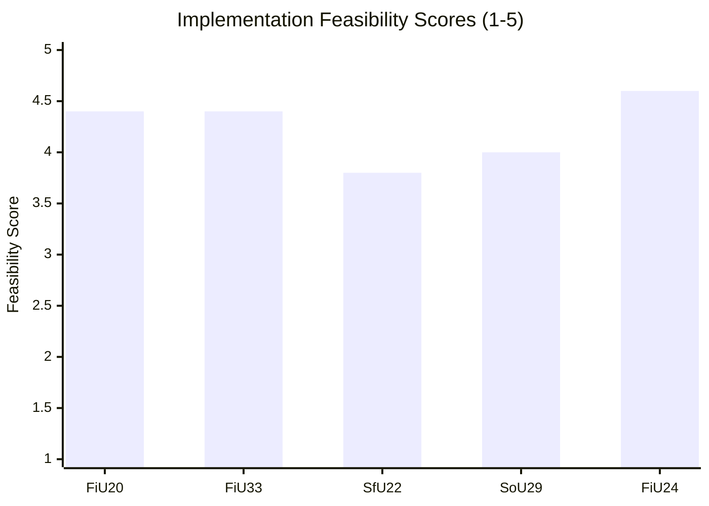

# Implementation Feasibility — Committee Reports 2024/25

**Author**: James Pether Sörling | **Date**: 2026-05-01 | **Framework**: Delivery Risk Assessment

## Assessment Framework

Five feasibility dimensions evaluated for each high-priority document:
- **Legal**: Are the measures legally robust?
- **Financial**: Is adequate funding secured?
- **Operational**: Do the required institutions and systems exist?
- **Political**: Is political will sustained?
- **Timeline**: Are the deadlines realistic?

Scale: 1 (low feasibility) — 5 (high feasibility)

---

## HC01FiU20 — Vårproposition Economic Framework

| Dimension | Score | Assessment | Risk |
|-----------|-------|-----------|------|
| Legal | 5 | Budget law fully compliant | None |
| Financial | 4 | Funded within expenditure ceiling | US tariff revenue impact possible |
| Operational | 4 | Riksdag and government budget processes mature | Minor coordination risk |
| Political | 4 | SD+M+KD+L+C support confirmed | SD red-lines stable currently |
| Timeline | 5 | Riksdag calendar drives delivery | On schedule |

**Overall feasibility**: HIGH (4.4/5) | **Primary risk**: US tariff shock forcing mid-year revision

**Statskontoret relevance**: HC01FiU20 implementation is tracked by Finanspolitiska rådet (not Statskontoret) — no direct Statskontoret evaluation assigned, but Statskontoret may be commissioned to review specific programme efficiency if lågkonjunktur extends.

---

## HC01FiU33 — APL Emergency Pharma Capital Injection

| Dimension | Score | Assessment | Risk |
|-----------|-------|-----------|------|
| Legal | 4 | Extra ändringsbudget procedure valid; EU state-aid risk | TFEU Art.107-108 exposure |
| Financial | 5 | 700 MSEK explicitly appropriated | Funded |
| Operational | 4 | APL existing entity; management capacity intact | Capacity growth management |
| Political | 5 | Cross-party support | Negligible political risk |
| Timeline | 4 | Emergency appropriation; Q3 2025 target | Possible procurement delay |

**Overall feasibility**: HIGH (4.4/5) | **Primary risk**: EU state-aid challenge (probability 20%)

**Statskontoret relevance**: Statskontoret may be tasked with post-investment efficiency review of APL 2026. Recommend monitoring Statskontoret work programme.

---

## HC01SfU22 — Detention Coercive Powers

| Dimension | Score | Assessment | Risk |
|-----------|-------|-----------|------|
| Legal | 3 | Passed legally; ECHR challenge risk; Lagrådet status unconfirmed | **Significant legal risk** |
| Financial | 5 | No major cost (operational implementation by Migrationsverket) | Funded |
| Operational | 3 | Migrationsverket must retrofit facilities with glass partitions; staff training | **Infrastructure and training gap** |
| Political | 5 | SD core demand; government fully committed | No political risk currently |
| Timeline | 3 | Physical retrofit of detention facilities: 6–12 months; legal challenge may delay | Realistic but tight |

**Overall feasibility**: MODERATE-HIGH (3.8/5) | **Primary risk**: ECtHR interim measure (probability 25%); operational retrofit timeline

**Statskontoret relevance**: None assigned at time of analysis. If ECtHR or JO opens investigation, Statskontoret may be assigned independent review of Migrationsverket detention capacity.

---

## HC01SoU29 — Fritidskort

| Dimension | Score | Assessment | Risk |
|-----------|-------|-----------|------|
| Legal | 5 | Simple welfare programme; no rights tension | None |
| Financial | 4 | Funded in FiU20 envelope; cost control risk | Demand higher than projected |
| Operational | 3 | **E-hälsomyndigheten must build new IT system** | **Critical IT delivery risk** |
| Political | 5 | Cross-party support | None |
| Timeline | 3 | September 2025 target; IT system tight | Risk of 3–6 month delay |

**Overall feasibility**: MODERATE-HIGH (4.0/5) | **Primary risk**: E-hälsomyndigheten IT system delivery

**Statskontoret relevance**: HIGH — fritidskort is a new government programme with Statskontoret-eligible evaluation mandate. Recommend intelligence watch for Statskontoret evaluation commissioning in 2025–2026.

---

## HC01FiU24 — Riksbank Evaluation

| Dimension | Score | Assessment | Risk |
|-----------|-------|-----------|------|
| Legal | 5 | Evaluation mandate; no legislative implementation | None |
| Financial | 5 | No cost | None |
| Operational | 4 | Riksbank independent; will consider recommendations | FX over-reliance deeply embedded |
| Political | 5 | Cross-party support for Riksbank independence | None |
| Timeline | 4 | Riksbank response expected within 12 months | On track |

**Overall feasibility**: VERY HIGH (4.6/5)

---

## Feasibility Dashboard

## Summary Risk Table

| Document | Overall | Critical Risk | Statskontoret Relevance |
|----------|---------|--------------|------------------------|
| HC01FiU20 | HIGH | US tariff budget revision | Indirect (Finanspolitiska rådet primary) |
| HC01FiU33 | HIGH | EU state-aid challenge | Possible post-investment review |
| HC01SfU22 | MOD-HIGH | ECHR/ECtHR legal challenge + facility retrofit | Possible if JO investigation |
| HC01SoU29 | MOD-HIGH | E-hälsomyndigheten IT delivery | HIGH — new programme eligible for evaluation |
| HC01FiU24 | VERY HIGH | None significant | None |
