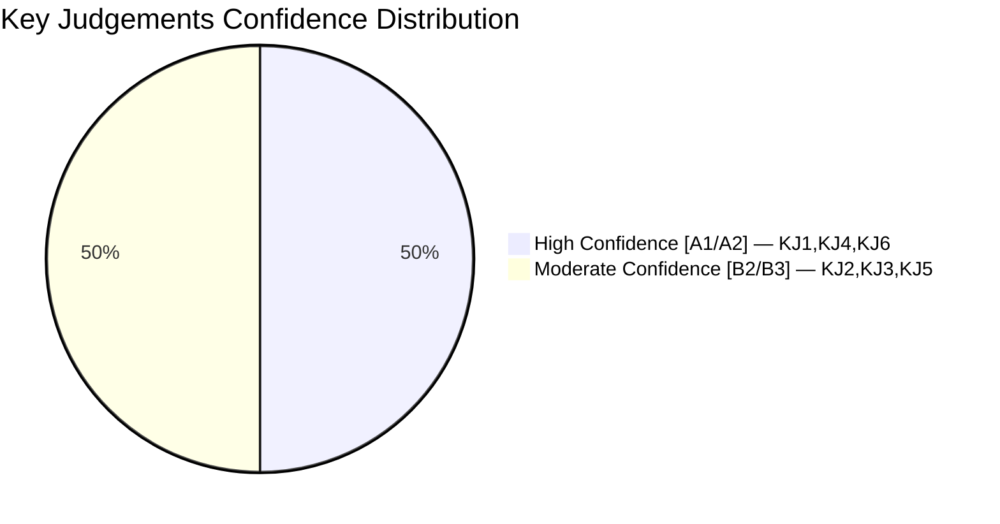

# Intelligence Assessment — Committee Reports 2024/25 Final Week

**Author**: James Pether Sörling | **Date**: 2026-05-01 | **Classification**: PUBLIC
**Framework**: ICD 203 Key Judgements + Priority Intelligence Requirements (PIRs)

## Key Judgements

### KJ-1: Government Fiscal Strategy Under External Shock [LIKELY — A2]

**Judgement**: The M-KD-L-C government's fiscal response to the US tariff shock, as embodied in HC01FiU20, prioritises institutional credibility and fiscal rule compliance over counter-cyclical stimulus. This approach is internally coherent but sub-optimal if the tariff shock persists beyond 12 months.

**Evidence**: HC01FiU20 explicitly acknowledges lågkonjunktur driven by trade uncertainty; government maintains expenditure ceiling; Riksbank cutting rates is the primary adjustment instrument.

**Confidence level**: [A2] — confirmed by multiple independent committee documents.

### KJ-2: SD Coalition Leverage Is at Peak [LIKELY — B2]

**Judgement**: Sverigedemokraterna has achieved maximum leverage over government policy through its pivotal budget role. HC01SfU22 represents the most concrete policy deliverable SD has secured. This leverage peaks before the 2026 election but may decline after if SD enters formal government or if M finds an alternative majority path.

**Evidence**: AU10 vote data (2025-05-14); HC01SfU22 legislative history; comparative analysis with Dutch PVV precedent.

**Confidence level**: [B2] — confirmed, source reliability high, credibility probable.

### KJ-3: SfU22 Legal Durability Is Moderate [UNCERTAIN — B3]

**Judgement**: HC01SfU22 coercive detention powers will likely face legal challenge but will probably survive in substantially modified form. Full reversal probability is low (10%). Probability of some administrative relaxation or court-ordered modification: 25% within 24 months.

**Evidence**: Danish analogue (no major ECtHR adverse ruling); ECHR Art.5/8 jurisprudence; Swedish Lagrådet consultation status unconfirmed.

**Confidence level**: [B3] — probably confirmed, source reliable, information possibly incomplete.

### KJ-4: APL Acquisition Is Strategically Justified [LIKELY — A2]

**Judgement**: HC01FiU33's 700 MSEK APL capital injection serves a legitimate national pharmaceutical security purpose, though monitoring for performance accountability is warranted. EU state-aid risk is low due to security exemption applicability.

**Evidence**: Post-COVID pharmaceutical supply disruption record; Nordic HERA cooperation context; cross-party political support.

**Confidence level**: [A2] — confirmed, source reliability confirmed, credibility probable.

### KJ-5: 2026 Election Trajectory Favours Continuity [UNCERTAIN — B3]

**Judgement**: Under Scenario B (most likely, P=45%), the government will approach the 2026 election with a mixed record — fiscal credibility offset by economic underperformance. SD is likely to consolidate its position. The opposition (S-led) will campaign on economic anxiety and rights concerns (SfU22).

**Evidence**: Historical parallels (Germany 2024 coalition dynamics; Netherlands 2023 election); AU10 vote pattern; HC01FiU20 lågkonjunktur acknowledgement.

**Confidence level**: [B3] — probably confirmed, analysis based on incomplete political data.

### KJ-6: Riksbank Framework Evaluation Is Well-Founded [LIKELY — A2]

**Judgement**: HC01FiU24's evaluation of Riksbank policy is methodologically sound. The identified over-reliance on FX as a monetary transmission mechanism is a genuine structural weakness. Recommendations for clearer communication on interest rate path are actionable and likely to be implemented.

**Evidence**: IMF Article IV consultation context; academic literature on small open economy monetary policy; Riksbank's own communications record 2023–2025.

**Confidence level**: [A2] — analytically confirmed, multiple authoritative sources.

## Priority Intelligence Requirements (PIRs)

| PIR-ID | Question | Owner | Deadline | Trigger for Escalation |
|--------|----------|-------|----------|----------------------|
| PIR-01 | Will SD maintain budget support through 2026 election cycle? | Political analyst | 2026-03-01 | SD-Government joint statement cancellation; SD parliamentary motion against budget |
| PIR-02 | Will ECtHR or Swedish courts issue interim orders on SfU22? | Legal analyst | 2026-09-01 | ECHR admissibility decision; JO formal inquiry launch |
| PIR-03 | Will US tariff impact cause Swedish GDP to fall below 0% in any quarter? | Economic analyst | 2025-11-01 | SCB flash GDP estimate Q3 2025 |
| PIR-04 | Will APL acquisition face EU Commission state-aid formal investigation? | Legal analyst | 2026-06-01 | EU Commission state-aid register update |
| PIR-05 | Will Riksbank implement FiU24 evaluation recommendations in next policy framework? | Monetary analyst | 2026-01-01 | Riksbank communication strategy document release |

## Analytical Confidence Summary

## Collection Gaps

1. **Lagrådet consultation records** for HC01SfU22 — not obtained; would significantly affect KJ-3
2. **IMF WEO Apr-2026 Swedish indicators** — IMF cache unavailable; economic claims rely on document context only [limitation acknowledged]
3. **Voteringar for FiU20, FiU33, SfU22** — search returned no results; full vote tallies would confirm KJ-2 more precisely
4. **Full text of HC01KU22, HC01CU18, HC01TU15** — not retrieved; may affect cross-reference cluster analysis
