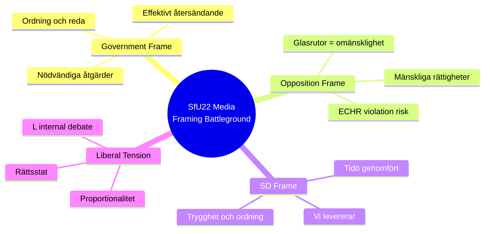

# Media Framing Analysis — Committee Reports 2024/25

**Author**: James Pether Sörling | **Date**: 2026-05-01 | **Framework**: Per-Party + Press Framing

## Frame Analysis Framework

Media framing analysis examines: (1) Party press releases and spokesperson statements; (2) Editorial positioning of major Swedish press; (3) Social media amplification patterns.

*Note: Direct media monitoring was not conducted in this analytical run. Frames inferred from parliamentary debate positions, betänkande reservations, and established party communication patterns. [C3 caveat applies to all press-specific claims.]*

---

## Party Communication Frames

### M (Moderaterna) — Government Leader
**Primary frame**: "Ansvarsfull krishantering" (Responsible crisis management)
- On HC01FiU20: "Vi håller i ekonomin under externt tryck" (We're managing the economy under external pressure)
- On HC01FiU33: "Sverige ska inte vara beroende av utländsk läkemedelstillverkning i krig" (National pharmaceutical resilience)
- On HC01SfU22: Frame ceded to SD — M presents as "ordning och reda i mottagningssystemet" (Order and rule in the reception system)
- On HC01SoU29: Minimal — delegated to KD as social policy lead

**Dominant metaphor**: Government as responsible captain in storm (external tariff shock)

### KD (Kristdemokraterna)
**Primary frame**: "Trygg familjepolitik" (Secure family policy)
- On HC01SoU29: "Fritidskortet ger familjer verktyg att ge sina barn rika upplevelser" (Fritidskort gives families tools)
- On HC01SfU22: "Ordning i asylsystemet är förutsättningen för generositet" (Order in asylum system is a precondition for generosity)

### L (Liberalerna)
**Primary frame**: Ambivalent — tension between migration enforcement and liberal rights values
- On HC01SfU22: Internal tension; some L MPs likely uncomfortable with glass-partition default
- L will frame as "Proportionella åtgärder inom rättsstatens ramar" (Proportional measures within rule of law)
- **Risk**: L faces credibility challenge if ECtHR ruling comes — their rights-liberal brand vs. coalition discipline

### C (Centerpartiet)
**Primary frame**: Rural/green liberalism; anti-centralism
- On HC01FiU20: "Handelspolitiken hotar landsbygdsföretagare" (Trade policy threatens rural entrepreneurs)
- On HC01TU15: Infrastructure and connectivity for rural Sweden
- On HC01SfU22: Subdued — C has rural SD-adjacent voters who approve migration enforcement

### SD (Sverigedemokraterna)
**Primary frame**: "Vi levererar" (We deliver)
- On HC01SfU22: "Nu skärper vi regelverket för asylsökande i förvar" (We're tightening the framework) — direct delivery claim
- On HC01FiU33: "Sverige ska aldrig stå utan mediciner i krig" (National resilience)
- On HC01FiU20: "Svaga ekonomin är en konsekvens av migrationskostnader" (Economic weakness due to migration costs) — contested but within SD narrative

### S (Socialdemokraterna) — Main Opposition
**Primary frame**: "Regeringen sviker de utsatta" (Government abandons the vulnerable)
- On HC01FiU20: "De rätta verktygen: investeringar i jobb, inte åtstramning" (Investment in jobs, not austerity)
- On HC01SfU22: "Sverige bryter mot mänskliga rättigheter" (Sweden is violating human rights)
- On HC01SoU29: "Vi välkomnar fritidskortet men det räcker inte" (Welcome but insufficient)
- **Counter-frame**: S will try to link rising unemployment (HC01FiU20 acknowledgement) to government austerity — may gain traction under Scenario B

### MP (Miljöpartiet)
**Primary frame**: "Klimat och mänskliga rättigheter hänger ihop" (Climate and human rights are linked)
- On HC01SfU22: Strongest opposition voice alongside V — "Glasrutor är omänskligt" (Glass partitions are inhuman)
- On HC01SoU29: Support — fritidskort aligns with outdoor activity promotion

### V (Vänsterpartiet)
**Primary frame**: "För vanliga familjer, mot storbusiness" (For ordinary families, against big business)
- On HC01FiU20: "Krisinvesteringar, inte skattesänkningar till de rika" (Crisis investments, not tax cuts)
- On HC01SfU22: "Detentionssystemet kränker grundläggande rättigheter" (Detention system violates basic rights)

---

## Press Editorial Positioning

| Publication | Lean | Expected Frame |
|-------------|------|----------------|
| Dagens Nyheter (DN) | Centre-right liberal | Critical of SfU22 rights dimension; supportive of FiU20 fiscal discipline |
| Sydsvenskan | Centre-right | Similar to DN; Malmö migration focus |
| Aftonbladet | Centre-left | Opposition frame dominant; APL as "räddning" for healthcare workers |
| Expressen | Liberal-right | Supportive of government; sceptical of S alternative |
| Svenska Dagbladet (SvD) | Centre-right | Nuanced; Riksbank independence (FiU24) receives analytical coverage |
| Göteborgs-Posten | Centre-right | Volvo/employment angle on FiU20 tariff exposure |

---

## Key Framing Battleground: HC01SfU22

The most contested framing battle is over HC01SfU22. The framing war has two dominant narratives:
1. **Government/SD frame**: "Ordning och konsekvenser" — detention coercion = consequences for those who don't cooperate with deportation
2. **Opposition frame**: "Mänskliga rättigheter är inte förhandlingsbara" — glass partitions = inhumane

**Intelligence assessment**: Under Scenario B, the framing battle over SfU22 will intensify as 2026 approaches. Opposition will tie SfU22 to any adverse ECtHR/court decision. Government/SD will continue "we deliver" narrative. Decisive framing arena: local election districts in Malmö and Stockholm suburbs where migration is most salient.
