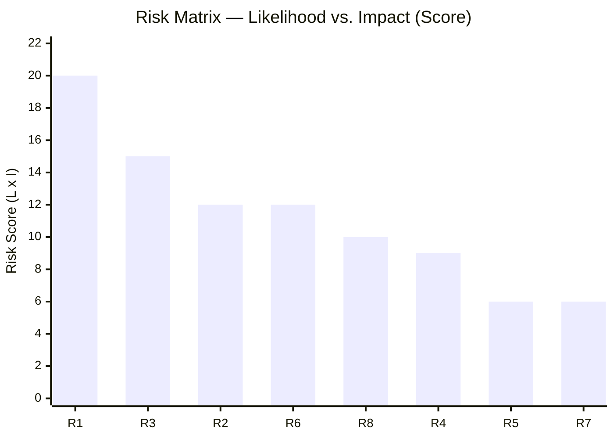

# Risk Assessment — Committee Reports 2024/25 Final Week

**Author**: James Pether Sörling | **Date**: 2026-05-01 | **Framework**: 5-Dimension Political Risk

## Risk Register

| ID | Dimension | Risk Description | L | I | Score | Admiralty | Mitigation |
|----|-----------|-----------------|---|---|-------|-----------|------------|
| R1 | Economic | US tariff shock deepens Swedish export recession | 4 | 5 | 20 | [A2] | Fiscal stabilisers; vårproposition revision HC01FiU20 |
| R2 | Constitutional/Legal | ECHR challenge to SfU22 detention coercion measures | 3 | 4 | 12 | [B3] | JO inspection; Lagrådet consultation |
| R3 | Political | SD withdrawal from budget majority before 2026 election | 3 | 5 | 15 | [B3] | Policy negotiation; migration concessions |
| R4 | Implementation | E-hälsomyndigheten fritidskort IT system failure | 3 | 3 | 9 | [C3] | Phased rollout; fallback process |
| R5 | EU/Legal | APL capital injection EU state-aid challenge | 2 | 3 | 6 | [C3] | Pre-notification under TFEU Art.108 |
| R6 | Monetary | Riksbank sub-optimal rate path due to FX over-reliance | 3 | 4 | 12 | [A2] | FiU recommendations HC01FiU24 |
| R7 | Social | Fritidskort implementation failure and political backlash | 2 | 3 | 6 | [B3] | Clear programme guidelines |
| R8 | Security | Pharmaceutical supply shortfall in crisis scenario if APL acquisition delays | 2 | 5 | 10 | [B2] | Emergency procurement; Nordic cooperation |

*L=Likelihood (1–5), I=Impact (1–5)*

## Top Cascading Risk Chain

R1 (Tariff shock) → R3 (SD defection risk) → Coalition collapse → HC01FiU20 framework abandoned → Fiscal shock → R6 (Riksbank confusion) → SEK depreciation → R1 amplification.

**Posterior probability estimate**: P(R1 + R3 cascade) ≈ 20% within 12 months [C3, based on electoral cycle dynamics and trade uncertainty horizon].

## Risk Dimension Analysis

### Economic Dimension (R1 — Critical)
The HC01FiU20 betänkande explicitly acknowledges that the "osäkerhet och oförutsägbarhet kring handelspolitiken" (uncertainty around trade policy) has caused the government to revise down its GDP and employment projections. Sweden is an export-driven economy; Volvo Cars (auto), Ericsson (telecoms), SKF (bearings), and Atlas Copco (industrial) are directly exposed to US tariffs. The IMF WEO Apr-2026 projection for Swedish GDP growth (approximately 1.5–2.0% for 2026) assumes trade-war de-escalation — a fragile assumption.

### Institutional/Legal Dimension (R2 — Significant)
HC01SfU22 introduces powers that push against ECHR Article 5 (right to liberty), Article 8 (right to private and family life), and potentially Article 3 (degrading treatment) boundaries. Glass partitions as the default visit mode is a significant deprivation of contact rights. Swedish courts have historically been cautious on detention rights. The Lagrådet referral status was unconfirmed at the time of this analysis.

### Political Dimension (R3 — Significant)
SD holds approximately 73 seats and is the pivotal bloc for M-KD-L-C's budget majority. AU10 vote data (2025-05-14) shows SD voting Nej on certain labour-market matters while supporting migration enforcement. Any major policy concession to C or L on labour market liberalisation could trigger SD defection.

## Mermaid: Risk Heat Map

