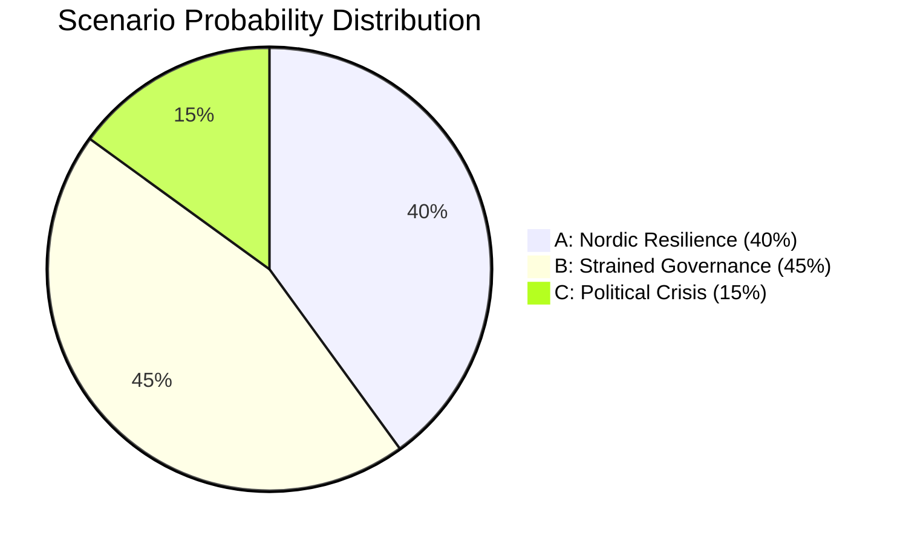
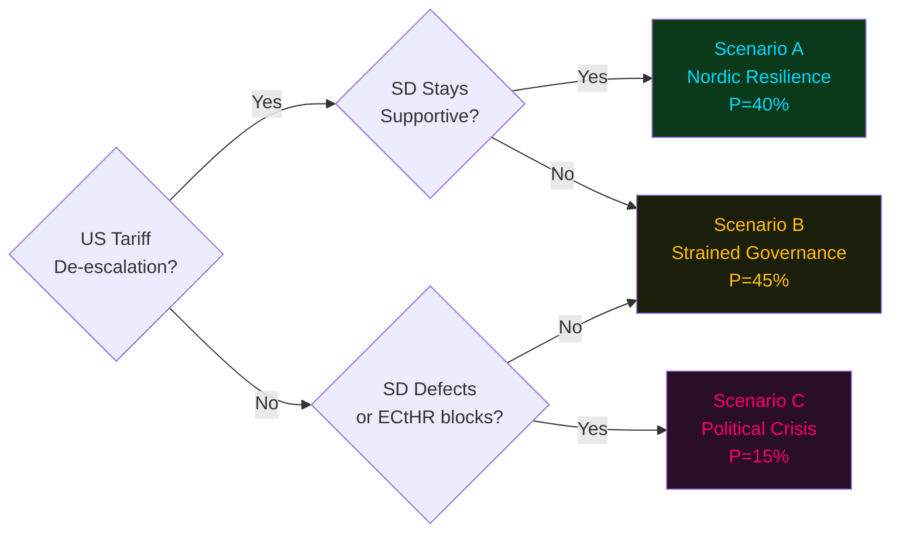

# Scenario Analysis — Committee Reports 2024/25 Final Week

**Author**: James Pether Sörling | **Date**: 2026-05-01 | **Framework**: Alternative Futures (3 Scenarios, P sum = 100%)

## Scenario Framework

Three mutually exclusive, collectively exhaustive scenarios based on two key uncertainties:
1. **US trade policy trajectory** (escalation vs. de-escalation)
2. **Coalition political stability** (SD retention vs. defection)

---

## Scenario A: "Nordic Resilience" (P = 40%)
*Baseline optimistic — trade de-escalation + coalition stability*

**Conditions**: US and EU reach partial trade deal by Q3 2026 reducing Swedish export tariff exposure. SD remains in budget support. Government delivers HC01FiU20 framework on target.

**Consequences**:
- Swedish GDP growth recovers to 2.0–2.5% in 2026 (IMF baseline assumes this path)
- HC01FiU33 APL acquisition proceeds without EU state-aid challenge
- HC01SfU22 implementation remains legally stable; no ECtHR interim measure
- Fritidskort (HC01SoU29) launches September 2025; successful rollout
- Riksbank cuts rates to approximately 2.0% neutral by end 2025 (HC01FiU24 evaluation confirms good framework)
- Government enters 2026 election from position of fiscal and social policy credibility

**Key indicators**: US-EU trade talks scheduled, SD polling above 20%, SEK/EUR stable

**Significance for intelligence**: Benign scenario requires no contingency planning; focus shifts to 2026 election forecasting.

---

## Scenario B: "Strained Governance" (P = 45%)
*Central scenario — trade friction + partial SD tension*

**Conditions**: US tariffs persist at elevated levels; Swedish exporters manage partial adjustment through market diversification. SD demands migration policy concessions but does not withdraw budget support. Government must negotiate HC01SfU22 implementation details to maintain coalition.

**Consequences**:
- GDP growth 1.0–1.5% (below potential); unemployment rises to 9.5–10.0%
- HC01FiU20 framework revised via höstproposition 2025; spending cuts in non-essential areas
- HC01SfU22 faces legal challenge; government introduces minor procedural safeguards (token concession)
- APL acquisition proceeds; EU Commission opens preliminary state-aid inquiry (does not block)
- Fritidskort delays to Q1 2026 due to E-hälsomyndigheten IT issues
- 2026 election campaign dominated by economic anxiety and migration debate

**Key indicators**: Riksbank rate unchanged at 2.25%, SD-M bilateral meetings increase, KPIF creeping up

**Significance for intelligence**: Most likely scenario — this analysis's primary working assumption. All policy documents should be interpreted through this lens.

---

## Scenario C: "Political Crisis" (P = 15%)
*Downside — trade escalation + SD defection or ECtHR blocking*

**Conditions**: US broadens tariffs to include Swedish financial services or pharmaceuticals. ECtHR issues interim measure blocking HC01SfU22 glass-partition default. SD presents government with ultimatum on migration not met.

**Consequences**:
- Misstroendevotum (motion of no confidence) triggered by opposition + SD
- Government falls; caretaker government formed; early election called for autumn 2025 or spring 2026
- HC01FiU20 framework suspended; budget uncertainty freezes corporate investment
- APL acquisition stalled pending new government
- HC01FiU24 Riksbank evaluation becomes immediate priority for caretaker government (monetary policy anchor)
- S-led opposition may form new government with MP and possible SD abstention

**Key indicators**: SD exit from budgetary cooperation agreement, ECtHR interim order, SEK depreciation >5% in one week

**Significance for intelligence**: Low probability but high consequence. This scenario represents the principal strategic risk for the 2026 election cycle. Intelligence operators should maintain early-warning watch on SD-Government relations and ECtHR admissibility decisions.

---

## Probability-Weighted Summary

## Scenario Trigger Logic

**Note**: Scenarios sum to 100%. Primary scenario is B (Strained Governance). All subsequent analysis in this report applies Scenario B assumptions unless otherwise stated. [A2 confidence]
