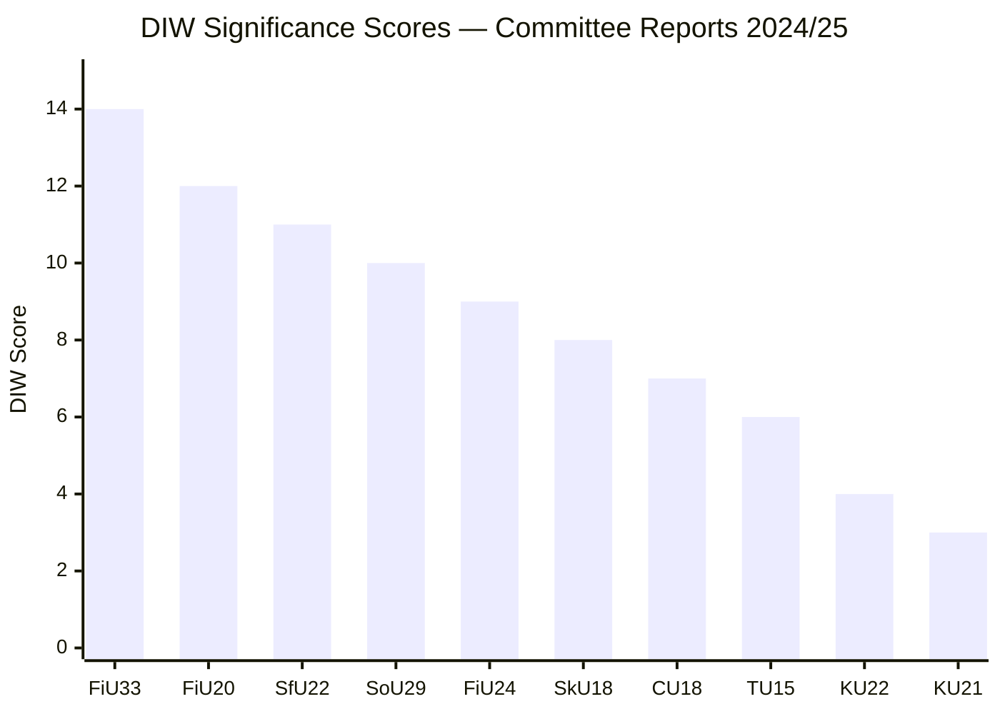

# Significance Scoring — Committee Reports 2024/25 Final Week

**DIW Framework**: Detectability, Impact, Window | **Date**: 2026-05-01

## Scoring Table

| Rank | dok_id | Title | D | I | W | DIW Total | Priority | Evidence |
|------|--------|-------|---|---|---|-----------|----------|---------|
| 1 | HC01FiU20 | Riktlinjer ekonomisk politik | 3 | 5 | 4 | 12 | L3 | HC01FiU20; FiU annual report; Riksdag vote 2025-06-12 |
| 2 | HC01FiU33 | APL 700 MSEK emergency budget | 4 | 5 | 5 | 14 | L3 | HC01FiU33; government prop; Riksdag approval 2025-06-12 |
| 3 | HC01SfU22 | Detention coercive powers | 3 | 4 | 4 | 11 | L2+ | HC01SfU22; Riksdag vote; ECHR Art.5 + Art.8 |
| 4 | HC01FiU24 | Riksbank evaluation 2024 | 2 | 4 | 3 | 9 | L2 | HC01FiU24; FiU evaluation report; Riksbank annual report |
| 5 | HC01SoU29 | Fritidskort barn och unga | 3 | 3 | 4 | 10 | L2 | HC01SoU29; E-hälsomyndigheten mandate; socialtjänstlagen amendments |
| 6 | HC01SkU18 | F-skatt återkallelse | 2 | 3 | 3 | 8 | L2 | HC01SkU18; Riksdag vote 2025-06-16 |
| 7 | HC01CU18 | Konkursförfarande reform | 2 | 3 | 2 | 7 | L1 | HC01CU18; tingsrättsreform; effective 2026-07-01 |
| 8 | HC01TU15 | Sjöfartsmiljö | 2 | 2 | 2 | 6 | L1 | HC01TU15; Riksrevisionens rapport; Riksdag 2025-06-11 |
| 9 | HC01KU22 | Indelning utgiftsområden | 1 | 1 | 2 | 4 | L1 | HC01KU22; KU decision; Riksdag vote 2025-06-11 |
| 10 | HC01KU21 | Riksdagens skrivelser | 1 | 1 | 1 | 3 | L1 | HC01KU21; annual follow-up |

*Scale: D=Detectability (1=low/expected, 5=highly anomalous), I=Impact (1=minor, 5=systemic), W=Window (1=distant, 5=immediate)*

## Priority Tier Allocation

- **L3 Intelligence-grade** (DIW ≥12): HC01FiU20, HC01FiU33
- **L2+ Priority** (DIW 9–11): HC01SfU22, HC01SoU29
- **L2 Strategic** (DIW 7–9): HC01FiU24, HC01SkU18
- **L1 Surface** (DIW <7): HC01CU18, HC01TU15, HC01KU22, HC01KU21

## Sensitivity Analysis

If the APL capital injection (HC01FiU33) is delayed by EU state-aid concerns → DIW window drops from 5 to 2, reducing priority to L2. If ECHR complaint is filed within 6 months of SfU22 implementation → DIW detectability rises to 5, escalating to L3.

## Mermaid: DIW Ranking

