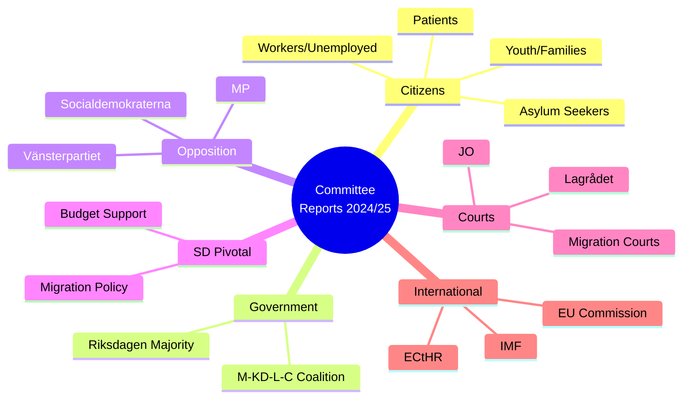

# Stakeholder Perspectives — Committee Reports 2024/25 Final Week

**Author**: James Pether Sörling | **Date**: 2026-05-01 | **Framework**: 6-Lens Stakeholder Matrix

## 6-Lens Framework

| Lens | Primary Questions |
|------|------------------|
| 1. Citizens | Direct impact on welfare, rights, cost |
| 2. Government (M-KD-L-C) | Policy delivery, electoral positioning |
| 3. Opposition (S+MP+V) | Legislative goals, 2026 campaign platform |
| 4. SD (pivotal) | Red lines, migration, order narrative |
| 5. Courts / Lagrådet | Legality, proportionality, ECHR compliance |
| 6. EU / International | State-aid, trade, European integration |

## Stakeholder Matrix

### Lens 1: Citizens

**HC01FiU20 (Economic Framework)**
- Working-age citizens: face rising unemployment as lågkonjunktur extends; government prioritises fiscal discipline over stimulus
- Homeowners: benefit from continued Riksbank rate cuts (lower mortgage rates)
- Exporters/employees at Volvo, Ericsson, SKF: uncertain; US tariff risk threatens jobs
- Sentiment: [B3] Mixed — rate relief vs. job uncertainty

**HC01FiU33 (APL Emergency Pharma)**
- Patients and care facilities: positive; pharmaceutical supply security maintained
- Taxpayers: 700 MSEK one-time cost; justified under national security logic
- Sentiment: [A2] Broadly supportive

**HC01SoU29 (Fritidskort)**
- Children/youth (6–15) from low-income families: direct positive
- Municipal recreation facilities: increased funding and demand
- Organisers of activities: administrative burden
- Sentiment: [B3] Positive for beneficiaries

**HC01SfU22 (Detention Powers)**
- Asylum seekers/detainees: significant rights restriction — glass partitions, room search
- Citizens concerned about migration: support stricter measures
- Human rights organisations: strong opposition [A1]
- Sentiment: Polarised

### Lens 2: Government (M-KD-L-C Coalition)

- **HC01FiU20**: Core delivery — demonstrates fiscal responsibility under external shock; vårproposition framework is their signature policy
- **HC01FiU33**: Unifying — national security framing crosses party lines; no controversy
- **HC01SoU29**: Political win — fritidskort shows social dimension of centre-right government
- **HC01SfU22**: Critical for SD retention; signals "tough migration management"
- **HC01FiU24**: Technical Riksbank evaluation; no electoral salience
- Overall government stance: High cohesion on FiU20/FiU33/SfU22; minor tensions on SoU29 cost

### Lens 3: Opposition (S+MP+V)

- **S (Social Democrats)**: Support APL (HC01FiU33) and fritidskort (SoU29); oppose HC01FiU20 fiscal restraint framing as inadequate stimulus; strongly oppose HC01SfU22 coercion powers
- **MP (Miljöpartiet)**: Support SoU29 youth welfare; oppose SfU22; ambivalent on FiU20 fiscal conservatism
- **V (Vänsterpartiet)**: Oppose FiU20 fiscal discipline; support SoU29; strongly oppose SfU22
- Campaign positioning: S/MP/V to campaign on 2026 election with "human rights in detention" as key differentiator on migration

### Lens 4: SD (Pivotal Supporter)

- **HC01SfU22**: Central SD priority — glass partitions, room search, tighter detention = core SD narrative. [A1]
- **HC01FiU33**: Support — national security and self-sufficiency align with SD worldview
- **HC01FiU20**: Support if fiscal restraint limits immigration-related spending
- **HC01SoU29**: Ambivalent — welfare for children broadly fine but would prefer means-testing
- **Red lines**: Any weakening of SfU22 via court order or amendment would constitute major SD grievance
- Overall SD position: [B2] Satisfied with current direction; monitoring SfU22 implementation carefully

### Lens 5: Courts and Legal Bodies

- **Lagrådet**: Likely concerns about HC01SfU22 proportionality (no confirmed referral at time of analysis); HC01FiU33 emergency procedure bypasses standard legislative scrutiny
- **Swedish Courts**: Migration courts may refer SfU22 glass-partition default to ECHR or ConstitutionCourt
- **EU Court**: APL state-aid exposure exists; Commission has broad discretion
- **JO (Parliamentary Ombudsman)**: Active monitoring of Migrationsverket detention conditions

### Lens 6: EU and International

- **EU Commission**: Concerned about HC01FiU33 state-aid compliance; otherwise neutral on domestic Swedish policy
- **ECHR Council of Europe**: Closely watching SfU22 implementation; potential intervention
- **IMF/ECB**: Monitoring Riksbank independence (HC01FiU24 evaluation) and Swedish fiscal trajectory
- **USA**: Swedish export concerns secondary to US domestic tariff politics; Sweden has no direct leverage

## Stakeholder Influence Map

