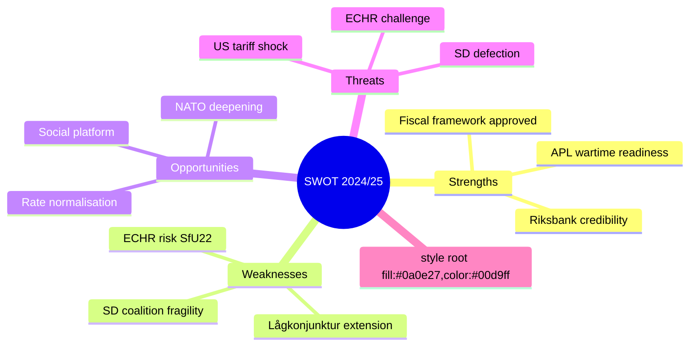

# SWOT Analysis — Committee Reports 2024/25 Final Week

**Date**: 2026-05-01 | **Methodology**: Political SWOT Framework | **Confidence**: HIGH [B2]

## Strengths

| Strength | Evidence | Admiralty | Impact |
|----------|----------|-----------|--------|
| Government fiscal framework approved by Riksdag majority | HC01FiU20 — Riksdag approved vårproposition economic guidelines 2025-06-12 | [B2] | Institutional stability, predictable fiscal path |
| Emergency pharmaceutical preparedness secured | HC01FiU33 — 700 MSEK APL capital injection approved; wartime medicine production | [A2] | Total-defence readiness, NATO obligation support |
| Riksbank credibility maintained | HC01FiU24 — FiU evaluation concludes "sammantaget god" policy performance; inflation at 1.9% KPIF 2024 | [A2] | Monetary policy independence, SEK stability |
| Broad Riksdag approval for social programme | HC01SoU29 — Fritidskort legislation; cross-party support elements | [B2] | Social cohesion, inter-generational equity |
| Migration enforcement capacity hardened | HC01SfU22 — Migrationsverket expanded powers; security at detention; effective Aug 2025 | [A2] | Rule of law enforcement, government credibility with SD bloc |

## Weaknesses

| Weakness | Evidence | Admiralty | Impact |
|----------|----------|-----------|--------|
| Extended lågkonjunktur — tariff-driven growth revision | HC01FiU20 — government revised down GDP and unemployment forecasts due to US trade policy uncertainty | [A2] | Delayed household income recovery, welfare system strain |
| SD budget dependence remains structurally fragile | AU10 vote pattern (2025-05-14) shows S abstaining, SD-Nej on some votes; any SD defection risks fiscal cliff | [B2] | Coalition stability, 2026 election risk |
| Fritidskort implementation risk | HC01SoU29 — E-hälsomyndigheten assigned new IT system; launch 8 Sep 2025 is aggressive | [B3] | Programme failure risk, political exposure |
| ECHR compliance gap at detention | HC01SfU22 — expanded body search, glass partitions — ECHR Art.5 and Art.8 tension; no Lagrådet yttrande confirmed | [B3] | Legal exposure, potential ECHR violation finding |
| Riksbank FX-model over-reliance | HC01FiU24 — FiU evaluators note "Riksbanken fäste stor vikt vid räntans effekt på växelkursen, något det finns få belägg för" | [A2] | Sub-optimal rate path, SEK mispricing risk |

## Opportunities

| Opportunity | Evidence | Admiralty | Impact |
|-------------|----------|-----------|--------|
| NATO total-defence integration deepens through APL | HC01FiU33 — pharmaceutical production capacity; aligns with NATO Article 3 resilience obligation | [B2] | Enhanced alliance credibility, Nordic defence industrial collaboration |
| Riksbank rate normalisation supports SEK | HC01FiU24 — faster rate cuts supported by FiU; policy rate reduction trajectory | [B2] | Business investment, housing market stabilisation |
| Social platform for 2026 election (fritidskort) | HC01SoU29 — visible social investment; 400K+ children benefiting | [B3] | Electoral positioning, moderate voter retention |
| Bankruptcy modernisation boosts business climate | HC01CU18 — effective July 2026; tingsrätt role reduction; modern insolvency | [C3] | Enterprise recovery, creditor confidence |

## Threats

| Threat | Evidence | Admiralty | Impact |
|--------|----------|-----------|--------|
| US tariff escalation deepens Swedish export shock | HC01FiU20 — government acknowledged trade policy uncertainty in vårproposition; revised growth down | [A2] | Export-led recession risk; Volvo, Ericsson, SKF exposure |
| ECHR challenge to SfU22 detention measures | HC01SfU22 — ECHR Art.5 (liberty), Art.8 (private life); no Lagrådet yttrande confirmed | [B3] | Political embarrassment, legislative reversal, EU credibility |
| E-hälsomyndigheten IT failure for fritidskort | HC01SoU29 — new national IT system; tight timeline | [C3] | Programme credibility damage, political backlash |
| APL EU state-aid scrutiny | HC01FiU33 — 700 MSEK injection to state-owned entity; EU competition rules | [C3] | Delayed implementation, reduced defence readiness |
| SD withdrawal from budget support | AU10 vote data — SD-Nej on labour market matters; SD priorities diverge on some fiscal questions | [B3] | Government fall scenario before 2026 election |

## TOWS Matrix

| | Strengths | Weaknesses |
|---|-----------|------------|
| **Opportunities** | SO: Use APL strength + NATO opportunity to deepen Nordic defence industrial ties; Use Riksbank credibility + rate normalisation to attract investment | WO: Address Riksbank FX over-reliance through clearer policy communication; Use fritidskort as social narrative while fixing E-hälsomyndigheten implementation |
| **Threats** | ST: Use fiscal framework approval to demonstrate stability against tariff uncertainty; Use migration enforcement credibility to maintain SD support | WT: Avoid ECHR legal exposure on SfU22 through proactive JO engagement; Mitigate APL EU state-aid risk through advance notification |

## Cross-SWOT Theme: Total-Defence Mainstreaming

The pattern across FiU33, SfU22, and the FiU20 economic framework is the weaponisation of "total defence" as a legitimising frame. APL = medicine security = wartime readiness. Detention hardening = border control = national security. This frame generates cross-party appeal while embedding SD security priorities into mainstream Swedish state capacity.

