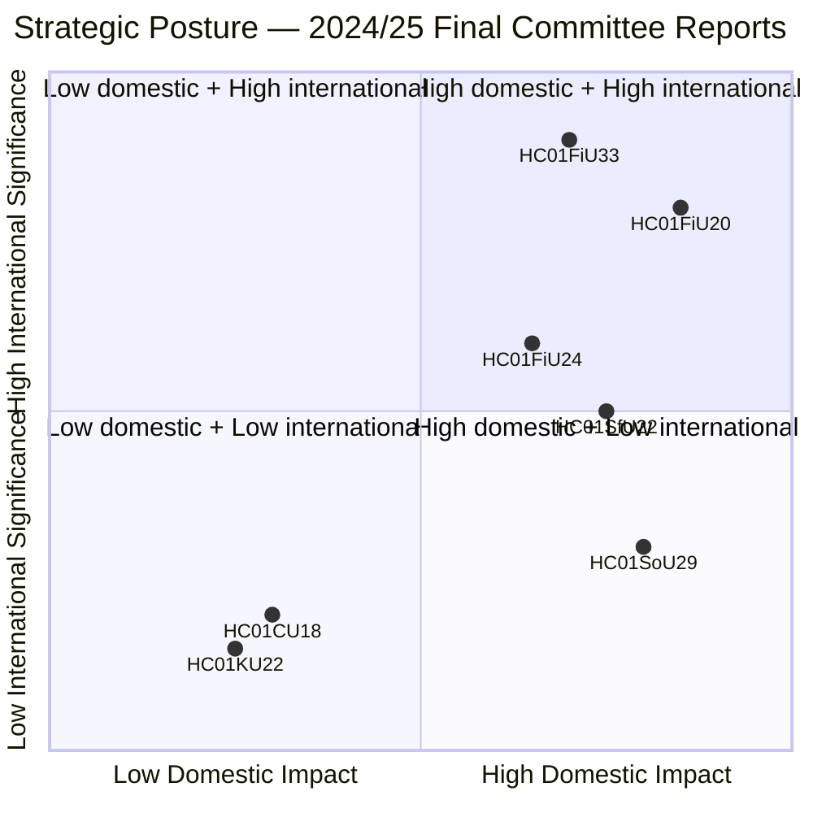

# Synthesis Summary — Riksdag Committee Reports 2024/25 Final Week

**Author**: James Pether Sörling | **Date**: 2026-05-01 | **Confidence**: HIGH [B2]

## Lead Story

The Riksdag's final week of the 2024/25 riksmöte (June 2025) crystallised Sweden's dual-track strategic posture: **total-defence preparedness** (APL pharmaceutical stockpiling, detention security hardening) running in parallel with **constrained economic recovery** (below-trend GDP growth, extended lågkonjunktur, delayed household income gains). The Finance Committee's endorsement of the economic policy framework (HC01FiU20) is the most politically significant output — it formally ratifies the government's revised, more pessimistic macroeconomic projections and endorses continued fiscal caution while acknowledging that US tariff escalation has pushed back Sweden's recovery timeline.

## DIW-Weighted Document Ranking

| Rank | dok_id | DIW Weight | Rationale |
|------|--------|-----------|-----------|
| 1 | HC01FiU20 | L3 Intelligence-grade | Sets entire fiscal framework; approved by Riksdag; major economic direction document |
| 2 | HC01FiU33 | L2+ Priority | 700 MSEK emergency capital; wartime readiness; unusual emergency procedure |
| 3 | HC01SfU22 | L2+ Priority | ECHR-sensitive expansion of coercive powers; migration/security nexus |
| 4 | HC01FiU24 | L2 Strategic | Riksbank accountability; rate outlook; transparency critique |
| 5 | HC01SoU29 | L2 Strategic | Major social programme rollout; 400K+ children benefiting; implementation risk |
| 6 | HC01KU22 | L1 Surface | Government defeated on minor budget classification; limited direct impact |
| 7 | HC01CU18 | L1 Surface | Bankruptcy modernisation; effective 2026 |
| 8 | HC01TU15 | L1 Surface | Maritime environmental follow-up |
| 9 | HC01SkU18 | L1 Surface | F-skatt withdrawal rules |
| 10 | HC01KU21 | L1 Surface | Annual tillkännagivanden follow-up |

## Integrated Intelligence Picture

**Economic track**: Sweden's Tidö government is navigating the tightest macro environment since 2009. The spring 2025 vårproposition revised down GDP and employment forecasts due to US tariff uncertainty. The Finance Committee's approval (HC01FiU20) confirms the Riksdag majority holds for the government's three-pillar framework: household support (tax relief, energy cost mitigation), labour market (reducing unemployment from ~9% projection), and growth/investment (business climate, deregulation). The M-KD-L government survives on SD budget dependence — a structurally fragile configuration entering an election year (2026).

**Defence/preparedness track**: The APL capital injection (HC01FiU33) is a direct expression of Sweden's post-NATO-accession posture. APL (Apotek Produktion & Laboratorier) is the only Swedish manufacturer of certain critical medicines. The 700 MSEK injection enables acquisition of an additional manufacturing unit to ensure supply continuity in crisis and wartime. This decision, alongside Riksdag committee approval, signals near-consensus on total-defence medicine preparedness. The M+KD+L+C government majority passed this; SD likely voted in favour given their national security alignment.

**Migration/security track**: HC01SfU22's expansion of coercive powers at Migrationsverket detention facilities represents the continuation of Sweden's post-2015 hardening of migration enforcement. The new measures — body searches without consent trigger, glass-partition visits, enhanced room searches — will face legal scrutiny under ECHR Article 5 (liberty) and Article 8 (private life). The measure enters force 1 August 2025, well ahead of the 2026 election, giving SD and the government maximum political benefit from visible enforcement.

**Social investment track**: HC01SoU29's fritidskort represents the government's attempt to maintain a social policy "balance" to the security/migration moves. 400,000+ children from households qualifying for economic support will receive a card enabling participation in sports, culture, and outdoor activities. E-hälsomyndigheten's new administrative role creates implementation risk; the September 2025 launch date is ambitious.

## Integrated Mermaid: Sweden's Strategic Posture Matrix

## Key Patterns

1. **Coalition arithmetic dependency**: Every major approval (FiU20, FiU33, SfU22, SoU29) relies on M+KD+L+C with SD either supporting or abstaining. HC01KU22 rejection is a rare government defeat — KU cross-party opposition to budget classification change.
2. **Total-defence mainstreaming**: The APL emergency budget and SfU detention hardening are both positioned as national security measures — expanding the definition of total-defence to include pharmaceutical supply chains and migration enforcement.
3. **Riksbank independence affirmed**: FiU's positive evaluation preserves institutional credibility even while criticising specific modelling choices.
