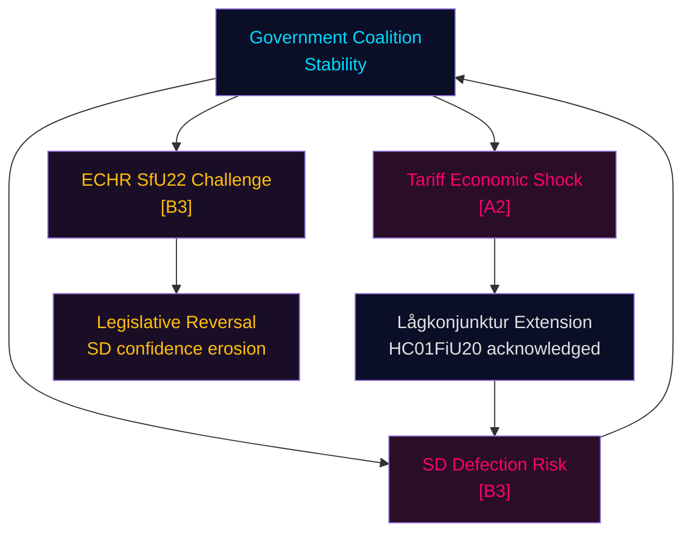

# Threat Analysis — Committee Reports 2024/25 Final Week

**Author**: James Pether Sörling | **Date**: 2026-05-01 | **Framework**: Political Threat Taxonomy

## Threat Actor Matrix

| Actor | Threat Type | Target | Capability | Intent |
|-------|------------|--------|-----------|--------|
| US Trump Administration | Trade Policy | Swedish export economy (Volvo, Ericsson, SKF) | High — tariff authority | Moderate |
| ECtHR / Civil society | Legal Challenge | HC01SfU22 detention coercion | High — binding jurisprudence | Medium |
| Sverigedemokraterna (SD) | Political Leverage | Budget majority stability | High — 73-seat pivotal bloc | Moderate |
| EU Commission (DG COMP) | State Aid Review | APL 700 MSEK injection | Medium — TFEU Art.108 | Low |
| Russia/hybrid actors | Information Operations | Swedish defence narrative | Medium — disinformation | High |

## Political Threat Taxonomy

### Category A — Existential Political Threats
**A1: Coalition Collapse via SD Defection**
SD holds budget pivotal power. If M-KD-L-C introduces measures perceived as weakening Sweden's migration enforcement (e.g., court orders modifying SfU22 implementation), SD could condition budget support on compensation measures. Evidence: AU10 vote 2025-05-14 shows SD-Nej pattern on some labour market votes. [B3]

### Category B — Institutional/Legal Threats
**B1: ECHR SfU22 Challenge**
The extension of body-search, room-search, and glass-partition measures at Migrationsverket detention facilities creates a credible ECHR Article 5, 8 challenge vector. Similar Danish measures have been challenged. Timeline: complaint window opens August 2025, ECtHR admissibility decision likely 2026–2027. [B3]

**B2: APL EU State Aid**
700 MSEK capital injection to state-owned APL under emergency procedure (extra ändringsbudget) without full EU pre-notification creates exposure. Government likely relies on TFEU Art.107(3)(b) "important project of common European interest" carve-out or Article 107(2)(b) "natural disaster" analogy for wartime scenarios. Uncertain. [C3]

### Category C — Economic Threats
**C1: US Tariff Shock**
Sweden's trade exposure is significant: goods exports ~46% GDP (SCB). Major exporters — Volvo, Ericsson, SKF, Atlas Copco — face US tariff risk. HC01FiU20 formally acknowledges this risk and the resulting lågkonjunktur extension. IMF WEO Apr-2026 flags trade fragmentation as primary global downside. [A2]

### Category D — Implementation Threats
**D1: Fritidskort E-hälsomyndigheten System**
New national registry and card administration system. Launch September 2025. Risk of IT procurement failure or system overload. Evidence: SoU29 assigns new mandatory IT functions to E-hälsomyndigheten; no prior large-scale fritidskort system exists. [C3]

## Mermaid: Threat Map

## MITRE-Style TTP Mapping

| TTP-ID | Tactic | Technique | Relevant to |
|--------|--------|-----------|-------------|
| TTP-01 | Narrative Manipulation | Frame APL injection as state overreach | HC01FiU33 opposition narrative |
| TTP-02 | Legal Exploitation | ECHR Art.5/8 complaint filing | HC01SfU22 |
| TTP-03 | Fiscal Leverage | SD conditions budget on migration reciprocity | HC01FiU20 coalition |
| TTP-04 | Procedural Delay | Committee obstruction on fritidskort implementation regulations | HC01SoU29 |
