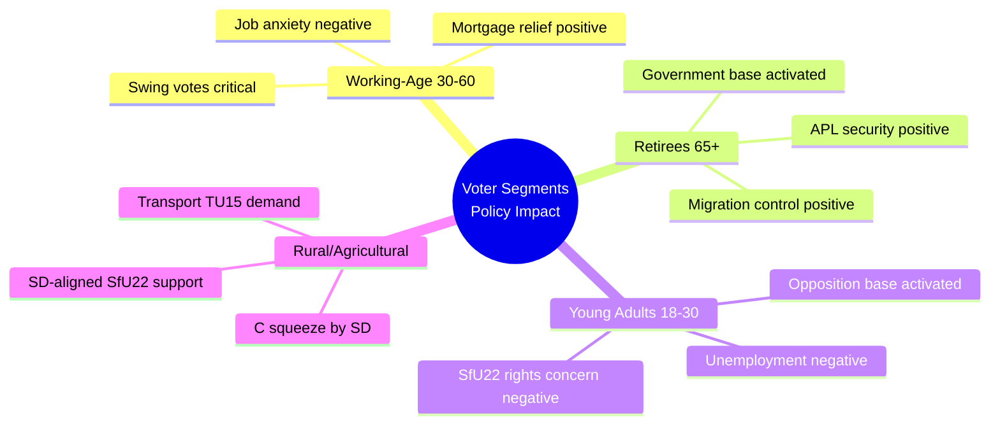

# Voter Segmentation Analysis — Committee Reports 2024/25

**Author**: James Pether Sörling | **Date**: 2026-05-01 | **Framework**: Demographic and Regional Segmentation

## Segmentation Framework

Committee report portfolio impacts distributed across voter segments. Analysis identifies which segments are activated, mobilised, or demobilised by the 2024/25 betänkanden.

## Demographic Segments

### Segment 1: Working-Age Employed (30–60)
**Size**: ~2.5 million voters | **Party affiliation**: Split M/S/C/L

**Policy impact**:
- HC01FiU20: Wage growth constrained by lågkonjunktur; employment uncertainty at export-oriented firms
- HC01FiU24: Lower mortgage rates (Riksbank cuts) provide direct benefit for homeowners in this segment
- HC01SoU29: Fritidskort benefits children in this segment

**Electoral activation**: MODERATE — economic anxiety activates some toward S; mortgage relief activates some toward government continuation. Net: slight demobilisation of decisive swing voters.

**Admirable coding**: [B3]

### Segment 2: Retirees (65+)
**Size**: ~1.8 million voters | **Party affiliation**: M/KD-leaning

**Policy impact**:
- HC01FiU20: Stable pensions (indexed) under fiscal discipline
- HC01FiU33: APL supply security directly relevant (care facility medications)
- HC01SfU22: Approve of stricter migration enforcement

**Electoral activation**: HIGH for government base — APL and SfU22 both resonate strongly. This segment is disproportionately mobilised by migration and security messaging.

### Segment 3: Young Adults (18–30)
**Size**: ~1.0 million voters | **Party affiliation**: MP/S/V-leaning

**Policy impact**:
- HC01FiU20: Rising unemployment disproportionately affects entry-level workers
- HC01SfU22: Strong negative reaction among rights-conscious young voters
- HC01SoU29: Fritidskort benefits their younger siblings; may positively influence family perception

**Electoral activation**: HIGH for opposition — SfU22 rights concerns may mobilise MP and V base, particularly urban youth.

### Segment 4: Rural and Agricultural Communities
**Size**: ~0.8 million voters | **Party affiliation**: C/SD-leaning

**Policy impact**:
- HC01TU15: Transport infrastructure — rural connectivity is key C platform
- HC01FiU20: Trade impact on agricultural exports modest but relevant
- HC01SfU22: Support for stricter migration enforcement in rural communities (SD strongholds)

**Electoral activation**: MODERATE-HIGH for SD in rural; C may face squeeze from SD.

### Segment 5: Immigrant Communities and Asylum Seekers (non-voting but policy-affected)
**Size**: ~0.5 million residents | Indirect electoral impact via advocacy

**Policy impact**:
- HC01SfU22: Direct and severe negative impact — glass partitions, room searches, coercive powers
- HC01FiU20: Economic integration affected by lågkonjunktur

**Electoral activation**: N/A (non-voting) but drives human rights advocacy that influences MP and V platforms. Media amplification effect significant.

## Regional Segments

| Region | Key Issue from Portfolio | Party Tendency | Electoral Relevance |
|--------|-------------------------|----------------|---------------------|
| Stockholm | Riksbank/mortgage rates (FiU24); employment (FiU20) | M/L/MP | High swing — many floating voters |
| Gothenburg | Volvo/manufacturing tariff exposure (FiU20) | S/M split | High — large employer concentration |
| Malmö | Migration policy (SfU22); social welfare (SoU29) | S/SD competition | Very high — pivotal regional battle |
| Norrland/Rural | Transport (TU15); pharmaceutical supply (FiU33) | SD/C | High for SD consolidation |
| University cities | Rights concerns (SfU22); climate-economy balance | MP/V/S | High for opposition mobilisation |

## Segmentation Map

## Key Intelligence Finding

The 2024/25 portfolio has a polarising effect on the electorate. Measures that strengthen the government's base (SfU22 → retirees and rural SD voters; APL → all segments via security framing) simultaneously alienate progressive voters (SfU22 → young urban). This reflects a deliberate electoral strategy: shore up the coalition's existing voters rather than chase swing votes. The fritidskort (SoU29) is the only cross-cutting measure designed to appeal to swing parents. [B2]
