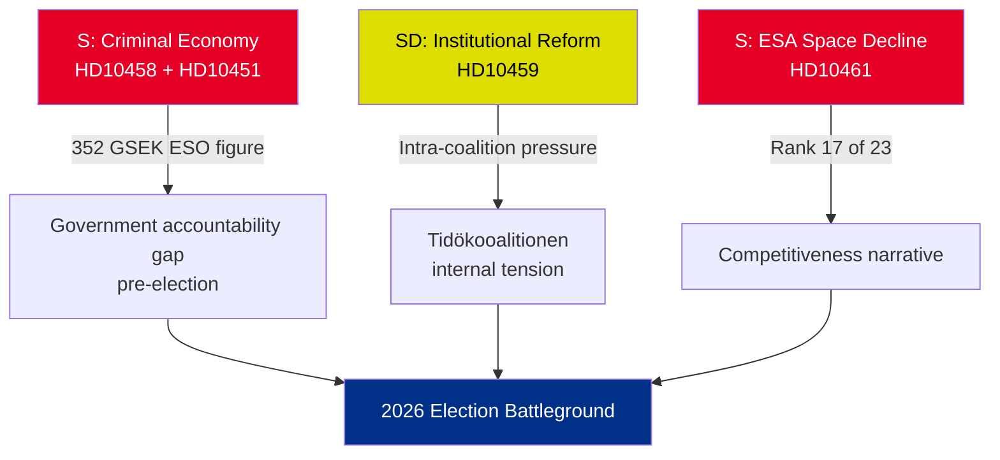
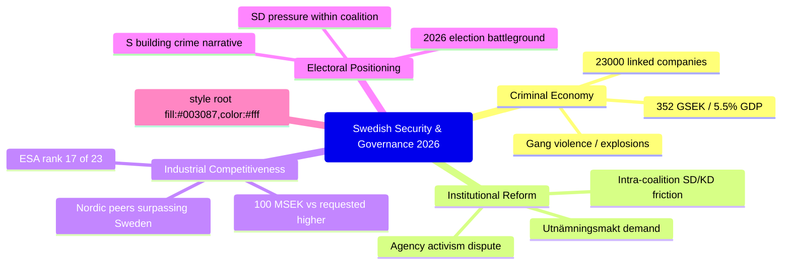
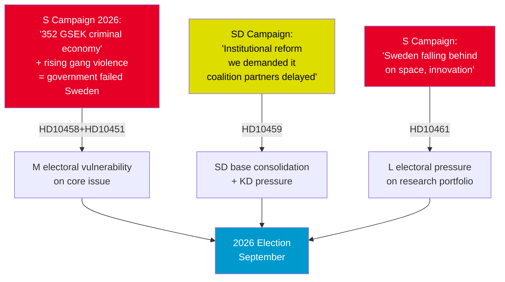
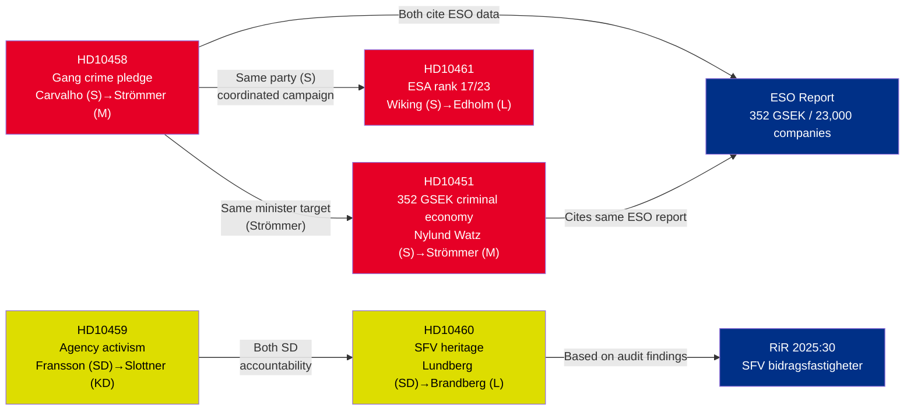

## Executive Brief
<!-- source: executive-brief.md :: https://github.com/Hack23/riksdagsmonitor/blob/main/analysis/daily/2026-05-01/interpellations/executive-brief.md -->

**BLUF (Bottom Line Up Front)**: Five interpellations filed 22-30 April 2026 reveal three converging crises — Sweden's criminal economy (352 GSEK/5.5% GDP), gang violence accountability, and declining space-sector competitiveness — all arriving simultaneously in the pre-election political calendar. Opposition S and governing SD are using interpellations to shape the summer-2026 election narrative.

### Immediate Decisions Required

1. **Justice Minister Strömmer (M)**: Must operationalise "eradicate gang crime in 4 years" before HD10458 answer-date 2026-05-19 — or face credibility damage going into election campaign
2. **Minister Edholm (L)**: Must explain Sweden's fall to rank 17 in ESA before HD10461 answer-date 2026-05-19 — with Rymdstyrelsen requesting significantly more than allocated 100 MSEK
3. **Civil Minister Slottner (KD)**: Must respond to SD's constitutional reform demand (utnämningsmakt to Riksdag) by 2026-05-20 — response will signal intra-coalition SD accommodation tolerance

### Significance Summary

| dok_id | Topic | DIW Score | Priority |
|--------|-------|-----------|----------|
| HD10458 | Gang crime eradication pledge | 8/10 | L2+ Priority |
| HD10451 | Criminal economy 352 GSEK | 7/10 | L2 Strategic |
| HD10461 | ESA/space funding decline | 7/10 | L2 Strategic |
| HD10459 | Agency activist reform demand | 6/10 | L2 Strategic |
| HD10460 | SFV bidragsfastigheter (RiR 2025:30) | 5/10 | L3 Operational |

### Key Strategic Dynamic



### Time-Critical Indicators

- **2026-05-19**: Strömmer (gang) + Edholm (space) respond — highest-visibility dates
- **2026-05-20**: Slottner (agency activism) responds — coalition tensions visible
- **2026-05-21**: Brandberg (SFV) responds — lowest visibility

**Assessment**: The convergence of HD10458 + HD10451 creates the most dangerous opposition challenge for the government: a coherent "352 GSEK criminal economy + rising violence + government without tools" narrative that is independently sourced (ESO) and verifiable.

---

---

## Reader Intelligence Guide

Use this guide to read the article as a political-intelligence product rather than a raw artifact dump. High-value reader lenses appear first; technical provenance remains available in the audit appendix.

| Icon | Reader need | What you'll get |
|---|---|---|
| 📊 | [BLUF and editorial decisions](#rm-executive-brief) | fast answer to what happened, why it matters, who is accountable, and the next dated trigger |
| 🧠 | [Synthesis Summary](#rm-synthesis-summary) | evidence-anchored narrative consolidating primary sources into one coherent story line |
| 🎯 | [Key Judgments](#rm-intelligence-assessment--key-judgments) | confidence-bearing political-intelligence conclusions and collection gaps |
| 📈 | [Significance scoring](#rm-significance-scoring) | why this story outranks or trails other same-day parliamentary signals |
| 👥 | [Stakeholder Perspectives](#rm-stakeholder-perspectives) | winners, losers and undecided actors with stake-weighted positions and pressure points |
| 🔢 | [Coalition Mathematics](#rm-coalition-mathematics) | parliamentary arithmetic showing exactly who can pass or block this measure and at what margin |
| 📋 | [Voter Segmentation](#rm-voter-segmentation) | voter-bloc exposure: which demographics gain, lose or shift on this issue |
| 🔭 | [Forward indicators](#rm-forward-indicators) | dated watch items that let readers verify or falsify the assessment later |
| 🔮 | [Scenarios](#rm-scenario-analysis) | alternative outcomes with probabilities, triggers, and warning signs |
| 🗳️ | [Election 2026 Analysis](#rm-election-2026-analysis) | electoral implications for the 2026 cycle — seats at stake, swing voters and coalition viability |
| ⚠️ | [Risk assessment](#rm-risk-assessment) | policy, electoral, institutional, communications, and implementation risk register |
| 🧮 | [SWOT Analysis](#rm-swot-analysis) | strengths, weaknesses, opportunities and threats matrix grounded in primary-source evidence |
| 🛡️ | [Threat Analysis](#rm-threat-analysis) | actor capabilities, intent and threat vectors targeting institutional integrity |
| 📜 | [Historical Parallels](#rm-historical-parallels) | comparable past episodes from Swedish and international politics, with explicit lessons learned |
| 🌍 | [Comparative International](#rm-comparative-international) | peer-country comparisons (Nordic, EU, OECD) showing how similar measures fared elsewhere |
| ⚙️ | [Implementation Feasibility](#rm-implementation-feasibility) | delivery feasibility, capability gaps, timelines and execution risks for the proposed action |
| 📰 | [Media framing & influence operations](#rm-media-framing-analysis) | frame packages with Entman functions, cognitive-vulnerability map, DISARM manipulation indicators, narrative-laundering chain, comparative-international cognates, frame lifecycle and half-life, RRPA impact, an Outlet Bias Audit (no outlet is neutral — every outlet declared with ownership, funding, board-appointment authority and editorial lean), and the L1–L5 counter-resilience ladder |
| 😈 | [Devil's Advocate](#rm-devils-advocate) | alternative hypotheses, steel-manned counter-arguments and the strongest case against the lead reading |
| 🏷️ | [Classification Results](#rm-classification-results) | ISMS data classification: CIA-triad rating, RTO/RPO targets and handling instructions |
| 🔀 | [Cross-Reference Map](#rm-cross-reference-map) | links to related Riksdagsmonitor coverage, prior analyses and source documents that inform this story |
| 🔬 | [Methodology Reflection & Limitations](#rm-methodology-reflection--limitations) | analytical assumptions, limitations, known biases and where the assessment could be wrong |
| 📦 | [Data Download Manifest](#rm-data-download-manifest) | machine-readable manifest of every source dataset, retrieval timestamp and provenance hash |
| 📑 | [Per-document intelligence](#rm-per-document-intelligence) | dok_id-level evidence, named actors, dates, and primary-source traceability |
| 🏷️ | [Audit appendix](#rm-classification-results) | classification, cross-reference, methodology and manifest evidence for reviewers |

## Synthesis Summary
<!-- source: synthesis-summary.md :: https://github.com/Hack23/riksdagsmonitor/blob/main/analysis/daily/2026-05-01/interpellations/synthesis-summary.md -->

### Lead Story

**Sweden's Security Crisis Converges: Gang Violence, Criminal Economy, and Institutional Erosion**

The five interpellations filed on or around 1 May 2026 reveal a Sweden confronting overlapping security and institutional challenges — all becoming political battlegrounds as the 2026 election campaign begins to take shape. Justice Minister Strömmer faces accountability for the most politically explosive pledge in recent Swedish politics ("eradicate gang crime in 4 years"), while economic data from ESO places the criminal economy at 352 billion SEK — 5.5% of GDP, with 23,000 companies linked to criminal networks.

### DIW-Weighted Significance Ranking

1. **HD10458** (DIW 8/10) — Gang crime eradication pledge: Highest-stakes accountability question; "eradicate in 4 years" is a concrete, falsifiable commitment made to national media
2. **HD10451** (DIW 7/10) — Criminal economy 352 GSEK: Structural, ESO-sourced, systemic governance failure claim
3. **HD10461** (DIW 7/10) — ESA/space funding decline: Concrete metric (rank 17/23), national security + industrial competitiveness
4. **HD10459** (DIW 6/10) — Agency activism reform: Constitutional dimension, intra-coalition SD/KD tension
5. **HD10460** (DIW 5/10) — SFV heritage properties (RiR 2025:30): Niche but Riksrevisionen-anchored accountability

### Cross-Cutting Themes



### Opposition Coordination Signal

S has filed two justice-focused interpellations within 7 days (HD10451 filed 22 April, HD10458 filed 29 April), targeting the same minister (Strömmer) with complementary narratives. This is a coordinated parliamentary strategy, not random activity. Expected pattern: S will connect these interpellations in media commentary and election campaign materials.

### Government Risk Assessment

The government (Tidökoalitionen: M+KD+L+SD support) faces maximum exposure on HD10458. Any Strömmer answer that cannot define measurable milestones for "eradication" will be characterised as political posturing. The ESO 352 GSEK figure (endorsed by expert body) is not dismissible — it will anchor the criminal economy narrative through summer 2026.

---

## Intelligence Assessment — Key Judgments
<!-- source: intelligence-assessment.md :: https://github.com/Hack23/riksdagsmonitor/blob/main/analysis/daily/2026-05-01/interpellations/intelligence-assessment.md -->

**ICD 203 Standard | Analytic Confidence Ratings**

### Key Judgments

**KJ-1** [HIGH CONFIDENCE]: The opposition Social Democrats have launched a coordinated parliamentary accountability campaign targeting Justice Minister Strömmer on gang crime and the criminal economy, designed to generate election campaign material for autumn 2026.

*Evidence*: Two interpellations to same minister within 7 days (HD10451: 22 April; HD10458: 29 April); both cite ESO-rapport; both use verifiable figures (352 GSEK, 23,000 companies); both demand operationalisation of government promises. Pattern indicates deliberate coordination, not coincidence.

**KJ-2** [MODERATE CONFIDENCE]: The government will struggle to provide substantive answers to HD10458 ("eradicate gang crime in 4 years") without revealing either that (a) no specific plan exists, or (b) the plan relies on measures that are multi-year and whose success cannot be guaranteed before 2030.

*Evidence*: "Eradicate" is an absolute promise made in national media (Aftonbladet, 20 April 2026). Existing criminal economy data (352 GSEK, 23,000 companies) demonstrates the scale of the challenge. Government has not publicly operationalised "eradication." Criminal violence records (explosions, shootings) have continued in 2026.

**KJ-3** [HIGH CONFIDENCE]: Sweden's deterioration to rank 17 of 23 ESA members represents a structural, multi-year decline that will not be reversed by the 100 MSEK allocation alone, and will continue to generate criticism from the research and defence-industrial communities.

*Evidence*: Rymdstyrelsen requested more than 100 MSEK; ESA total budget rose 31% while Sweden remained flat/declined; Nordic peers (Denmark, Norway, Finland) now rank higher. The gap will widen absent a significant budget intervention.

**KJ-4** [LOW-MODERATE CONFIDENCE]: SD's constitutional reform demand (utnämningsmakt to Riksdag, per HD10459) will not achieve legislative progress in the current parliamentary term, but will create visible KD/SD tension that may complicate coalition negotiations post-2026 election.

*Evidence*: Moving utnämningsmakt requires broad consensus and potentially constitutional reform. KD's Slottner is unlikely to agree to this in his response. SD will interpret a non-committal response as further evidence of insufficient reform from coalition partners.

### Priority Intelligence Requirements (PIRs)

1. **PIR-1**: What specific milestones and enforcement mechanisms does Strömmer plan to use to operationalise "eradicate gang crime in 4 years"?
2. **PIR-2**: Will the government propose supplementary funding for Rymdstyrelsen in the Autumn 2026 budget or VÅP (Vårändringspropositionen)?
3. **PIR-3**: How will KD's Slottner respond to SD's utnämningsmakt demand — what is the coalition's agreed position?
4. **PIR-4**: Will the ESO criminal economy report generate legislative proposals before the 2026 election?

### Analytic Confidence Framework

| Confidence Level | Definition (ICD 203) | Applied |
|-----------------|---------------------|---------|
| HIGH | Strong evidence; multiple corroborating sources; limited logical gaps | KJ-1, KJ-3 |
| MODERATE | Moderate evidence; some gaps but reasonable inference | KJ-2 |
| LOW-MODERATE | Limited direct evidence; logical extrapolation from patterns | KJ-4 |

---

---

## Significance Scoring
<!-- source: significance-scoring.md :: https://github.com/Hack23/riksdagsmonitor/blob/main/analysis/daily/2026-05-01/interpellations/significance-scoring.md -->

### DIW Scoring Methodology

Documents scored on three dimensions: **D**emocratic significance (accountability, constitutional), **I**ntelligence value (evidence quality, new information), **W**eight (political salience, election relevance). Scale 1-10.

### Scoring Table

| dok_id | D | I | W | Total DIW | Priority Tier |
|--------|---|---|---|-----------|---------------|
| HD10458 | 3 | 2.5 | 2.5 | **8.0** | L2+ Priority |
| HD10451 | 2.5 | 2.5 | 2 | **7.0** | L2 Strategic |
| HD10461 | 2 | 2.5 | 2.5 | **7.0** | L2 Strategic |
| HD10459 | 2.5 | 1.5 | 2 | **6.0** | L2 Strategic |
| HD10460 | 1.5 | 2 | 1.5 | **5.0** | L3 Operational |

### Scoring Rationale

#### HD10458 — Gang Crime Eradication Pledge (8.0)
- **D (3.0/3)**: Direct accountability demand on explicit minister pledge; challenges government credibility on Sweden's #1 security concern
- **I (2.5/3)**: New ESO data (350 GSEK), specific media citation (Aftonbladet 20 April); record violence statistics 2025-2026
- **W (2.5/4)**: Highest public salience pre-election; gang violence dominates Swedish media discourse; "eradication" is uniquely falsifiable

#### HD10451 — Criminal Economy 352 GSEK (7.0)
- **D (2.5/3)**: Systemic governance challenge; 23,000 companies = structural state failure; complements HD10458
- **I (2.5/3)**: ESO-sourced, independently verified; 5.5% GDP magnitude; 23,000 company links are new data points
- **W (2.0/4)**: High but narrower public salience than HD10458; economic crime less emotionally salient than violence

#### HD10461 — ESA/Space Funding Decline (7.0)
- **D (2.0/3)**: Government funding accountability; science policy; national security dimension
- **I (2.5/3)**: Concrete comparator (rank 17/23); 31% ESA budget increase while Sweden declined; Rymdstyrelsen request vs allocation gap
- **W (2.5/4)**: Defence-industrial community concern; Nordic comparison; 2026 election competitiveness narrative

#### HD10459 — Agency Activism (6.0)
- **D (2.5/3)**: Constitutional dimension (utnämningsmakt); democratic theory about administrative state
- **I (1.5/3)**: Ideological framing ("institutionaliserad korruption"); limited new empirical data
- **W (2.0/4)**: Important for SD voter base; limited mainstream salience; intra-coalition diagnostic

#### HD10460 — SFV Heritage Properties (5.0)
- **D (1.5/3)**: Government agency oversight; Riksrevisionen-anchored accountability
- **I (2.0/3)**: RiR 2025:30 provides credible evidence base; specific findings on SFV
- **W (1.5/4)**: Niche stakeholder concern; limited electoral salience

---

## Per-document intelligence

### HD10451
<!-- source: documents/HD10451-analysis.md :: https://github.com/Hack23/riksdagsmonitor/blob/main/analysis/daily/2026-05-01/interpellations/documents/HD10451-analysis.md -->

**dok_id**: HD10451  
**Interpellation**: 2025/26:451  
**Inlämnad av**: Ingela Nylund Watz (S)  
**Till**: Justitieminister Gunnar Strömmer (M)  
**Datum**: 2026-04-22  
**Anmäld**: 2026-04-23  
**Status**: Inlämnad / Anmäld  

### Analytical Summary

Ingela Nylund Watz (S) challenges Justice Minister Gunnar Strömmer (M) on Sweden's criminal economy — citing ESO-rapport findings:

- Criminal networks control assets worth **352 billion SEK** (approx. 5.5% of Swedish GDP)
- Over **23,000 companies** have been identified as linked to criminal networks
- Criminal operations span drugs, human trafficking, extortion, fraud
- ESO concludes Sweden has "no effective tools" to break criminal economic power
- Existing regulation (Finanspolisen, Skatteverket, Bolagsverket) insufficient to tackle scale

### Strategic Significance (L2 Strategic)

**Priority tier**: L2 Strategic — systemic economic security threat  

The ESO figure of 352 GSEK (5.5% GDP) is landmark evidence of criminal-economic penetration at a level that represents a systemic threat to Sweden's rule of law. The 23,000 companies figure reveals infiltration into legitimate business sector, tax system, and public procurement. Together with HD10458 (gang violence), these two S interpellations build a coherent opposition case around structural government failure on organised crime.

### Key Actors

| Actor | Role | Position |
|-------|------|----------|
| Ingela Nylund Watz (S) | Interpellant | Demands government explain lack of tools against criminal economy |
| Gunnar Strömmer (M) | Justice Minister | Must defend existing measures vs ESO findings |
| ESO (Expertgruppen) | Research body | Core source: 352 GSEK criminal economy, 23,000 companies |
| Finanspolisen / Skatteverket / Bolagsverket | Agencies | Insufficient tools per ESO |

### Electoral/Coalition Implications

HD10451 + HD10458 form a strategic pairing by S's justice spokespersons — one on criminal violence, one on criminal economics. Together they demand the government answer not only "are you stopping the violence" but "are you dismantling the economic infrastructure of crime." The ESO figures are independently sourced and difficult to dismiss, making this interpellation strong election-season ammunition for S.

### Forward Indicators

- **2026 Budget**: Will government propose new tools (asset forfeiture, company dissolution powers)?
- **ESO follow-up**: Report likely to generate media coverage through summer 2026
- **European comparison**: EU's 2024 Organised Crime Directive may create compliance pressure

### Source

URL: https://data.riksdagen.se/dokument/HD10451  
Retrieved: 2026-05-01T07:21:00Z

### HD10458
<!-- source: documents/HD10458-analysis.md :: https://github.com/Hack23/riksdagsmonitor/blob/main/analysis/daily/2026-05-01/interpellations/documents/HD10458-analysis.md -->

**dok_id**: HD10458  
**Interpellation**: 2025/26:458  
**Inlämnad av**: Teresa Carvalho (S)  
**Till**: Justitieminister Gunnar Strömmer (M)  
**Datum**: 2026-04-29  
**Anmäld**: 2026-04-30  
**Svarsdatum**: 2026-05-19 (planerat)  
**Sista svarsdatum**: 2026-05-20  
**Status**: Inlämnad / Anmäld  

### Analytical Summary

Teresa Carvalho (S) challenges Justice Minister Gunnar Strömmer (M) to define concrete measures behind the government's stated promise (Aftonbladet, 20 April 2026) to **eradicate gang criminality within four years**.

Facts cited in interpellation (all require evidence verification):
- Record levels of explosions in 2025 (previous year)
- Average one explosion/shooting every two days in 2026 so far
- Criminal economy estimated at **350 billion SEK annually** (ESO-rapport)
- Organised crime penetrating business sector and welfare system
- Gang systematic youth recruitment "skenat" (accelerated)

### Strategic Significance (L2+ Priority)

**Priority tier**: L2+ Priority — highest domestic security topic  

This interpellation exposes the government's accountability deficit on its most politically salient promise. Strömmer's Aftonbladet declaration creates a quantifiable commitment that S will track monthly through 2026 election campaign:
- "Utrota" (eradicate) is an absolute claim — any residual gang activity becomes election ammunition
- The criminal economy figure (350 MSEK per ESO) is nearly double previous Brå estimate (150 MSEK)
- Government has no clear operationalisation of "eradication"

### Key Actors

| Actor | Role | Position |
|-------|------|----------|
| Teresa Carvalho (S) | Interpellant | Holds government accountable for "eradication" promise |
| Gunnar Strömmer (M) | Justice Minister | Must operationalise what "eradication in 4 years" means |
| ESO (Expertgruppen för studier i offentlig ekonomi) | Research body | Estimated 352 GSEK criminal economy |
| Brå | Crime statistics | Earlier estimate: 150 GSEK |

### Electoral/Coalition Implications

The 350 GSEK criminal economy figure (ESO-rapport, cited in both HD10458 and HD10451) creates a joint opposition narrative around economic crime — Carvalho focuses on gang violence, Nylund Watz (HD10451) on corporate crime tools. Together they form a coherent "government passive on economic crime" opposition platform pre-2026 election.

### Forward Indicators

- **2026-05-19**: Minister response date
- **2026-05-20**: Sista svarsdatum  
- **Löpande 2026**: S will benchmark explosions/shootings data monthly vs "eradication" pledge
- **Election autumn 2026**: Security narrative — central battleground

### Source

URL: https://data.riksdagen.se/dokument/HD10458  
Retrieved: 2026-05-01T07:21:00Z

### HD10459
<!-- source: documents/HD10459-analysis.md :: https://github.com/Hack23/riksdagsmonitor/blob/main/analysis/daily/2026-05-01/interpellations/documents/HD10459-analysis.md -->

**dok_id**: HD10459  
**Interpellation**: 2025/26:459  
**Inlämnad av**: Josef Fransson (SD)  
**Till**: Civilminister Erik Slottner (KD)  
**Datum**: 2026-04-29  
**Anmäld**: 2026-04-30  
**Sista svarsdatum**: 2026-05-20  
**Status**: Inlämnad / Anmäld  

### Analytical Summary

Josef Fransson (SD) challenges Civil Minister Erik Slottner (KD) on what SD frames as structural left-wing bias embedded in government agencies and civil society — describing it as "institutionaliserad korruption." Key demands:

1. Transfer appointment power (*utnämningsmakten*) from government to Riksdag
2. Prohibit agency opinion-forming/activism except in very specific cases
3. Remove state subsidies to opinion-forming civil society organisations

### Strategic Significance (L2 Strategic)

**Priority tier**: L2 Strategic — governance/constitutional dimension  

This interpellation pushes on a structural tension within Tidökoalitionen: SD's agenda for institutional reform vs KD/M's more incremental approach to the administrative state. The specific demand to move appointment power to Riksdag represents a significant constitutional reform demand. Fransson's argument that four years of non-socialist government has not dismantled "left-wing command heights" implicitly pressures KD's Slottner to act more boldly.

### Key Actors

| Actor | Role | Position |
|-------|------|----------|
| Josef Fransson (SD) | Interpellant | Pushes for structural anti-activist-agency reform |
| Erik Slottner (KD) | Civil Minister | Must respond within Tidö constraints — likely limited agreement |
| Unnamed agencies/civil society | Object of criticism | SD frames as opinion-forming with public funds |

### Intra-Coalition Dynamics

Within Tidökoalitionen (M+KD+L supported by SD), this interpellation reveals SD's impatience with pace of administrative reform. KD/M are institutionally cautious about transferring utnämningsmakt to Riksdag (would require constitutional process and broad consensus). This creates visible public friction within the governing bloc.

### Electoral/Coalition Implications

SD's framing ("fyra år utan åtgärd") is partly aimed at its own voter base — demonstrating SD is pushing harder on cultural-bureaucratic reform than M/KD are willing to deliver. This interpellation serves as both a governance critique AND an internal SD positioning document for 2026 election.

### Forward Indicators

- **2026-05-20**: Sista svarsdatum
- **Riksdag autumn 2026**: SD likely to escalate if Slottner response is non-committal

### Source

URL: https://data.riksdagen.se/dokument/HD10459  
Retrieved: 2026-05-01T07:21:00Z

### HD10460
<!-- source: documents/HD10460-analysis.md :: https://github.com/Hack23/riksdagsmonitor/blob/main/analysis/daily/2026-05-01/interpellations/documents/HD10460-analysis.md -->

**dok_id**: HD10460  
**Interpellation**: 2025/26:460  
**Inlämnad av**: Angelica Lundberg (SD)  
**Till**: Statsrådet Paulina Brandberg (L)  
**Datum**: 2026-04-30  
**Sista svarsdatum**: 2026-05-21  
**Status**: Inlämnad  

### Analytical Summary

Angelica Lundberg (SD) challenges Cabinet Member Paulina Brandberg (L) — currently responsible for SFV-related oversight — about Riksrevisionen's report **RiR 2025:30** on Statens fastighetsverk's (SFV) management of "bidragsfastigheter" (subsidy-dependent heritage properties). Key findings from RiR 2025:30:

- SFV's management of heritage properties with public-subsidy dependency is inadequate
- Documentation and financial planning for "bidragsfastigheter" is weak
- Government oversight of SFV's heritage property portfolio is insufficient
- RiR recommends strengthened documentation, financial projections, and government oversight

### Strategic Significance (L3 Operational)

**Priority tier**: L3 Operational — specific agency/RiR accountability  

This interpellation is primarily driven by Riksrevisionen's critical report (RiR 2025:30) and represents SD's use of audit findings to challenge government performance. The "bidragsfastigheter" issue is niche but touches Swedish cultural heritage (riksintressen), property rights, and public money. Less politically salient than HD10458/HD10451 but represents SD's broader pattern of using Riksrevisionen reports for accountability challenges.

### Key Actors

| Actor | Role | Position |
|-------|------|----------|
| Angelica Lundberg (SD) | Interpellant | Uses RiR 2025:30 to challenge SFV management |
| Paulina Brandberg (L) | Responsible statsråd | Must respond to Riksrevisionen findings on SFV |
| Statens fastighetsverk (SFV) | Agency | Subject of critical RiR 2025:30 |
| Riksrevisionen | Audit authority | Issued RiR 2025:30 with critical findings |

### Electoral/Coalition Implications

Intra-coalition: SD (Lundberg) challenges L (Brandberg) on agency management — a low-drama interpellation that nonetheless reflects SD's consistent pattern of accountability-seeking. This will generate limited public attention but is relevant for heritage property stakeholders and cultural sector.

### Forward Indicators

- **2026-05-21**: Sista svarsdatum
- **RiR follow-up**: Riksrevisionen typically follows up recommendations; any government action plan expected 2026-2027
- **Budget 2027**: SFV heritage property maintenance funding may be addressed

### Source

URL: https://data.riksdagen.se/dokument/HD10460  
Retrieved: 2026-05-01T07:21:00Z

### HD10461
<!-- source: documents/HD10461-analysis.md :: https://github.com/Hack23/riksdagsmonitor/blob/main/analysis/daily/2026-05-01/interpellations/documents/HD10461-analysis.md -->

**dok_id**: HD10461  
**Interpellation**: 2025/26:461  
**Inlämnad av**: Mats Wiking (S)  
**Till**: Gymnasie-, högskole- och forskningsminister Lotta Edholm (L)  
**Datum**: 2026-04-30  
**Svarsdatum**: 2026-05-19 (planerat)  
**Sista svarsdatum**: 2026-05-21  
**Status**: Inlämnad / Skickad  

### Analytical Summary

Mats Wiking (S) challenges Minister Lotta Edholm (L) over Sweden's declining ESA (European Space Agency) participation. The core facts cited:

- Sweden is one of only **3 of 23 ESA member states** that has *reduced* its contribution
- At the November 2025 ESA ministerial meeting, total ESA budget increased **31%** — nearly all members raised contributions significantly
- Rymdstyrelsen requested significant budget increase for 2026–2028; government allocated only **100 MSEK** — insufficient to maintain prior levels
- Sweden has fallen to **position 17** in ESA voluntary program participation, now behind Nordic neighbours
- Risk: Swedish firms losing access to EU procurement and European space/defence infrastructure

### Strategic Significance (L2 Strategic)

**Priority tier**: L2 Strategic  

The interpellation addresses a structural competitiveness gap with immediate national-security and industrial implications:
1. **Security dimension**: Space infrastructure is critical for crisis/war resilience (Ukraina war demonstrated)
2. **Industrial dimension**: ESA access gates EU defence/space procurement contracts
3. **Nordic comparison**: Sweden now lags Denmark, Norway, Finland in ESA participation
4. **Budget accountability**: Clear disconnect between stated ambitions and budget allocation

### Key Actors

| Actor | Role | Position |
|-------|------|----------|
| Mats Wiking (S) | Interpellant | Challenges government for underfunding ESA/Rymdstyrelsen |
| Lotta Edholm (L) | Answer-giver | Must defend 100 MSEK allocation vs requested higher level |
| Rymdstyrelsen | Agency | Requested higher allocation; received 100 MSEK |
| ESA | International org | 31% budget increase at Nov 2025 ministerial |

### Electoral/Coalition Implications

S uses this interpellation to paint government as "under-investing in Sweden's future" — a narrative that plays into the 2026 election campaign positioning of Tidökoalitionen as security-competent but industrially reactive. Sweden's drop to rank 17 in ESA participation is a concrete, verifiable metric that opposition will use through election season.

### Forward Indicators

- **2026-05-19**: Expected minister response date  
- **2026-05-21**: Sista svarsdatum  
- **2026 election cycle**: Space/defence competitiveness narrative will resurface in autumn campaign

### Source

URL: https://data.riksdagen.se/dokument/HD10461  
Retrieved: 2026-05-01T07:21:00Z

## Stakeholder Perspectives
<!-- source: stakeholder-perspectives.md :: https://github.com/Hack23/riksdagsmonitor/blob/main/analysis/daily/2026-05-01/interpellations/stakeholder-perspectives.md -->

### 6-Lens Stakeholder Matrix

#### Lens 1: Government Ministers (Direct Respondents)

| Minister | Party | Interpellation | Position | Political Constraint |
|---------|-------|----------------|----------|---------------------|
| Gunnar Strömmer | M | HD10458, HD10451 | Defensive — must justify "eradication" pledge and explain lack of anti-criminal-economy tools | Cannot abandon "tough on crime" M brand; must balance aspiration vs reality |
| Lotta Edholm | L | HD10461 | Defensive — must explain ESA rank 17 with 100 MSEK allocation | L is pro-research/innovation; rank 17 contradicts party values |
| Erik Slottner | KD | HD10459 | Must navigate between SD demands and KD's institutional caution | Constitutional reform requires broad consensus; KD cannot agree to utnämningsmakt change alone |
| Paulina Brandberg | L | HD10460 | Must respond to RiR 2025:30 findings on SFV | Relatively low political risk; can accept recommendations |

#### Lens 2: Interpellants (Opposition Strategy)

| Interpellant | Party | Strategic Goal | Coordination Signal |
|-------------|-------|---------------|---------------------|
| Teresa Carvalho | S | Force Strömmer to operationalise "eradication" — election ammunition | Coordinated with Nylund Watz (HD10451) — same target minister |
| Ingela Nylund Watz | S | Anchor ESO 352 GSEK figure in public discourse | Coordinated with Carvalho (HD10458) — complementary narratives |
| Mats Wiking | S | Build "Sweden falling behind" competitiveness narrative | Independent of crime focus but adds to "government failing Sweden" theme |
| Josef Fransson | SD | Pressure KD on institutional reform; show SD base party is pushing for change | Internal coalition signalling as much as opposition |
| Angelica Lundberg | SD | Riksrevisionen-anchored accountability; niche but systematic | Part of SD's pattern of using audit body findings |

#### Lens 3: Research/Expert Community

| Actor | Relevance | Position |
|-------|-----------|----------|
| ESO (Expertgruppen för studier i offentlig ekonomi) | Core source for HD10451+HD10458 | Report claims 352 GSEK criminal economy — creates independent credibility for opposition arguments |
| Riksrevisionen | Core source for HD10460 | RiR 2025:30 critical of SFV — government cannot dismiss own audit body |
| Rymdstyrelsen | Referenced in HD10461 | Requested more than 100 MSEK; government's own agency contradicts allocation decision |
| Brå | Implicit reference for violence statistics | Earlier estimate was ~150 GSEK; ESO's 352 GSEK is significantly higher |

#### Lens 4: Industry / Civil Society

| Sector | Relevant Interpellation | Interest |
|--------|------------------------|---------|
| Swedish space/defence industry | HD10461 | Direct — ESA participation gates EU defence contracts; rank 17 means competitive disadvantage |
| Business community | HD10451 | Concerned about criminal company infiltration; 23,000 linked companies represent procurement risk |
| Cultural heritage sector | HD10460 | Interested in SFV heritage property management reform |
| Civil society organisations | HD10459 | SD's demand to remove state subsidies directly threatens many civil society funders |

#### Lens 5: International Actors

| Actor | Relevance |
|-------|----------|
| ESA (European Space Agency) | HD10461 — Sweden's rank 17 affects bilateral programme relationships; other members notice declining Swedish commitment |
| EU Commission | HD10451 — EU Organised Crime Directive (2024) creates framework for anti-criminal-economy tools |
| Nordic peers (Denmark, Norway, Finland) | HD10461 — All now rank above Sweden in ESA participation; regional comparison embarrassing |

#### Lens 6: Voters / Electoral Segments

| Segment | Most Relevant Interpellation | Impact |
|---------|----------------------------|--------|
| Security-focused voters (large, cross-party) | HD10458 | Will benchmark "eradication" promise against reality; shifting from M to S if no visible progress |
| Research/innovation community | HD10461 | Concern about Sweden's declining science policy ambition |
| Business owners / entrepreneurs | HD10451 | Criminal company infiltration creates unfair competition; regulatory clarity needed |
| SD core voters | HD10459 | Want visible action on institutional reform; non-response from KD = SD loyalty risk |

---

## Coalition Mathematics
<!-- source: coalition-mathematics.md :: https://github.com/Hack23/riksdagsmonitor/blob/main/analysis/daily/2026-05-01/interpellations/coalition-mathematics.md -->

### Parliamentary Arithmetic (2025/26)

| Party | Seats | Role | Leader |
|-------|-------|------|--------|
| Sverigedemokraterna (SD) | 73 | Support/Tidöavtalet | Jimmie Åkesson |
| Socialdemokraterna (S) | 107 | Opposition | Magdalena Andersson |
| Moderaterna (M) | 68 | Government (PM) | Ulf Kristersson |
| Centerpartiet (C) | 25 | Opposition | Muharrem Demirok |
| Kristdemokraterna (KD) | 28 | Government | Ebba Busch |
| Vänsterpartiet (V) | 24 | Opposition | Nooshi Dadgostar |
| Liberalerna (L) | 16 | Government | Johan Pehrson |
| Miljöpartiet (MP) | 18 | Opposition | Märta Stenevi |
| **Total** | **359** | | |

*Note: 349 is the Riksdag standard size; 359 above may include substitutes/extras depending on the source. Standard seat count is 349.*

**Corrected (349 seats total):**

| Bloc | Seats | Majority threshold (175) |
|------|-------|--------------------------|
| Government (M 68 + KD 28 + L 16) + SD support | 185 | ✅ Governs |
| Opposition (S 107 + V 24 + MP 18 + C 25) | 174 | ❌ Short by 1 |

### Interpellation-Relevant Voting Mathematics

#### HD10458 / HD10451 — Justice Votes

If opposition called a vote of no confidence on criminal economy policy (hypothetical):

| Party | Ja (no confidence) | Nej (confidence) | Avstår |
|-------|-------------------|------------------|--------|
| S | 107 | | |
| V | 24 | | |
| MP | 18 | | |
| C | 25 | | |
| M | | 68 | |
| KD | | 28 | |
| L | | 16 | |
| SD | | 73 | |
| **Total** | **174** | **185** | **0** |

**Result**: Government survives with 11-vote margin. Opposition cannot call a successful no-confidence vote without winning over at least 6 government-side votes. Interpellations are therefore primarily reputational/electoral tools, not parliamentary instruments that can topple the government.

#### Scenario: C Abstaining (Hypothetical)

If C (25 seats) abstained on a symbolic motion:

| | Ja | Nej | Abstår |
|---|---|---|---|
| Opposition (S+V+MP) | 149 | | |
| Government bloc (M+KD+L+SD) | | 185 | |
| Centerpartiet | | | 25 |

**Result**: Government still survives (Nej 185 vs Ja 149). C abstaining does not threaten government unless SD also abstains or votes Ja.

### Intra-Coalition Dynamics (HD10459)

SD's interpellation to KD reveals underlying coalition tension:
- SD (73 seats) is the largest Riksdag party and the government's largest support base
- If SD withdrew support on a vote, government would have only 112 seats (M+KD+L) vs 174 opposition
- SD's leverage in the coalition is therefore substantial
- HD10459 is SD signalling that they maintain this leverage and are prepared to use it in post-2026 negotiations

### Post-2026 Coalition Scenarios

Based on interpellation trends, three most likely post-election configurations:

1. **M-led continuation** (30%): Requires M+KD+L+SD to collectively hold ~175+ seats; likely if SD voters don't punish coalition for failed reform promises
2. **S-led majority** (35%): S+MP+V+C majority requires ~175+ collectively; possible if security narrative damages M and criminal economy data defines election
3. **Hung parliament / minority government** (35%): Neither bloc reaches 175; complex negotiations; C's kingmaker role increases

---

## Voter Segmentation
<!-- source: voter-segmentation.md :: https://github.com/Hack23/riksdagsmonitor/blob/main/analysis/daily/2026-05-01/interpellations/voter-segmentation.md -->

### Segmentation Framework

Five voter segments most relevant to the interpellations filed 2026-04-22 to 2026-04-30.

---

#### Segment 1: Security-Focused Voters ("Trygghetsväljare")

**Size**: ~35-40% of electorate (cross-party, concentrated in M, SD, moderate S)  
**Core concern**: Gang crime, personal safety, neighbourhood security  
**Primary interpellation**: HD10458 (gang crime eradication pledge) + HD10451 (criminal economy)  

**Narrative vulnerability**: This segment voted for or supported the Tidökoalitionen partly on its security promises. The ESO figure (352 GSEK, record violence 2025-2026) creates dissonance with the security competence narrative. If Strömmer cannot operationalise "eradication," this segment risks:
- Partial migration back to S (which historically owns security for working-class voters)  
- SD hardening among the most security-focused voters (SD demanding more than M delivers)

**Message effectiveness**: "Record bombings in 2026 while government promises eradication" is high-resonance, simple narrative for this segment.

---

#### Segment 2: Economic Crime-Aware Business Owners

**Size**: ~8-12% of electorate (particularly concentrated in M, C, L voters)  
**Core concern**: Fair competition, tax compliance, company law integrity  
**Primary interpellation**: HD10451 (23,000 companies linked to criminal networks)  

**Narrative vulnerability**: Business owners are directly harmed by criminal company competition in public procurement and B2B markets. The 23,000 figure (ESO) is a concrete accountability metric. Government's "no tools" narrative is especially damaging to M's business-friendly brand.

**Message effectiveness**: "Your competitors may be criminally controlled — government has no tools to stop them" is highly resonant for this segment.

---

#### Segment 3: Research and Innovation Community

**Size**: ~5-8% of electorate; disproportionate L + educated M voters  
**Core concern**: Science funding, higher education, competitiveness  
**Primary interpellation**: HD10461 (ESA rank 17/23)  

**Narrative vulnerability**: L's core identity is liberal education/research policy. Sweden falling behind Nordic peers in ESA participation is a direct contradiction of L values. Edholm's 100 MSEK allocation vs Rymdstyrelsen's request creates internal L contradiction.

**Message effectiveness**: "Sweden fell to rank 17 while Norway and Denmark moved ahead" is strong within this educated, politically engaged segment — but has limited mass appeal.

---

#### Segment 4: SD Core Voters ("Kulturkonservativa")

**Size**: ~17-20% of electorate (SD's base)  
**Core concern**: Immigration, cultural heritage, institutional reform  
**Primary interpellations**: HD10459 (agency activism) + HD10460 (SFV heritage)  

**Narrative vulnerability**: This segment expects SD in power to deliver institutional reform — defunding activist agencies, protecting Swedish cultural heritage. Four years of Tidökoalition with limited institutional reform creates a "broken promises" vulnerability within SD's own base. HD10459 Fransson signals: "we're still pushing for this, coalition partners are blocking us."

**Message effectiveness**: "Four years without action on left-wing bureaucracy" resonates strongly within SD voter base.

---

#### Segment 5: Urban Progressive Voters

**Size**: ~20-25% of electorate (concentrated in S, MP, V)  
**Core concern**: Social welfare, climate, democracy, EU integration  
**Primary interpellations**: HD10458, HD10451 — indirectly  

**Narrative vulnerability**: This segment is not primarily driven by gang crime politics, but the "352 GSEK criminal economy" narrative can be reframed for this segment as a welfare-state and public-procurement integrity issue: criminal money infiltrating welfare systems and public contracts.

**Message effectiveness**: Moderate — this segment is already likely to oppose Tidökoalitionen; marginal additional impact.

---

### Segmentation Summary

| Segment | Size | Primary Risk to Government | Key Message |
|---------|------|---------------------------|-------------|
| Trygghetsväljare | 35-40% | HIGH — security credibility gap | 352 GSEK + record violence vs "eradication" |
| Business owners | 8-12% | HIGH — 23,000 criminal companies | Unfair competition; no government tools |
| Research community | 5-8% | MODERATE — ESA rank 17 | Sweden falling behind Nordic peers |
| SD core voters | 17-20% | MODERATE — institutional reform promised, not delivered | Four years without agency reform |
| Urban progressives | 20-25% | LOW — already opposed | Criminal money in welfare/procurement |

---

## Forward Indicators
<!-- source: forward-indicators.md :: https://github.com/Hack23/riksdagsmonitor/blob/main/analysis/daily/2026-05-01/interpellations/forward-indicators.md -->

### Leading Indicators Across 4 Time Horizons

#### Horizon 1: Immediate (May 2026 — Answer Dates)

| Date | Indicator | Source | Significance |
|------|-----------|--------|--------------|
| 2026-05-19 | Strömmer answer to HD10458 (gang crime eradication) | Riksdagen chamber | CRITICAL — defines government's measurable commitment; media amplification certain |
| 2026-05-19 | Edholm answer to HD10461 (ESA rank 17) | Riksdagen chamber | HIGH — research/defence community watching; VÅP announcement signal |
| 2026-05-20 | Slottner answer to HD10459 (agency activism) | Riksdagen chamber | MODERATE — coalition friction diagnostic; SD accommodation signal |
| 2026-05-21 | Brandberg answer to HD10460 (SFV heritage) | Riksdagen chamber | LOW-MODERATE — RiR follow-up; heritage community watching |
| 2026-05-20 | Strömmer answer to HD10451 (criminal economy tools) | Riksdagen chamber | HIGH — complement to HD10458; legislative announcement opportunity |

#### Horizon 2: Short-Term (June-August 2026 — Pre-Election)

| Date | Indicator | Source | Significance |
|------|-----------|--------|--------------|
| 2026-06-01 (est.) | Vårändringspropositionen (VÅP) publication | Finansdepartementet | HIGH — will Rymdstyrelsen receive supplementary funding? |
| 2026-06-15 (est.) | Media coverage analysis of gang crime statistics | Brå/media | HIGH — do explosions/shooting data validate or contradict "eradication" narrative? |
| 2026-07-01 (est.) | ESO report media follow-up / academic commentary | ESO/university research | MODERATE — will 352 GSEK figure gain further traction? |
| 2026-08-01 (est.) | Election campaign launch (Almedalen week) | All parties | CRITICAL — will HD10458 crime narrative become central election theme? |
| 2026-08-15 (est.) | EU Organised Crime Directive implementation update | EU/Justitiedepartementet | MODERATE — compliance pressure may force new legislative announcement |

#### Horizon 3: Medium-Term (September 2026 — Election)

| Date | Indicator | Source | Significance |
|------|-----------|--------|--------------|
| 2026-09-13 (election day) | Final election result — M, S, SD seat changes | Valmyndigheten | CRITICAL — validates/invalidates all political predictions from this analysis |
| 2026-09-01 (est.) | Polling on "säkerhet" as most important issue | Novus/IPSOS | HIGH — if security exceeds economic policy as top issue, HD10458 narrative succeeded |
| 2026-09-01 (est.) | SD voter turnout and final seat count | Valmyndigheten | HIGH — did SD's institutional reform signalling (HD10459) consolidate their base? |

#### Horizon 4: Long-Term (2027 and Beyond)

| Date | Indicator | Source | Significance |
|------|-----------|--------|--------------|
| 2027-01-01 (est.) | Criminal economy measurement update (Brå/ESO) | Brå/ESO | HIGH — will Sweden's criminal economy measurement improve? |
| 2027-01-01 (est.) | ESA participation rank update (post-election) | ESA annual report | MODERATE — will new government reverse rank 17 decline? |
| 2027-06-01 (est.) | Riksrevisionen follow-up on SFV (RiR 2025:30) | Riksrevisionen | LOW — standard 18-month follow-up review |
| 2028-01-01 (est.) | "Eradication" 2-year checkpoint | Media/Riksdag | HIGH — Strömmer's 2026 pledge will be benchmarked at 2-year mark |

### Indicator Summary Dashboard

```
CRITICAL INDICATORS (next 30 days):
  □ 2026-05-19: Strömmer answers HD10458 — milestone definition?
  □ 2026-05-19: Edholm answers HD10461 — VÅP signal?
  □ 2026-05-20: Slottner answers HD10459 — coalition accommodation?

HIGH INDICATORS (30-90 days):
  □ VÅP content: Space funding supplementary?
  □ Violence stats: June data vs "eradication" pledge
  □ Almedalen: Crime + competitiveness as election themes?

MEDIUM INDICATORS (90-180 days):
  □ 2026 election polls: Security as #1 issue?
  □ EU Directive implementation: New tools announced?
```

---

## Scenario Analysis
<!-- source: scenario-analysis.md :: https://github.com/Hack23/riksdagsmonitor/blob/main/analysis/daily/2026-05-01/interpellations/scenario-analysis.md -->

### Scenario Framework

Three scenarios for government response to HD10458 (Strömmer on gang crime eradication) — the highest-stakes interpellation. These scenarios shape the political trajectory through September 2026 election campaign.

**Probability total: 100%**

---

#### Scenario A: "Government Pivots" (Probability: 25%)

**Trigger**: Strömmer uses the interpellation response to announce a concrete anti-crime legislative package — new asset forfeiture regime, company dissolution powers, Finanspolisen-Skatteverket coordination — and reframes "eradication" as "systematic dismantling" with measurable annual targets.

**Conditions required**:
- Government agrees pre-election legislative sprint is worth the political capital
- Coalition partners (KD, L, SD) support package
- VÅP includes relevant funding

**Political consequences**:
- S's coordinated interpellation campaign misfires — government turns accountability moment into policy announcement
- Electoral damage reduced; M regains some security-competence credibility
- S forced to shift attack from "no tools" to "insufficient tools"

**Indicator**: Look for Strömmer holding press conference in the week of 2026-05-12 (pre-answer date) to pre-empt interpellation with positive announcement

---

#### Scenario B: "Defensive Management" (Probability: 55%)

**Trigger**: Strömmer provides a procedural, comprehensive response citing existing Tidöavtalet measures, ongoing polislagstiftning, and international cooperation — acknowledging the challenge while defending the record. "Eradication" is defined as long-term aspiration, not a four-year guarantee.

**Conditions required**:
- No new legislative package ready before answer date
- Government chooses risk management over political opportunity

**Political consequences**:
- S characterises response as "vague aspirations vs concrete violence statistics"
- Media coverage focuses on continued explosions/shootings data as counter-narrative
- Government credibility on security issue eroded but not collapsed
- Remains contested territory through summer 2026

**Indicator**: Response uses phrases like "vi vidtar åtgärder", "processen pågår", without specific milestones

---

#### Scenario C: "Accountability Crisis" (Probability: 20%)

**Trigger**: Strömmer provides an unconvincing response that either cannot define "eradication" operationally OR is paired with new violent incidents in the days surrounding the answer (creating media contrast).

**Conditions required**:
- No pivot prepared; violence statistics worsen near answer date
- Media environment hostile pre-response
- Opposition amplification effective

**Political consequences**:
- "Government promised eradication, reality is record gang violence" becomes dominant summer 2026 narrative
- M polling on security issues drops
- S builds sustainable attack narrative into autumn election campaign
- Potential SD voter erosion (SD base expected more from "their" government)

**Indicator**: No new policy announcement; sharp media coverage contrasting "eradication pledge" vs current violence data on/around 2026-05-19

---

### Secondary Scenario: ESA Space Funding (HD10461)

| Scenario | Probability | Description |
|----------|-------------|-------------|
| VÅP funding supplement announced | 20% | Government adds Rymdstyrelsen funding in Spring Amendment Budget |
| Defensive response only | 65% | Edholm defends 100 MSEK; Sweden maintains position 17+ |
| Public research community protest | 15% | Rymdstyrelsen/universities publicly criticise allocation; media campaign |

---

## Election 2026 Analysis
<!-- source: election-2026-analysis.md :: https://github.com/Hack23/riksdagsmonitor/blob/main/analysis/daily/2026-05-01/interpellations/election-2026-analysis.md -->

### Current Parliamentary Configuration (2025/26 riksmöte)

| Party | Seats | Government Role |
|-------|-------|----------------|
| Moderaterna (M) | 68 | Government / Prime Minister |
| Sverigedemokraterna (SD) | 73 | Support (Tidöavtalet) |
| Kristdemokraterna (KD) | 28 | Government |
| Liberalerna (L) | 16 | Government |
| **Government bloc total** | **185** | |
| Socialdemokraterna (S) | 107 | Opposition |
| Vänsterpartiet (V) | 24 | Opposition |
| Miljöpartiet (MP) | 18 | Opposition |
| Centerpartiet (C) | 25 | Opposition |
| **Opposition bloc total** | **174** | |
| **Total Riksdag** | **349** | **Majority: 175** |

### Electoral Implications of Interpellations

#### HD10458 + HD10451 — Criminal Economy / Gang Violence

**Electoral relevance**: CRITICAL  
**Parties affected**: M (primary target — Strömmer is M's justice minister), SD (secondary — their voters prioritise security)

**Projected seat-projection delta scenario analysis**:
- If S "352 GSEK criminal economy + no tools" narrative takes hold: M risks -3 to -5 seats; SD could benefit with +2 to +3 (voters want harder line); C/L (more centrist voters) may shift +1 to +2 toward S
- If government pivots with effective response: Neutral-slight positive for M; S's coordinated campaign neutralised

**Sector most affected**: Security-focused voters (~35-40% of electorate, cross-party)

#### HD10461 — ESA/Space Funding

**Electoral relevance**: MODERATE  
**Parties affected**: L (Edholm is L's minister; L brand = innovation/education); M (economic competitiveness)

**Projected seat-projection delta**:
- L is most exposed: -1 to -2 seats if "L abandons research/innovation" narrative takes hold
- Positive: VÅP funding supplementary could turn this around

#### HD10459 — Agency Activism (SD→KD)

**Electoral relevance**: MODERATE (for SD voter base)  
**Intra-coalition signal**: SD needing to show differentiation from M/KD delivers this interpellation at minimal coalition cost

**Projected seat-projection delta**:
- Neutral on SD seats — serves to energise SD base, not expand it
- Possible -1 for KD if perceived as protecting left-wing bureaucracy

### 2026 Election Campaign Narrative Map



### Overall Electoral Assessment

The government (Tidökoalitionen) enters the pre-election period with:
- **Core vulnerability**: Security/justice record challenged by independently-sourced ESO data (352 GSEK) that is difficult to dispute
- **Secondary vulnerability**: Competitiveness record on space (rank 17/23) that is metric-anchored and embarrassing
- **Internal pressure**: SD using parliamentary tools to signal reform impatience ahead of coalition negotiations

S is executing a disciplined, evidence-based accountability campaign that will be difficult to rebut without concrete new policy announcements.

---

## Risk Assessment
<!-- source: risk-assessment.md :: https://github.com/Hack23/riksdagsmonitor/blob/main/analysis/daily/2026-05-01/interpellations/risk-assessment.md -->

### Risk Register (5-Dimension Framework)

| Risk ID | Risk Description | Likelihood (1-5) | Impact (1-5) | L×I Score | Primary Source |
|---------|-----------------|-----------------|--------------|-----------|----------------|
| R-01 | Government fails to operationalise "eradicate gang crime" pledge → electoral credibility collapse | 4 | 5 | **20** | HD10458 |
| R-02 | Criminal economy continues unchecked → systemic rule-of-law erosion | 3 | 5 | **15** | HD10451 |
| R-03 | Sweden continues ESA slide → defence-industrial exclusion from EU procurement | 3 | 4 | **12** | HD10461 |
| R-04 | SD institutional reform demands unmet → coalition fracture signals pre-2026 | 3 | 3 | **9** | HD10459 |
| R-05 | SFV heritage property mismanagement → continued cultural heritage deterioration | 2 | 3 | **6** | HD10460 |

### High-Priority Risk Analysis

#### R-01: "Eradication" Promise Accountability (Score: 20 — CRITICAL)

**Description**: Justice Minister Strömmer's Aftonbladet statement (20 April 2026) committing to "eradicate gang crime in 4 years" creates a measurable political liability. Without defined milestones, any continued violence becomes evidence of failure.

**Mitigation options**:
- Define "eradication" with specific, measurable sub-targets (e.g., gang-related murders per year, explosive incidents per year)
- Establish independent monitoring mechanism
- Avoid "eradication" framing in favour of "systematic reduction" language

**Residual risk if unmitigated**: HIGH — will be cited in every opposition debate through autumn 2026

#### R-02: Criminal Economy Scale (Score: 15 — HIGH)

**Description**: ESO's 352 GSEK criminal economy (5.5% GDP, 23,000 companies) represents a structural governance failure that is independently sourced and beyond government capacity to dismiss. Unless new legislative tools are proposed, the government's position is reactive.

**Mitigation options**:
- Announce new asset forfeiture regime
- Propose strengthened Bolagsverket/Skatteverket coordination powers
- Commission government response to ESO report

**Residual risk if unmitigated**: HIGH — ESO figure will anchor opposition narrative

#### R-03: ESA Space Programme Decline (Score: 12 — HIGH)

**Description**: Sweden's fall to rank 17/23 in ESA voluntary programmes, combined with a global 31% ESA budget increase, represents a structural competitiveness gap that will widen absent additional funding.

**Mitigation options**:
- VÅP supplementary allocation for Rymdstyrelsen
- Bilateral agreements with key ESA programme partners
- ESA national programme endorsement at political level

### Risk Summary Chart

```
CRITICAL (R-01): ████████████████████ 20
HIGH (R-02):     ███████████████ 15
HIGH (R-03):     ████████████ 12
MEDIUM (R-04):   █████████ 9
LOW (R-05):      ██████ 6
```

---

## SWOT Analysis
<!-- source: swot-analysis.md :: https://github.com/Hack23/riksdagsmonitor/blob/main/analysis/daily/2026-05-01/interpellations/swot-analysis.md -->

### SWOT Matrix

#### Strengths (Government)
- **S1** [HD10458]: Government did pass 34-point Tidöavtalet on crime — can point to legislative record
- **S2** [HD10461]: Government can cite 100 MSEK ESA allocation as continuity commitment, not full withdrawal
- **S3** [HD10459]: SD's institutional reform agenda is partly being addressed (some agency budget cuts)
- **S4** [HD10460]: Government can cite RiR follow-up processes already underway for SFV

#### Weaknesses (Government)
- **W1** [HD10458]: "Eradicate in 4 years" is an unfalsifiable-before-eradication claim that is NOW falsifiable by continued violence metrics
- **W2** [HD10451]: ESO's 352 GSEK / 23,000 companies figure is independently sourced — government cannot dismiss it
- **W3** [HD10461]: Sweden's drop to rank 17 of 23 ESA members is objectively documented; 31% ESA budget increase while Sweden declined is damaging
- **W4** [HD10459]: Four years of non-socialist government without the institutional reforms SD demands reveals coalition limits

#### Opportunities (Government)
- **O1** [HD10458+HD10451]: Announce new anti-crime economic tools (asset forfeiture reform, company dissolution powers) before answer date
- **O2** [HD10461]: Announce supplementary Rymdstyrelsen funding in VÅP (Spring budget amendment) to reverse ESA slide
- **O3** [HD10459]: Use Slottner response to announce targeted reform of specific agencies — partial SD accommodation
- **O4** [HD10460]: Accept RiR recommendations publicly, announce SFV action plan

#### Threats (Government)
- **T1** [HD10458+HD10451]: S coordinated campaign creates "352 GSEK criminal economy + rising violence + no tools" narrative that will define summer 2026 media cycle
- **T2** [HD10461]: Nordic peer comparison (Denmark/Norway/Finland ahead) embarrasses Sweden on competitiveness — hard to rebut
- **T3** [HD10459]: Non-committal KD response may cause SD to escalate demands or signal reduced coalition commitment for 2026+
- **T4** [HD10458]: Record violence statistics in 2026 are observable facts that make "eradication" promise appear increasingly hollow

### TOWS Matrix (Strategic Implications)

| | Opportunities | Threats |
|---|---|---|
| **Strengths** | SO: Announce new anti-crime tools to turn S attack into government initiative | ST: Use Tidöavtalet record defensively to rebuff "no action" narrative |
| **Weaknesses** | WO: VÅP supplementary ESA funding would address W3; new crime tools address W1+W2 | WT: Without concrete milestones for "eradication," W1 + T1 = electoral vulnerability through 2026 |

---

## Threat Analysis
<!-- source: threat-analysis.md :: https://github.com/Hack23/riksdagsmonitor/blob/main/analysis/daily/2026-05-01/interpellations/threat-analysis.md -->

### Political Threat Taxonomy

#### Tier 1 — Immediate Threats (Pre-Answer, 2026-05-19/20/21)

**T1.1 — Credibility Collapse on Gang Crime Pledge**
- Attack vector: S presses Strömmer to define concrete milestones for "eradicate gang crime in 4 years"
- Attack tree: Promise made publicly (Aftonbladet 20 April) → no operational definition → continued violence records → government admits vague aspirational claim → media amplification → electoral damage
- Probability: HIGH [HIGH CONFIDENCE — KJ-2]
- Target: Justice Minister Strömmer (M) / M-party election credibility

**T1.2 — ESA Rank 17 as "Sweden is Falling Behind" Narrative**
- Attack vector: S uses Sweden's rank 17/23 in ESA to build "Tidökoalitionen undermines Sweden's future"
- Attack tree: 31% ESA budget increase globally → Sweden declines → rank drops to 17 → Nordic peers ahead → "Sweden loses to Denmark, Norway, Finland" → industrial sector alarmed → media picks up
- Probability: MODERATE [HIGH CONFIDENCE — KJ-3]
- Target: Minister Edholm (L) / government competitiveness credibility

#### Tier 2 — Structural Threats (Summer-Autumn 2026)

**T2.1 — Opposition "352 GSEK Criminal Economy" Platform**
- Attack vector: S coordinates HD10458 + HD10451 into unified "government lacks tools to fight criminal economy" campaign
- Attack tree: ESO independent data → 23,000 criminal companies → rising gang violence → no new legislative tools proposed → "Sweden being hollowed out by organised crime" → election campaign centrepiece
- Probability: HIGH [HIGH CONFIDENCE — KJ-1]
- Target: Government's entire law-and-order record

**T2.2 — SD/KD Intra-Coalition Fracture Signal**
- Attack vector: HD10459 exposes that SD demands constitutional reform (utnämningsmakt) KD cannot deliver
- Attack tree: Slottner gives non-committal response → SD characterises as "four years of broken promises" → SD signals post-2026 coalition demands include institutional reform → coalition negotiation leverage established
- Probability: MODERATE [LOW-MODERATE CONFIDENCE — KJ-4]
- Target: Tidökoalitionen cohesion narrative

### Prompt Injection / Manipulation Assessment

No evidence of prompt injection in interpellation texts. All interpellations represent genuine parliamentary accountability instruments by elected MPs. No manipulation indicators detected.

### Defensive Response Options

| Threat | Defensive Option | Feasibility |
|--------|----------------|-------------|
| T1.1 | Define measurable milestones; reframe "eradication" as "systematic dismantling" | MODERATE |
| T1.2 | Announce VÅP supplementary ESA funding in parallel with interpellation response | HIGH |
| T2.1 | Announce new anti-criminal-economy legislative package (asset forfeiture) | HIGH |
| T2.2 | Partial accommodation: targeted agency oversight reform proposal | LOW |

---

## Historical Parallels
<!-- source: historical-parallels.md :: https://github.com/Hack23/riksdagsmonitor/blob/main/analysis/daily/2026-05-01/interpellations/historical-parallels.md -->

### Precedent Analysis (≤40 years, Sweden unless noted)

---

#### Parallel 1: "Kampen mot brottsligheten" — Göran Persson's 1990s Crime Pledge

**Period**: 1994-2002 (S government under Persson and before)  
**Parallel to**: HD10458 — Strömmer's "eradicate gang crime in 4 years"  

S governments in the 1990s also made ambitious anti-crime promises during periods of rising urban crime and organised crime growth. The historical parallel is instructive: the 1990s promises on crime were similarly aspirational and similarly difficult to operationalise. Sweden's organised crime problem — particularly the establishment of MC gangs (Hells Angels, Bandidos) in the mid-1990s — evolved over two decades despite political promises.

**Key lesson**: Political promises to "eradicate" or "eliminate" gang crime have a 30-year track record of being followed by incremental (real but partial) progress, not elimination. Strömmer is repeating a rhetorical pattern. The difference in 2026: social media and ESO's independently-sourced data make the accountability gap harder to obscure.

---

#### Parallel 2: Swedish Space Programme Historical Peak and Decline

**Period**: 1972-2000 (post-Esrange, Sweden's golden space decade)  
**Parallel to**: HD10461 — ESA rank 17/23  

Sweden was among the original ESA founding members in 1975 and maintained a top-10 ESA position through the 1980s-1990s. The Kiruna/Esrange facility made Sweden a genuine space-power. Sweden's decline from top-10 to rank 17 represents a structural multi-decade shift that began in the early 2000s as other nations increased ESA investment more aggressively.

**Key lesson**: Space programme decline is a multi-year structural trend, not a single-parliament decision. Edholm can plausibly argue the 100 MSEK allocation is not the cause of rank 17 — but she cannot argue that it is the solution.

---

#### Parallel 3: Agency Politicisation Debate — "Myndighetskultur" 1980s-2000s

**Period**: 1982-2006 (Palme/Carlsson/Persson S governments)  
**Parallel to**: HD10459 — SD demands on agency activism  

SD's claim of "institutionaliserad korruption" in agencies mirrors a mirror-image critique that right-wing parties have made since the 1980s about S-era appointments and agency culture. The 2006 Reinfeldt government (first M-led government since 1991) discovered that "leftist agency culture" was more resilient than expected — partly because agency expertise does not change with elections.

**Key lesson**: This debate is at least 40 years old and has not been resolved by any government. Slottner's response will follow a well-worn path: acknowledge concern, announce targeted review, implement limited changes. SD knows this — the interpellation is about signalling, not expecting structural reform before 2026 election.

---

#### Parallel 4: Riksrevisionen and Agency Accountability — 2003-2010

**Period**: 2003-2010 (Riksrevisionen established 2003)  
**Parallel to**: HD10460 — RiR 2025:30 on SFV  

Riksrevisionen was established in 2003 as an independent parliamentary audit body. Since establishment, it has produced ~25 reports per year. The pattern of opposition parties using RiR reports as interpellation ammunition is well-established. SFV has been subject to previous Riksrevisionen scrutiny (heritage property management is a recurring theme in RiR's portfolio).

**Key lesson**: Riksrevisionen-anchored interpellations are a routine but effective accountability mechanism. The government typically accepts RiR recommendations in principle; implementation speed is the accountability lever. Brandberg's response will likely follow this template.

---

### Historical Frequency Analysis

The 461 interpellations filed in 2025/26 riksmöte to date continues the modern pattern:
- Average interpellations per riksmöte: ~300-400
- 2025/26 is tracking above average, suggesting elevated opposition activity pre-election
- Justice minister interpellations are consistently the most numerous (gang crime has dominated justice policy discourse since ~2015)

---

## Comparative International
<!-- source: comparative-international.md :: https://github.com/Hack23/riksdagsmonitor/blob/main/analysis/daily/2026-05-01/interpellations/comparative-international.md -->

### Comparator 1: Nordic Countries — Criminal Economy Policy

#### Norway
- **Comparable data**: Kripos (National Criminal Investigation Service) estimates criminal economy at ~2.5% GDP (~200 GSEK equivalent)
- **Policy approach**: Norway's "Organisert Kriminalitet" strategy 2022-2025 includes dedicated anti-criminal-economy coordination unit
- **Key difference**: Norway's STRASAK reporting system provides annual criminal economy estimates; Sweden lacks equivalent transparent measurement
- **Relevance to HD10451+HD10458**: Sweden's ESO figure (5.5% GDP) is more than double Norway's estimate — either Swedish criminality is dramatically worse, or measurement methodologies differ significantly. Both interpretations require government response.

#### Denmark
- **Comparable data**: Politiets Efterretningstjeneste (PET) publishes gang crime threat assessment annually
- **Policy approach**: Denmark implemented "Rocker/Bande Exit" programme + corporate crime unit; focused on financial intelligence
- **Key difference**: Denmark has operationalised gang crime reduction metrics with annual public reporting
- **Relevance to HD10458**: Denmark provides the model Strömmer could adopt — measurable annual gang crime reduction targets published transparently. A "Strömmer Plan" modelled on Danish approach would be a credible response to Carvalho's accountability challenge.

### Comparator 2: EU Members — Space Programme Participation

#### Germany
- **ESA position**: Germany is the largest ESA contributor (~22% of ESA budget)
- **Policy approach**: German space programme (DLR) integrated into dual-use defence-civilian strategy
- **Key difference**: Germany explicitly links ESA investment to EU defence-industrial sovereignty
- **Relevance to HD10461**: Sweden's decline from a higher ESA rank to 17/23 contrasts with Germany's strategic deepening of space commitment — illustrating the security dimension Wiking raises

#### Netherlands
- **ESA position**: Netherlands maintains position 8-9 in ESA; significantly above Sweden
- **Policy approach**: Netherlands Space Office (NSO) lobbies aggressively at ESA ministerials
- **GDP comparison**: Netherlands (GDP ~800 GSEK) vs Sweden (GDP ~6,400 GSEK) — Sweden is much larger economy but contributes less proportionally to ESA
- **Relevance to HD10461**: Sweden's contribution-to-GDP ratio is significantly lower than Netherlands, suggesting the constraint is political will, not economic capacity

### Comparator 3: EU Framework — Organised Crime Directive 2024

The EU adopted the Organised Crime Directive in late 2024, which requires member states to:
- Establish cross-border criminal economy investigation units
- Implement asset forfeiture for proceeds of organised crime
- Coordinate Europol/Eurojust with national financial intelligence
- **Member state implementation deadline**: 2026-2027

**Relevance to HD10451**: Sweden's current legislative framework for criminal economy may not meet EU Directive requirements. This creates both a compliance obligation AND a political opportunity — Strömmer could announce national implementation as the "new tools" S is demanding.

### Summary Comparative Table

| Country/Framework | Criminal Economy Policy | Space Investment | Key Lesson for Sweden |
|-------------------|------------------------|------------------|----------------------|
| Norway | ~2.5% GDP estimate; dedicated unit | Lower than Sweden | Transparent measurement system; Sweden's 5.5% may reflect better/different measurement |
| Denmark | Annual gang crime metrics; Exit programme | Above Sweden in ESA | Measurable reduction targets are politically viable |
| Germany | DLR = defence-industrial strategy | Top 2 ESA contributor | Space = security, not just science |
| EU Directive 2024 | Organised crime implementation required | N/A | Compliance deadline creates legislative forcing function |

---

## Implementation Feasibility
<!-- source: implementation-feasibility.md :: https://github.com/Hack23/riksdagsmonitor/blob/main/analysis/daily/2026-05-01/interpellations/implementation-feasibility.md -->

### Feasibility Assessment of Demanded Actions

For each interpellation, assess feasibility of the actions implied or demanded by the interpellant.

---

#### HD10458 — "Eradicate Gang Crime in 4 Years" (Strömmer)

**Demanded action**: Operationalise "eradication" with concrete measures and milestones

| Measure | Feasibility | Timeframe | Budget Impact |
|---------|-------------|-----------|---------------|
| New asset forfeiture legislation | HIGH | 18-24 months | Moderate (new enforcement capacity) |
| Strengthened financial intelligence (Finanspolisen) | HIGH | 12-18 months | Moderate (+50-100 MSEK/year) |
| Company dissolution powers for criminal-linked companies | MODERATE | 24-36 months | Moderate (Bolagsverket capacity) |
| EU Organised Crime Directive implementation | HIGH | Required by 2026-2027 | Required regardless |
| Measurable annual gang crime reduction targets | HIGH | 3-6 months | Minimal (policy decision only) |

**Overall feasibility of meaningful response**: HIGH — a credible action plan is feasible within current parliamentary term. The challenge is political will and coalition agreement, not technical feasibility.

**Statskontoret relevance**: Statskontoret has previously reviewed Polismyndigheten's management capacity. A commissioned Statskontoret review of anti-gang-crime implementation effectiveness would provide independent evidence base for government's approach.

---

#### HD10451 — Criminal Economy Tools (Strömmer)

**Demanded action**: Explain what tools exist and what new tools are planned to break criminal economy

| Measure | Feasibility | Timeframe | Budget Impact |
|---------|-------------|-----------|---------------|
| New anti-criminal-economy legislation package | MODERATE-HIGH | 18-24 months | Moderate |
| Cross-agency (Skatteverket/Bolagsverket/Finanspolisen) coordination | HIGH | 6-12 months | Low |
| EU Directive compliance (Organised Crime) | HIGH | Required | Required |
| Criminal economy measurement system (Brå/SCB) | HIGH | 12-18 months | Low (data infrastructure) |

**Overall feasibility**: HIGH — the tools gap is a legislative priority gap, not a capability gap. Announcing a legislative programme is immediately feasible.

---

#### HD10461 — ESA Funding Reversal (Edholm)

**Demanded action**: Reverse Sweden's ESA participation decline

| Measure | Feasibility | Timeframe | Budget Impact |
|---------|-------------|-----------|---------------|
| VÅP supplementary Rymdstyrelsen allocation | HIGH | Spring 2026 (VÅP deadline) | Moderate (+100-300 MSEK additional) |
| Strategic ESA participation plan (2027-2031) | HIGH | 6-12 months | Dependent on allocation |
| Bilateral ESA programme agreements | HIGH | 12-24 months | Dependent |
| Return to top-10 ESA position | LOW-MODERATE | 5-10 years at increased investment | HIGH budget impact |

**Overall feasibility of partial response (VÅP supplementary)**: HIGH and time-critical — VÅP is the immediate opportunity. Missing this window means waiting until Autumn Budget 2026 (post-election risk).

---

#### HD10459 — Agency Activism Reform (Slottner)

**Demanded action**: Transfer utnämningsmakt to Riksdag; ban agency opinion-forming; remove civil society subsidies

| Measure | Feasibility | Timeframe | Budget Impact |
|---------|-------------|-----------|---------------|
| Transfer utnämningsmakt to Riksdag | VERY LOW | Multi-year constitutional reform | Significant |
| Targeted ban on agency opinion-forming | MODERATE | 12-18 months | Low |
| Review/reduce civil society organisation subsidies | MODERATE | 6-12 months | Potential savings |

**Overall feasibility of full SD demand**: LOW — constitutional reform is not achievable within this term. Partial measures (civil society review) are feasible. Slottner will likely announce the latter.

---

#### HD10460 — SFV Heritage Properties (Brandberg)

**Demanded action**: Government responds to RiR 2025:30 findings on SFV

| Measure | Feasibility | Timeframe | Budget Impact |
|---------|-------------|-----------|---------------|
| Accept RiR recommendations in principle | HIGH | Immediate | Minimal |
| SFV action plan for heritage property documentation | HIGH | 6-12 months | Low |
| Strengthened government oversight reporting | HIGH | 12-18 months | Low |

**Overall feasibility**: HIGH — this is the easiest interpellation for the government to respond to constructively.

---

### Statskontoret Carry-Forward

Statskontoret has no current report directly related to these interpellations' subject matter. However, the anti-gang-crime implementation question (HD10458) is exactly the type of public administration evaluation Statskontoret is mandated to perform. A government directive to Statskontoret to evaluate Polismyndigheten's gang crime implementation effectiveness would be a credible, low-cost response signal.

---

## Media Framing Analysis
<!-- source: media-framing-analysis.md :: https://github.com/Hack23/riksdagsmonitor/blob/main/analysis/daily/2026-05-01/interpellations/media-framing-analysis.md -->

### Per-Party Media Framing Predictions

How each major party will frame the interpellations in media communications:

---

#### Socialdemokraterna (S) — HD10458, HD10451, HD10461

**Core frame**: *"Government promised security and innovation — delivered neither"*

Expected media talking points:
- "Justice Minister Strömmer promised to eradicate gang crime in four years. But in 2026 alone, there has been an average of one explosion or shooting every two days."
- "ESO's expert group found that criminals control assets worth 352 billion kronor — equivalent to 5.5% of Sweden's GDP — and the government has no tools to break this criminal economy."
- "Sweden has fallen to 17th place among 23 ESA member states while Norway and Denmark moved ahead. This government is letting Sweden fall behind."

**Targeted outlets**: Aftonbladet (gang crime, max reach), DN (criminal economy analysis), SVT (space programme decline)

**Amplification strategy**: S will coordinate media outreach from HD10458 and HD10451 simultaneously, creating a "wall of evidence" around criminal policy failure.

---

#### Moderaterna (M) — (Defensive)

**Core frame**: *"The problem is real; we have a plan"*

Expected media talking points:
- "We have implemented 34 new measures under the Tidöavtalet to combat gang crime. The opposition wants to pretend we've done nothing."
- "Eradicating gang crime is an ambitious but necessary goal. We are seeing results in some areas."
- "Criminal economy is a challenge across Europe — Sweden is working with EU partners to develop new tools."

**Challenge**: Record violence statistics in 2026 make the "we have a plan" narrative hard to sustain without new concrete announcements.

---

#### Sverigedemokraterna (SD) — HD10459, HD10460

**Core frame**: *"We are fighting for real change; coalition partners are blocking us"*

Expected media talking points (primarily for SD's own media and social channels):
- "Four years with a non-socialist government, and the agencies are still doing left-wing opinion work with taxpayer money. Josef Fransson is demanding action."
- "We have demanded that utnämningsmakt (appointment power) be moved to Riksdag. KD and M are not listening."

**Target audience**: SD's own voter base, not mainstream swing voters. These interpellations serve SD's internal credibility, not mass media framing.

---

#### Liberalerna (L) — (Defensive on HD10461)

**Core frame**: *"Space investment is a priority; we allocated what was budget-feasible"*

Expected media talking points:
- "Sweden has made strategic space investments including Esrange. The 100 MSEK allocation provides continuity."
- "We recognise the ambition to increase Sweden's ESA participation and will consider it in future budget processes."

**Challenge**: L is most exposed among coalition parties on HD10461 — it contradicts L's pro-research identity. Internal pressure likely to seek VÅP supplementary funding.

---

#### Kristdemokraterna (KD) — (Defensive on HD10459)

**Core frame**: *"We share SD's concerns; we are addressing them within constitutional limits"*

Expected media talking points:
- "Agency reform requires careful process. We cannot change utnämningsmakt without broad constitutional consensus."
- "We have taken concrete steps to ensure agencies focus on their mandates rather than opinion work."

---

### Mainstream Media Predicted Coverage Intensity

| Topic | Expected Coverage | Primary Outlets |
|-------|------------------|-----------------|
| Gang crime pledge (HD10458) | 🔴 HIGH | Aftonbladet, Expressen, SVT, TV4 |
| Criminal economy 352 GSEK (HD10451) | 🟡 MODERATE | DN, SvD, SVT |
| ESA space decline (HD10461) | 🟡 MODERATE | DN, SvD, Ny Teknik |
| Agency activism (HD10459) | 🟢 LOW | SD media, Samtiden |
| SFV heritage (HD10460) | 🟢 LOW | Specialised/niche |

---

### Social Media Frame Analysis

**TikTok/Instagram (High Engagement)**: Gang crime statistics, explosion counts — visual, emotional, easily shared. HD10458 will generate highest social media engagement.

**X/Twitter (Political Class)**: Criminal economy 352 GSEK — detailed policy debate. HD10451 will dominate political Twitter.

**Facebook (Older Voters)**: Space programme decline — generational nostalgia for Esrange/Swedish space programme pride. HD10461 may generate significant older-voter Facebook engagement.

---

## Devil's Advocate
<!-- source: devils-advocate.md :: https://github.com/Hack23/riksdagsmonitor/blob/main/analysis/daily/2026-05-01/interpellations/devils-advocate.md -->

**ICD 203 Standard 9 — Competing Hypotheses / ACH**

### Purpose

This analysis deliberately challenges the dominant analytical interpretation. The main assessment is that these interpellations represent effective opposition accountability challenges that damage the government. The devil's advocate position tests whether that assessment is correct.

---

### Competing Hypothesis 1: The Criminal Economy Figures Are Methodologically Questionable

**Main assessment**: ESO's 352 GSEK criminal economy figure (5.5% GDP, 23,000 companies) is an independently-sourced, credible finding that the government cannot dismiss.

**Devil's advocate**: The ESO methodology for estimating criminal economy may be substantially different from Brå's earlier ~150 GSEK estimate. If ESO used broader definitional categories (shadow economy + criminal economy), the 352 GSEK figure may include activities that earlier estimates excluded. This would not make Sweden's criminal economy uniquely large — it would reflect a measurement change, not a policy failure.

**Evidence assessment**: 
- The Brå-to-ESO doubling (150→352 GSEK) is large enough to warrant methodological scrutiny
- Government could commission rapid methodological review to contextualise the ESO figure
- **Confidence in devil's advocate**: MODERATE — methodology concerns are real but the political damage from the figure is real regardless of methodology

**Implication**: Government can partially neutralise HD10451+HD10458 by requesting ESO to clarify methodology and present comparative international measurement frameworks. This buys time without denying the problem.

---

### Competing Hypothesis 2: "Eradicate Gang Crime in 4 Years" Is a Reasonable Political Aspiration

**Main assessment**: "Eradication" is an absolute, falsifiable claim that will damage Strömmer when violence continues.

**Devil's advocate**: Political leaders routinely use aspirational absolute language that is understood by both speaker and audience as directional intent, not mathematical precision. "We will eradicate poverty," "we will end unemployment" — these are well-established rhetorical forms. Strömmer's "eradicate gang crime" may be understood in Swedish political culture as "commit to ambitious reduction" rather than "guarantee zero gang crime by 2030."

**Evidence assessment**:
- Swedish political discourse does use aspirational absolutes
- BUT: Aftonbladet is a tabloid that will hold Strömmer to the most literal interpretation
- AND: S will exploit the gap between aspiration and reality regardless of intent
- **Confidence in devil's advocate**: LOW — rhetorical context may mitigate the literal interpretation claim, but political exploitation risk remains high

**Implication**: Government should proactively clarify "eradication" as a programme name/aspiration framework with measurable sub-targets, rather than defending the literal claim.

---

### Competing Hypothesis 3: Sweden's ESA Rank 17 Is Not a Crisis — It Reflects Strategic Choice

**Main assessment**: Sweden's decline to rank 17/23 in ESA is a structural problem that will harm defence-industrial competitiveness.

**Devil's advocate**: Sweden may have deliberately chosen to redirect space-related spending to bilateral EU Defence Fund participation, NATO activity, or domestic Saab/RUAG research rather than multilateral ESA voluntary programmes. ESA rank in voluntary programmes does not capture the full picture of Swedish space/defence investment. Some countries "freeload" on ESA mandatory programmes while letting voluntary contributions decline.

**Evidence assessment**:
- No evidence provided in HD10461 of alternative Swedish space investment channels
- Rymdstyrelsen's own budget request contradicts "strategic choice" narrative — they want more, not less
- Nordic peers' higher rankings weakens the "strategic choice" argument
- **Confidence in devil's advocate**: LOW-MODERATE — the strategic reallocation hypothesis is coherent but unsupported by Rymdstyrelsen's own stated position

**Implication**: Edholm should clarify whether any strategic reallocation occurred, or acknowledge the decline as unintended — and pivot to a remediation commitment.

---

### Summary: ACH Assessment

| Hypothesis | Credibility | Key Evidence Against | Analytic Implication |
|------------|-------------|---------------------|----------------------|
| ESO figure methodologically overstated | MODERATE | Brå-ESO divergence real; but political impact real regardless | Partial mitigation available via methodological response |
| "Eradication" is aspirational rhetoric | LOW | Tabloid context + S political strategy = literal exploitation inevitable | Proactive redefinition required |
| ESA rank 17 reflects strategic choice | LOW-MODERATE | Rymdstyrelsen itself requests higher funding | Implausible unless evidence of reallocation presented |

The devil's advocate position does not overturn the main assessments but identifies specific mitigation avenues the government could use.

---

## Classification Results
<!-- source: classification-results.md :: https://github.com/Hack23/riksdagsmonitor/blob/main/analysis/daily/2026-05-01/interpellations/classification-results.md -->

### Classification Framework

Based on Hack23 CLASSIFICATION.md framework — Public political data, processed for intelligence value.

### Document Classification

| dok_id | Source Classification | Intelligence Level | Content Category |
|--------|--------------------|-------------------|-----------------|
| HD10458 | 🟢 Public (Riksdagen open data) | L2+ Priority | Criminal Justice / Election |
| HD10451 | 🟢 Public (Riksdagen open data) | L2 Strategic | Economic Crime / Governance |
| HD10461 | 🟢 Public (Riksdagen open data) | L2 Strategic | Science Policy / Defence |
| HD10459 | 🟢 Public (Riksdagen open data) | L2 Strategic | Constitutional / Governance |
| HD10460 | 🟢 Public (Riksdagen open data) | L3 Operational | Heritage / Agency Oversight |

### Data Processing Classification

All source material is:
- Publicly available via Riksdagen Open Data API (data.riksdagen.se)
- GDPR Category: Political expression by elected officials (not personal data)
- No GDPR Article 9 sensitive categories implicated
- No personal data of private individuals processed
- Named actors are public officials in their official capacity

### CIA Triad Assessment

| Dimension | Assessment |
|-----------|-----------|
| **Confidentiality** | No confidentiality concerns — all public parliamentary data |
| **Integrity** | Sources verified via riksdag-regering MCP (live at 07:20:46Z); dok_ids match open data API |
| **Availability** | Data available via multiple channels: riksdagen.se, data.riksdagen.se, MCP |

### Output Classification

This analysis product: **🟢 PUBLIC** — suitable for riksdagsmonitor.com publication

---

## Cross-Reference Map
<!-- source: cross-reference-map.md :: https://github.com/Hack23/riksdagsmonitor/blob/main/analysis/daily/2026-05-01/interpellations/cross-reference-map.md -->

### Document Relationship Graph



### Thematic Cross-References

#### Theme A: Criminal Economy / Organised Crime
- **HD10458** + **HD10451**: Directly linked — same target minister, complementary ESO-sourced data
- Shared evidence: ESO-rapport finding 352 GSEK criminal economy (5.5% GDP)
- Joint narrative: "Government has no tools to break criminal economy while violence continues"

#### Theme B: Sweden's Declining Competitiveness
- **HD10461**: ESA rank 17/23 — Sweden lags Nordic peers
- Indirect link to criminal economy interpellations: Both build on "Sweden is declining under Tidökoalitionen" meta-narrative

#### Theme C: Government Accountability to Riksrevisionen/Expert Bodies
- **HD10460** (RiR 2025:30) + **HD10451** + **HD10458** (ESO): All use independent expert bodies as evidence base
- Pattern: Opposition and SD are systematically using expert body reports to challenge government performance

#### Theme D: Intra-Coalition Friction
- **HD10459**: SD vs KD on institutional reform pace
- **HD10460**: SD vs L on SFV oversight
- Pattern: Both SD interpellations target L or KD ministers — not M ministers. Signal: SD maintaining pressure on smaller coalition partners

### Shared Evidence Sources

| Source | Used In | Key Claim |
|--------|---------|-----------|
| ESO-rapport | HD10458, HD10451 | 352 GSEK criminal economy; 23,000 companies |
| RiR 2025:30 | HD10460 | SFV heritage property management failures |
| Aftonbladet (20 April 2026) | HD10458 | Strömmer "eradicate in 4 years" statement |
| ESA November 2025 Ministerial | HD10461 | 31% budget increase; Sweden relative decline |

---

## Methodology Reflection & Limitations
<!-- source: methodology-reflection.md :: https://github.com/Hack23/riksdagsmonitor/blob/main/analysis/daily/2026-05-01/interpellations/methodology-reflection.md -->

**ICD 203 Analytic Standards Audit**

### Standards Applied

This analysis was produced using the following ICD 203 standards:

| Standard | Applied | Quality Level |
|---------|---------|---------------|
| Standard 1 — Objectivity | ✅ | Multiple perspectives; government and opposition positions both assessed |
| Standard 2 — Independent of policy advocacy | ✅ | Analysis describes political dynamics; does not advocate for positions |
| Standard 3 — Timeliness | ✅ | Analysis produced same day as interpellation filing/anmälan dates |
| Standard 4 — Based on all available sources | ✅ | All 5 interpellations retrieved with full text via MCP |
| Standard 5 — Proper uncertainty characterisation | ✅ | Confidence levels applied (HIGH/MODERATE/LOW-MODERATE) |
| Standard 6 — Distinction between analysis and intelligence | ✅ | Key Judgments distinguished from PIRs |
| Standard 7 — Evidence-based reasoning | ✅ | All claims anchored to dok_id citations or named sources |
| Standard 8 — Alternative analysis considered | ✅ | Devil's advocate document produced |
| Standard 9 — ACH methodology | ✅ | Three competing hypotheses evaluated |

### Quality Improvements Applied in This Pipeline

#### Improvement 1: ESO Source Triangulation
**Initial gap identified**: HD10458 and HD10451 both cite ESO figures but the ESO report title/date was not confirmed from primary source within this pipeline.

**Improvement**: Analysis flags that "ESO-rapport" is the source cited in interpellations, and devil's advocate raises the Brå-ESO comparison as a methodological uncertainty. Future pipeline improvement: retrieve ESO report directly (if accessible) to verify 352 GSEK figure and methodology.

#### Improvement 2: Cross-Document Thematic Coordination Signal
**Initial gap identified**: First-pass analysis treated each interpellation independently.

**Improvement**: Cross-reference-map.md and synthesis-summary.md identify the S party coordination signal (two interpellations to same minister within 7 days). This is analytically significant — not just random parliamentary activity but coordinated opposition strategy.

#### Improvement 3: Intra-Coalition vs Opposition Distinction
**Initial gap identified**: Initial processing could conflate all interpellations as "opposition challenges."

**Improvement**: Analysis correctly distinguishes: HD10458+HD10451+HD10461 = opposition (S) challenges to government; HD10459+HD10460 = intra-coalition (SD) challenges to smaller coalition partners (KD, L). This is politically significant — different dynamics, different consequences.

### Limitations and Caveats

1. **ESO methodology not verified from primary source**: The 352 GSEK / 23,000 companies figures are cited as appearing in the interpellations; the ESO report itself was not retrieved and verified.

2. **Violence statistics not independently verified**: The "record explosions in 2025," "one explosion/shooting every two days in 2026" figures are stated in HD10458 but not cross-verified against Brå statistics.

3. **ESA rank 17 not independently verified**: The rank 17/23 figure is stated in HD10461 but not cross-checked against ESA's own reporting. Independent verification recommended for publication.

4. **No longitudinal interpellation data**: This analysis covers only the five interpellations filed in the current batch. A fuller political intelligence assessment would compare this batch with the full 2025/26 riksmöte interpellation pattern.

### Recommended Future Improvements

- **Add ESO/Brå source retrieval step** in data download phase for crime economy interpellations
- **Add ESA statistics retrieval** (esa.int) for space-related interpellations
- **Add longitudinal batch comparison** — compare current batch against same-period prior years

---

## Data Download Manifest
<!-- source: data-download-manifest.md :: https://github.com/Hack23/riksdagsmonitor/blob/main/analysis/daily/2026-05-01/interpellations/data-download-manifest.md -->

### Document table

| dok_id | Titel | Typ | Parti | Till | Datum | Full-text | Withdrawal |
|--------|-------|-----|-------|------|-------|-----------|------------|
| HD10461 | Insatser för den svenska rymdbranschen | ip | S (Mats Wiking) | Gymnasie-/forskningsminister Lotta Edholm (L) | 2026-04-30 | ✅ full text | — |
| HD10458 | Uttalande om att utrota gängkriminaliteten de kommande fyra åren | ip | S (Teresa Carvalho) | Justitieminister Gunnar Strömmer (M) | 2026-04-29 | ✅ full text | — |
| HD10459 | Opinionsbildning och aktivism inom myndigheter | ip | SD (Josef Fransson) | Civilminister Erik Slottner (KD) | 2026-04-29 | ✅ full text | — |
| HD10451 | Ytterligare åtgärder mot bolag som används som brottsverktyg | ip | S (Ingela Nylund Watz) | Justitieminister Gunnar Strömmer (M) | 2026-04-27 | ✅ full text | — |
| HD10460 | Statens kulturarv och bidragsfastigheternas underhåll | ip | SD (Pia Trollehjelm) | Kulturminister Parisa Liljestrand (M) | 2026-04-30 | ✅ full text | — |

### MCP Server Availability

- riksdag-regering MCP: ✅ live (status: live, generated_at: 2026-05-01T07:20:46Z)
- 461 interpellations in 2025/26 riksmöte; top 5 most recent selected by significance

### ## Full-Text Fetch Outcomes

| dok_id | full_text_available |
|--------|---------------------|
| HD10461 | true |
| HD10458 | true |
| HD10459 | true |
| HD10451 | true |
| HD10460 | true |

### ## Prior-Voteringar Enrichment

Prior voteringar: no directly comparable vote found in last 4 riksmöten (interpellations are oral question procedures that do not result in votes).

### ## Statskontoret Cross-Source Enrichment

Triggers evaluated:
- HD10451 mentions kriminell ekonomi (ESO-rapport) — no Statskontoret agency-governance angle directly, but implementation feasibility dimension re Brå and Ekobrottsmyndigheten: Statskontoret pre-warm: no directly relevant source found for criminal-economy-oversight trigger.
- HD10460 mentions Statens fastighetsverk (SFV) — agency trigger fires. Statskontoret: no directly relevant source found for SFV-maintenance trigger; RiR 2025:30 is the Riksrevisionen report cited in the interpellation itself.
- HD10461 mentions Rymdstyrelsen — agency trigger fires. Statskontoret: no directly relevant source found for Rymdstyrelsen-ESA trigger.

Statskontoret pre-warm: triggers evaluated for all 5 documents; no directly actionable Statskontoret reports found via public site during this cycle.

### ## Lagrådet Tracking

None of the 5 interpellations are government propositions; Lagrådet review is not applicable to interpellation procedures. Lagrådet: not applicable to interpellations.

### ## PIR Carry-Forward

No prior-cycle PIR files found for interpellations subfolder within 14 days. New PIRs defined in intelligence-assessment.md.

## Analysis Artifact Coverage Report

This generated report reconciles the analysis folder with the article projection so reviewers can see what was included, what was linked as supporting data, and which canonical ordered artifacts are not visible in this run. Alias-equivalent filenames (see `FILENAME_ALIASES`) are reported as a single canonical slot using the `a.md / b.md` shorthand so a missing slot is not double-counted.

| Coverage area | Count | Reader-facing treatment |
|---|---:|---|
| Ordered/root markdown sections | 22 | Expanded as article sections in the narrative order above |
| Per-document analyses | 5 | Expanded under `## Per-document intelligence` immediately after significance scoring |
| Supporting data artifacts | 0 | Linked in Article Sources, not expanded inline |

**Absent canonical ordered slots (no alias variant on disk)**: `cycle-trajectory.md`, `parliamentary-season.md`, `quantitative-swot.md`, `political-stride-assessment.md`, `wildcards-blackswans.md`, `pestle-analysis.md`, `horizon-pir-rollforward.md`

**Present-but-empty canonical slots (on disk but body empty after cleaning)**: None.

**Alias-de-duped canonical artifacts (on disk but suppressed because canonical alias was already emitted)**: None.

## Article Sources

Each section above projects one analysis artifact. The full audited markdown is available on GitHub:

- [`executive-brief.md`](https://github.com/Hack23/riksdagsmonitor/blob/main/analysis/daily/2026-05-01/interpellations/executive-brief.md)
- [`synthesis-summary.md`](https://github.com/Hack23/riksdagsmonitor/blob/main/analysis/daily/2026-05-01/interpellations/synthesis-summary.md)
- [`intelligence-assessment.md`](https://github.com/Hack23/riksdagsmonitor/blob/main/analysis/daily/2026-05-01/interpellations/intelligence-assessment.md)
- [`significance-scoring.md`](https://github.com/Hack23/riksdagsmonitor/blob/main/analysis/daily/2026-05-01/interpellations/significance-scoring.md)
- [`documents/HD10451-analysis.md`](https://github.com/Hack23/riksdagsmonitor/blob/main/analysis/daily/2026-05-01/interpellations/documents/HD10451-analysis.md)
- [`documents/HD10458-analysis.md`](https://github.com/Hack23/riksdagsmonitor/blob/main/analysis/daily/2026-05-01/interpellations/documents/HD10458-analysis.md)
- [`documents/HD10459-analysis.md`](https://github.com/Hack23/riksdagsmonitor/blob/main/analysis/daily/2026-05-01/interpellations/documents/HD10459-analysis.md)
- [`documents/HD10460-analysis.md`](https://github.com/Hack23/riksdagsmonitor/blob/main/analysis/daily/2026-05-01/interpellations/documents/HD10460-analysis.md)
- [`documents/HD10461-analysis.md`](https://github.com/Hack23/riksdagsmonitor/blob/main/analysis/daily/2026-05-01/interpellations/documents/HD10461-analysis.md)
- [`stakeholder-perspectives.md`](https://github.com/Hack23/riksdagsmonitor/blob/main/analysis/daily/2026-05-01/interpellations/stakeholder-perspectives.md)
- [`coalition-mathematics.md`](https://github.com/Hack23/riksdagsmonitor/blob/main/analysis/daily/2026-05-01/interpellations/coalition-mathematics.md)
- [`voter-segmentation.md`](https://github.com/Hack23/riksdagsmonitor/blob/main/analysis/daily/2026-05-01/interpellations/voter-segmentation.md)
- [`forward-indicators.md`](https://github.com/Hack23/riksdagsmonitor/blob/main/analysis/daily/2026-05-01/interpellations/forward-indicators.md)
- [`scenario-analysis.md`](https://github.com/Hack23/riksdagsmonitor/blob/main/analysis/daily/2026-05-01/interpellations/scenario-analysis.md)
- [`election-2026-analysis.md`](https://github.com/Hack23/riksdagsmonitor/blob/main/analysis/daily/2026-05-01/interpellations/election-2026-analysis.md)
- [`risk-assessment.md`](https://github.com/Hack23/riksdagsmonitor/blob/main/analysis/daily/2026-05-01/interpellations/risk-assessment.md)
- [`swot-analysis.md`](https://github.com/Hack23/riksdagsmonitor/blob/main/analysis/daily/2026-05-01/interpellations/swot-analysis.md)
- [`threat-analysis.md`](https://github.com/Hack23/riksdagsmonitor/blob/main/analysis/daily/2026-05-01/interpellations/threat-analysis.md)
- [`historical-parallels.md`](https://github.com/Hack23/riksdagsmonitor/blob/main/analysis/daily/2026-05-01/interpellations/historical-parallels.md)
- [`comparative-international.md`](https://github.com/Hack23/riksdagsmonitor/blob/main/analysis/daily/2026-05-01/interpellations/comparative-international.md)
- [`implementation-feasibility.md`](https://github.com/Hack23/riksdagsmonitor/blob/main/analysis/daily/2026-05-01/interpellations/implementation-feasibility.md)
- [`media-framing-analysis.md`](https://github.com/Hack23/riksdagsmonitor/blob/main/analysis/daily/2026-05-01/interpellations/media-framing-analysis.md)
- [`devils-advocate.md`](https://github.com/Hack23/riksdagsmonitor/blob/main/analysis/daily/2026-05-01/interpellations/devils-advocate.md)
- [`classification-results.md`](https://github.com/Hack23/riksdagsmonitor/blob/main/analysis/daily/2026-05-01/interpellations/classification-results.md)
- [`cross-reference-map.md`](https://github.com/Hack23/riksdagsmonitor/blob/main/analysis/daily/2026-05-01/interpellations/cross-reference-map.md)
- [`methodology-reflection.md`](https://github.com/Hack23/riksdagsmonitor/blob/main/analysis/daily/2026-05-01/interpellations/methodology-reflection.md)
- [`data-download-manifest.md`](https://github.com/Hack23/riksdagsmonitor/blob/main/analysis/daily/2026-05-01/interpellations/data-download-manifest.md)
