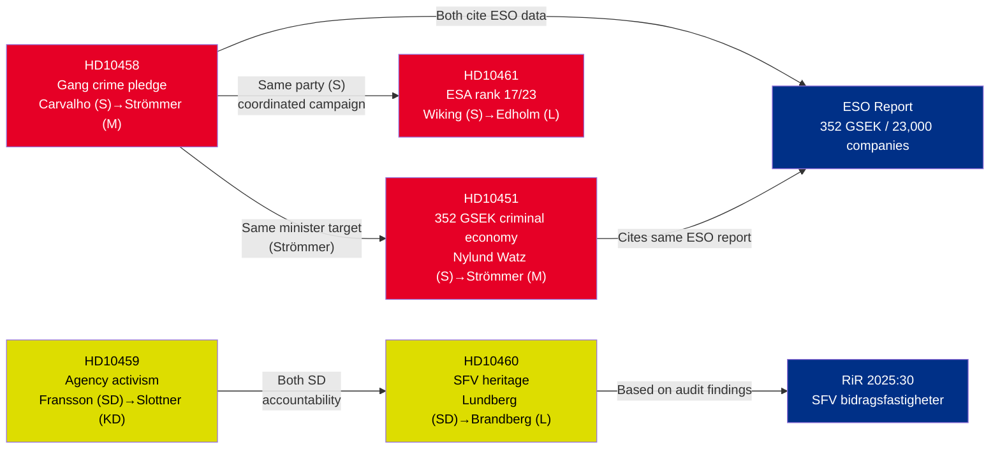

# Cross-Reference Map — Interpellations 2026-05-01

## Document Relationship Graph

## Thematic Cross-References

### Theme A: Criminal Economy / Organised Crime
- **HD10458** + **HD10451**: Directly linked — same target minister, complementary ESO-sourced data
- Shared evidence: ESO-rapport finding 352 GSEK criminal economy (5.5% GDP)
- Joint narrative: "Government has no tools to break criminal economy while violence continues"

### Theme B: Sweden's Declining Competitiveness
- **HD10461**: ESA rank 17/23 — Sweden lags Nordic peers
- Indirect link to criminal economy interpellations: Both build on "Sweden is declining under Tidökoalitionen" meta-narrative

### Theme C: Government Accountability to Riksrevisionen/Expert Bodies
- **HD10460** (RiR 2025:30) + **HD10451** + **HD10458** (ESO): All use independent expert bodies as evidence base
- Pattern: Opposition and SD are systematically using expert body reports to challenge government performance

### Theme D: Intra-Coalition Friction
- **HD10459**: SD vs KD on institutional reform pace
- **HD10460**: SD vs L on SFV oversight
- Pattern: Both SD interpellations target L or KD ministers — not M ministers. Signal: SD maintaining pressure on smaller coalition partners

## Shared Evidence Sources

| Source | Used In | Key Claim |
|--------|---------|-----------|
| ESO-rapport | HD10458, HD10451 | 352 GSEK criminal economy; 23,000 companies |
| RiR 2025:30 | HD10460 | SFV heritage property management failures |
| Aftonbladet (20 April 2026) | HD10458 | Strömmer "eradicate in 4 years" statement |
| ESA November 2025 Ministerial | HD10461 | 31% budget increase; Sweden relative decline |

---
*Date: 2026-05-01 | Analysis type: Cross-document thematic mapping*
