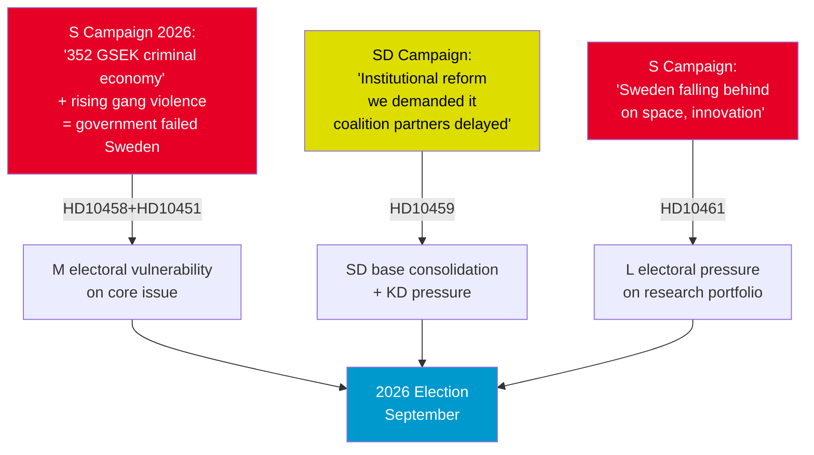

# Election 2026 Analysis — Interpellations 2026-05-01

## Current Parliamentary Configuration (2025/26 riksmöte)

| Party | Seats | Government Role |
|-------|-------|----------------|
| Moderaterna (M) | 68 | Government / Prime Minister |
| Sverigedemokraterna (SD) | 73 | Support (Tidöavtalet) |
| Kristdemokraterna (KD) | 28 | Government |
| Liberalerna (L) | 16 | Government |
| **Government bloc total** | **185** | |
| Socialdemokraterna (S) | 107 | Opposition |
| Vänsterpartiet (V) | 24 | Opposition |
| Miljöpartiet (MP) | 18 | Opposition |
| Centerpartiet (C) | 25 | Opposition |
| **Opposition bloc total** | **174** | |
| **Total Riksdag** | **349** | **Majority: 175** |

## Electoral Implications of Interpellations

### HD10458 + HD10451 — Criminal Economy / Gang Violence

**Electoral relevance**: CRITICAL  
**Parties affected**: M (primary target — Strömmer is M's justice minister), SD (secondary — their voters prioritise security)

**Projected seat-projection delta scenario analysis**:
- If S "352 GSEK criminal economy + no tools" narrative takes hold: M risks -3 to -5 seats; SD could benefit with +2 to +3 (voters want harder line); C/L (more centrist voters) may shift +1 to +2 toward S
- If government pivots with effective response: Neutral-slight positive for M; S's coordinated campaign neutralised

**Sector most affected**: Security-focused voters (~35-40% of electorate, cross-party)

### HD10461 — ESA/Space Funding

**Electoral relevance**: MODERATE  
**Parties affected**: L (Edholm is L's minister; L brand = innovation/education); M (economic competitiveness)

**Projected seat-projection delta**:
- L is most exposed: -1 to -2 seats if "L abandons research/innovation" narrative takes hold
- Positive: VÅP funding supplementary could turn this around

### HD10459 — Agency Activism (SD→KD)

**Electoral relevance**: MODERATE (for SD voter base)  
**Intra-coalition signal**: SD needing to show differentiation from M/KD delivers this interpellation at minimal coalition cost

**Projected seat-projection delta**:
- Neutral on SD seats — serves to energise SD base, not expand it
- Possible -1 for KD if perceived as protecting left-wing bureaucracy

## 2026 Election Campaign Narrative Map

## Overall Electoral Assessment

The government (Tidökoalitionen) enters the pre-election period with:
- **Core vulnerability**: Security/justice record challenged by independently-sourced ESO data (352 GSEK) that is difficult to dispute
- **Secondary vulnerability**: Competitiveness record on space (rank 17/23) that is metric-anchored and embarrassing
- **Internal pressure**: SD using parliamentary tools to signal reform impatience ahead of coalition negotiations

S is executing a disciplined, evidence-based accountability campaign that will be difficult to rebut without concrete new policy announcements.

---
*Date: 2026-05-01 | Seat data: Riksdagen.se official | Projections: Analytical judgment, not polling model*
