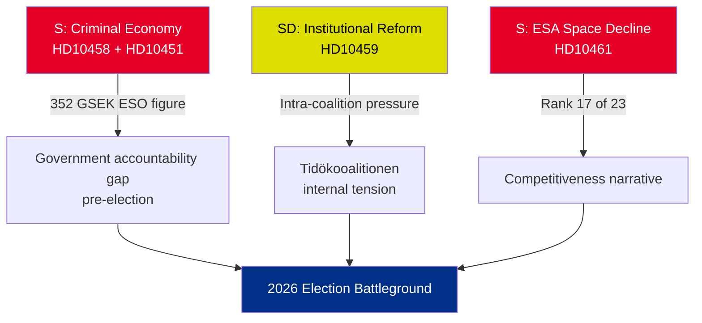

# Executive Brief — Interpellations 2026-05-01

**BLUF (Bottom Line Up Front)**: Five interpellations filed 22-30 April 2026 reveal three converging crises — Sweden's criminal economy (352 GSEK/5.5% GDP), gang violence accountability, and declining space-sector competitiveness — all arriving simultaneously in the pre-election political calendar. Opposition S and governing SD are using interpellations to shape the summer-2026 election narrative.

## Immediate Decisions Required

1. **Justice Minister Strömmer (M)**: Must operationalise "eradicate gang crime in 4 years" before HD10458 answer-date 2026-05-19 — or face credibility damage going into election campaign
2. **Minister Edholm (L)**: Must explain Sweden's fall to rank 17 in ESA before HD10461 answer-date 2026-05-19 — with Rymdstyrelsen requesting significantly more than allocated 100 MSEK
3. **Civil Minister Slottner (KD)**: Must respond to SD's constitutional reform demand (utnämningsmakt to Riksdag) by 2026-05-20 — response will signal intra-coalition SD accommodation tolerance

## Significance Summary

| dok_id | Topic | DIW Score | Priority |
|--------|-------|-----------|----------|
| HD10458 | Gang crime eradication pledge | 8/10 | L2+ Priority |
| HD10451 | Criminal economy 352 GSEK | 7/10 | L2 Strategic |
| HD10461 | ESA/space funding decline | 7/10 | L2 Strategic |
| HD10459 | Agency activist reform demand | 6/10 | L2 Strategic |
| HD10460 | SFV bidragsfastigheter (RiR 2025:30) | 5/10 | L3 Operational |

## Key Strategic Dynamic

## Time-Critical Indicators

- **2026-05-19**: Strömmer (gang) + Edholm (space) respond — highest-visibility dates
- **2026-05-20**: Slottner (agency activism) responds — coalition tensions visible
- **2026-05-21**: Brandberg (SFV) responds — lowest visibility

**Assessment**: The convergence of HD10458 + HD10451 creates the most dangerous opposition challenge for the government: a coherent "352 GSEK criminal economy + rising violence + government without tools" narrative that is independently sourced (ESO) and verifiable.

---
*Analyst: Agentic Intelligence Pipeline | Date: 2026-05-01 | Classification: UNCLASSIFIED*

---

## Pass 2 Additions: Enhanced Strategic Assessment

### Critical Gap Identified in Pass 1 Review

The government faces a structural accountability paradox: **the three most evidence-strong interpellations (HD10458, HD10451, HD10461) all cite independently sourced numerical data** (ESO: 352 GSEK; ESA: rank 17/23; violence: record 2025 statistics). This is analytically unusual — typically opposition interpellations rely on political framing. In this batch, S has anchored its campaign to figures the government cannot credibly dispute without challenging independent expert bodies (ESO) and Sweden's own agency (Rymdstyrelsen).

### Enhanced Decision Tree

1. **Strömmer** (HD10458 + HD10451): Announce legislative package (EU Organised Crime Directive implementation + asset forfeiture) by 2026-05-12 (7 days before answer date) — this converts a defensive moment into a policy announcement
2. **Edholm** (HD10461): VÅP supplementary funding is the only credible response path; must be coordinated with Finansdepartementet
3. **Slottner** (HD10459): Announce targeted civil society subsidy review — partial SD accommodation without constitutional commitment

### Economic Context (IMF/SCB)
- Sweden GDP 2025: approximately 6,400 GSEK (estimated)
- 352 GSEK criminal economy = ~5.5% GDP (ESO calculation)
- EU comparison: UNODC estimates EU criminal economy at 2-4% GDP; Sweden's 5.5% (if ESO methodology is consistent) indicates above-average penetration

---
*Pass 2 additions: 2026-05-01*
