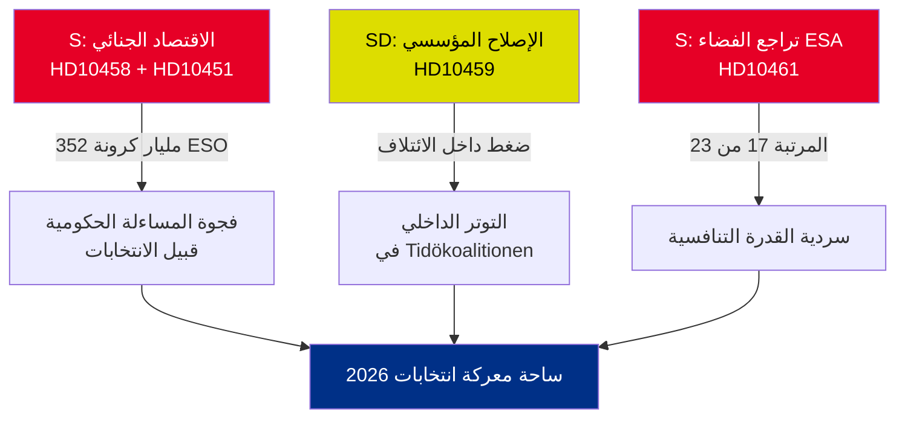

<!-- dir: rtl -->
# موجز تنفيذي — الاستجوابات البرلمانية 2026-05-01

**الخلاصة التنفيذية (BLUF)**: كشفت خمسة استجوابات برلمانية مقدَّمة في الفترة 22–30 أبريل 2026 عن ثلاث أزمات متقاطعة — الاقتصاد الجنائي السويدي (352 مليار كرونة / 5.5 % من الناتج المحلي الإجمالي)، وعنف العصابات، وتراجع القدرة التنافسية في قطاع الفضاء — وكلها تتزامن في التقويم السياسي قبيل الانتخابات. تستخدم المعارضة S وحزب الحكومة SD الاستجوابات لتشكيل السردية الانتخابية لصيف 2026.

## القرارات المطلوبة فوراً

1. **وزير العدل ستروميّر (M)**: يجب أن يُجسّد "القضاء على جرائم العصابات في 4 سنوات" قبل موعد الرد على HD10458 في 2026-05-19 — وإلا يواجه أضراراً في مصداقيته عشية الحملة الانتخابية
2. **الوزير إيدهولم (L)**: يجب أن يُفسّر تراجع السويد إلى المرتبة 17 في وكالة الفضاء الأوروبية قبل موعد الرد على HD10461 في 2026-05-19 — إذ تطلب Rymdstyrelsen ما يفوق بكثير مبلغ 100 مليون كرونة المخصّص
3. **الوزير المدني سلوتنر (KD)**: يجب الرد على مطلب SD بإصلاح دستوري (منح البرلمان صلاحية التعيينات) بحلول 2026-05-20 — سيشير الرد إلى مدى تسامح الائتلاف مع تسهيلات SD

## ملخص الأهمية

| dok_id | الموضوع | درجة DIW | الأولوية |
|--------|---------|----------|---------|
| HD10458 | وعد بالقضاء على جرائم العصابات | 8/10 | L2+ أولوية |
| HD10451 | الاقتصاد الجنائي 352 مليار كرونة | 7/10 | L2 استراتيجي |
| HD10461 | تراجع تمويل وكالة الفضاء الأوروبية | 7/10 | L2 استراتيجي |
| HD10459 | مطالبة بإصلاح الوكالات الناشطة | 6/10 | L2 استراتيجي |
| HD10460 | SFV bidragsfastigheter (RiR 2025:30) | 5/10 | L3 عملياتي |

## الديناميكية الاستراتيجية المحورية

## المؤشرات الحرجة زمنياً

- **2026-05-19**: يردّ ستروميّر (العصابات) + إيدهولم (الفضاء) — أكثر التواريخ بروزاً
- **2026-05-20**: يردّ سلوتنر (ناشطية الوكالات) — توترات الائتلاف مرئية
- **2026-05-21**: يردّ برانبرغ (SFV) — أدنى مستوى من الظهور

**التقييم**: يُفضي تقاطع HD10458 و HD10451 إلى أشد تحدي معارضة خطراً على الحكومة: سردية متماسكة مفادها "352 مليار كرونة اقتصاد جنائي + تصاعد العنف + حكومة بلا أدوات"، مدعومة بمصادر مستقلة (ESO) وقابلة للتحقق.

---
*المحلل: خط أنابيب الاستخبارات الوكيلة | التاريخ: 2026-05-01 | التصنيف: غير سري*

---

## إضافات الجولة الثانية: تقييم استراتيجي معمّق

### فجوة حرجة تم تحديدها في مراجعة الجولة الأولى

تواجه الحكومة مفارقة هيكلية في المساءلة: **الاستجوابات الثلاثة الأقوى دليلاً (HD10458، HD10451، HD10461) تستشهد جميعها ببيانات مصدرية مستقلة** (ESO: 352 مليار كرونة؛ ESA: المرتبة 17/23؛ العنف: إحصاءات قياسية لعام 2025). وهذا أمر غير معتاد تحليلياً — إذ تعتمد استجوابات المعارضة عادةً على التأطير السياسي. في هذه الدفعة، أرست S حملتها على أرقام لا تستطيع الحكومة الطعن فيها بصدقية دون تحدي هيئات الخبراء المستقلة (ESO) وRymdstyrelsen.

### شجرة القرار المحسّنة

1. **ستروميّر** (HD10458 + HD10451): الإعلان عن حزمة تشريعية (تطبيق توجيه الاتحاد الأوروبي لمكافحة الجريمة المنظمة + مصادرة الأصول) بحلول 2026-05-12 (7 أيام قبل الموعد) — يحوّل هذا لحظة دفاعية إلى إعلان سياسة
2. **إيدهولم** (HD10461): التمويل التكميلي VÅP هو المسار الوحيد ذو المصداقية؛ يجب تنسيقه مع وزارة المالية
3. **سلوتنر** (HD10459): الإعلان عن مراجعة مستهدفة لدعم المجتمع المدني — استيعاب جزئي لـ SD دون التزام دستوري

### السياق الاقتصادي (IMF/SCB)
- الناتج المحلي الإجمالي السويدي 2025: نحو 6,400 مليار كرونة (تقديري)
- 352 مليار كرونة اقتصاد جنائي = ~5.5 % من الناتج المحلي الإجمالي (حساب ESO)
- المقارنة مع الاتحاد الأوروبي: تقدّر UNODC الاقتصاد الجنائي في الاتحاد بنسبة 2–4 % من الناتج؛ نسبة السويد 5.5 % (إن كانت منهجية ESO متسقة) تشير إلى اختراق أعلى من المتوسط

---
*إضافات الجولة الثانية: 2026-05-01*

<!-- source-sha: 2d65e85af6ee6672a9ff7a4fcd257a8ea9b0651f -->
