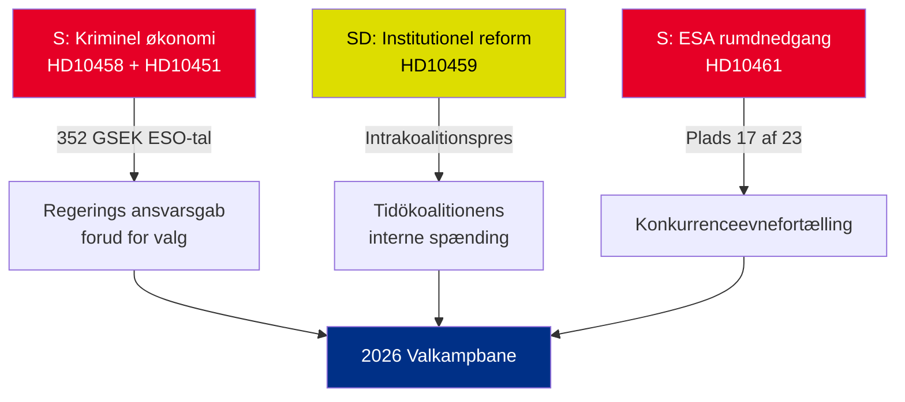

# Eksekutiv briefing — Interpellationer 2026-05-01

**BLUF (Bundlinie)**: Fem interpellationer indgivet 22.–30. april 2026 afslører tre samtidige kriser — Sveriges kriminelle økonomi (352 GSEK/5,5 % af BNP), banderelateret vold og faldende konkurrenceevne i rumsektoren — som alle ankommer simultant i den prævalgte politiske kalender. Oppositionen S og regeringspartiet SD bruger interpellationer til at forme sommerens valgfortælling 2026.

## Beslutninger der kræves straks

1. **Justitsminister Strömmer (M)**: Skal operationalisere "udrydde bandekriminalitet på 4 år" inden HD10458 svarsfrist 2026-05-19 — ellers risikeres troværdighedsskade forud for valgkampen
2. **Minister Edholm (L)**: Skal forklare Sveriges fald til plads 17 hos ESA inden HD10461 svarsfrist 2026-05-19 — Rymdstyrelsen anmoder om betydeligt mere end de tildelte 100 MSEK
3. **Civilminister Slottner (KD)**: Skal svare på SD's krav om konstitutionel reform (udnævnelsesmagt til Riksdag) senest 2026-05-20 — svaret signalerer tolerancen for intrakoalitionelt SD-imødekommende

## Signifikansoversigt

| dok_id | Emne | DIW-score | Prioritet |
|--------|------|-----------|----------|
| HD10458 | Løfte om at udrydde bandekriminalitet | 8/10 | L2+ Prioritet |
| HD10451 | Kriminel økonomi 352 GSEK | 7/10 | L2 Strategisk |
| HD10461 | ESA/rumfinansiering i tilbagegang | 7/10 | L2 Strategisk |
| HD10459 | Krav om reform af aktivistmyndigheder | 6/10 | L2 Strategisk |
| HD10460 | SFV bidragsfastigheter (RiR 2025:30) | 5/10 | L3 Operationel |

## Central strategisk dynamik

## Tidskritiske indikatorer

- **2026-05-19**: Strömmer (bander) + Edholm (rum) svarer — mest synlige datoer
- **2026-05-20**: Slottner (myndigheds aktivisme) svarer — koalitionsspændinger synliggøres
- **2026-05-21**: Brandberg (SFV) svarer — lavest synlighed

**Vurdering**: Konvergensen af HD10458 + HD10451 skaber den farligste oppositionsudfordring for regeringen: en sammenhængende fortælling om "352 GSEK kriminel økonomi + stigende vold + en regering uden redskaber" med uafhængigt kildebelæg (ESO) og verificerbarhed.

---
*Analytiker: Agentisk efterretningspipeline | Dato: 2026-05-01 | Klassifikation: UKLASSIFICERET*

---

## Pass 2-tilføjelser: Udvidet strategisk vurdering

### Kritisk lakune identificeret ved gennemgang af Pass 1

Regeringen møder et strukturelt ansvarsskabende paradoks: **de tre interpellationer med stærkest evidens (HD10458, HD10451, HD10461) citerer alle uafhængige kildedata** (ESO: 352 GSEK; ESA: plads 17/23; vold: rekordtal 2025). Dette er analytisk usædvanligt — typisk baserer oppositionens interpellationer sig på politisk framing. I dette batch har S forankret sin kampagne i tal, som regeringen ikke troværdigt kan bestride uden at udfordre uafhængige ekspertorganer (ESO) og Rymdstyrelsen.

### Forbedret beslutningstræ

1. **Strömmer** (HD10458 + HD10451): Annoncér lovpakke (gennemførelse af EU's direktiv mod organiseret kriminalitet + aktivkonfiskation) senest 2026-05-12 (7 dage inden svarsfrist) — dette omdanner et defensivt øjeblik til en politikannonce
2. **Edholm** (HD10461): VÅP-tillægsfinansiering er den eneste troværdige svarssti; skal koordineres med Finansdepartementet
3. **Slottner** (HD10459): Annoncér målrettet gennemgang af civilsamfundssubsidier — delvist SD-imødekommende uden forfatningsforpligtelse

### Økonomisk kontekst (IMF/SCB)
- Sveriges BNP 2025: anslået 6.400 GSEK
- 352 GSEK kriminel økonomi = ~5,5 % af BNP (ESO-beregning)
- EU-sammenligning: UNODC anslår EU's kriminelle økonomi til 2–4 % af BNP; Sveriges 5,5 % (hvis ESO-metodologien er konsistent) indikerer penetration over gennemsnittet

---
*Pass 2-tilføjelser: 2026-05-01*

<!-- source-sha: 2d65e85af6ee6672a9ff7a4fcd257a8ea9b0651f -->
