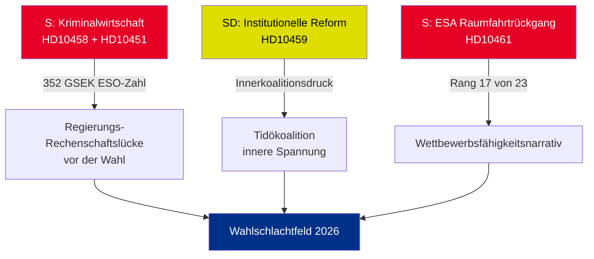

# Exekutivbericht — Interpellationen 2026-05-01

**BLUF (Kernaussage)**: Fünf zwischen dem 22. und 30. April 2026 eingereichte Interpellationen enthüllen drei gleichzeitig eskalierenden Krisen — Schwedens Kriminalwirtschaft (352 GSEK/5,5 % des BIP), Bandenkriminalität und sinkende Wettbewerbsfähigkeit im Raumfahrtsektor — die allesamt im vorwahlpolitischen Kalender zusammentreffen. Die Oppositionspartei S und die Regierungspartei SD nutzen Interpellationen, um das Wahlkampfnarrativ für Sommer 2026 zu gestalten.

## Sofort erforderliche Entscheidungen

1. **Justizminister Strömmer (M)**: Muss „Bandenkriminalität in 4 Jahren ausrotten" vor dem HD10458-Antworttermin 2026-05-19 operationalisieren — sonst drohen Glaubwürdigkeitsverluste im Wahlkampf
2. **Minister Edholm (L)**: Muss Schwedens Abstieg auf Rang 17 bei der ESA vor dem HD10461-Antworttermin 2026-05-19 erklären — Rymdstyrelsen beantragt erheblich mehr als die zugewiesenen 100 MSEK
3. **Zivilminister Slottner (KD)**: Muss auf SDs Forderung nach Verfassungsreform (Ernennungsrecht an den Riksdag) bis zum 2026-05-20 antworten — die Antwort signalisiert die Toleranz der Koalition gegenüber SD-Entgegenkommen

## Signifikanzübersicht

| dok_id | Thema | DIW-Bewertung | Priorität |
|--------|-------|---------------|----------|
| HD10458 | Versprechen zur Ausrottung der Bandenkriminalität | 8/10 | L2+ Priorität |
| HD10451 | Kriminalwirtschaft 352 GSEK | 7/10 | L2 Strategisch |
| HD10461 | ESA/Raumfahrtfinanzierung rückläufig | 7/10 | L2 Strategisch |
| HD10459 | Forderung nach Reform aktivistischer Behörden | 6/10 | L2 Strategisch |
| HD10460 | SFV bidragsfastigheter (RiR 2025:30) | 5/10 | L3 Operativ |

## Zentrale strategische Dynamik

## Zeitkritische Indikatoren

- **2026-05-19**: Strömmer (Banden) + Edholm (Raumfahrt) antworten — sichtbarste Daten
- **2026-05-20**: Slottner (Behördenaktivismus) antwortet — Koalitionsspannungen sichtbar
- **2026-05-21**: Brandberg (SFV) antwortet — geringste Sichtbarkeit

**Bewertung**: Die Konvergenz von HD10458 + HD10451 schafft die gefährlichste Oppositionsherausforderung für die Regierung: ein kohärentes Narrativ von „352 GSEK Kriminalwirtschaft + eskalierender Gewalt + Regierung ohne Mittel", das unabhängig belegt (ESO) und verifizierbar ist.

---
*Analyst: Agentische Nachrichtenpipeline | Datum: 2026-05-01 | Klassifizierung: NICHT EINGESTUFT*

---

## Pass 2-Ergänzungen: Erweiterte strategische Bewertung

### Kritische Lücke bei der Überprüfung von Pass 1 identifiziert

Die Regierung steht vor einem strukturellen Rechenschaftsparadoxon: **Die drei Interpellationen mit der stärksten Evidenz (HD10458, HD10451, HD10461) zitieren alle unabhängige Quelldaten** (ESO: 352 GSEK; ESA: Rang 17/23; Gewalt: Rekordwerte 2025). Dies ist analytisch ungewöhnlich — typischerweise stützen sich die Interpellationen der Opposition auf politisches Framing. In diesem Paket hat S ihre Kampagne auf Zahlen gestützt, die die Regierung nicht glaubwürdig bestreiten kann, ohne unabhängige Expertengremien (ESO) und Rymdstyrelsen herauszufordern.

### Erweiterter Entscheidungsbaum

1. **Strömmer** (HD10458 + HD10451): Gesetzgebungspaket ankündigen (Umsetzung der EU-Richtlinie gegen organisierte Kriminalität + Vermögenseinziehung) bis zum 2026-05-12 (7 Tage vor dem Antworttermin) — das wandelt einen defensiven Moment in eine Politikankündigung um
2. **Edholm** (HD10461): VÅP-Zusatzfinanzierung ist der einzige glaubwürdige Antwortpfad; muss mit dem Finanzministerium koordiniert werden
3. **Slottner** (HD10459): Gezielte Überprüfung der Zivilgesellschaftssubventionen ankündigen — teilweises SD-Entgegenkommen ohne Verfassungsbekenntnis

### Wirtschaftlicher Kontext (IMF/SCB)
- Schwedisches BIP 2025: schätzungsweise 6.400 GSEK
- 352 GSEK Kriminalwirtschaft = ~5,5 % des BIP (ESO-Berechnung)
- EU-Vergleich: UNODC schätzt die EU-Kriminalwirtschaft auf 2–4 % des BIP; Schwedens 5,5 % (wenn die ESO-Methodik konsistent ist) deutet auf eine überdurchschnittliche Durchdringung hin

---
*Pass 2-Ergänzungen: 2026-05-01*

<!-- source-sha: 2d65e85af6ee6672a9ff7a4fcd257a8ea9b0651f -->
