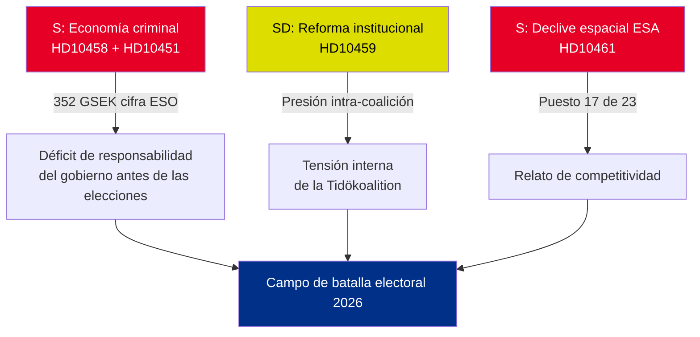

# Resumen ejecutivo — Interpelaciones 2026-05-01

**BLUF (Conclusión principal)**: Cinco interpelaciones presentadas entre el 22 y el 30 de abril de 2026 revelan tres crisis convergentes — la economía criminal sueca (352 GSEK/5,5 % del PIB), la violencia de bandas y el declive de la competitividad en el sector espacial — que llegan simultáneamente al calendario político preelectoral. La oposición S y el partido gubernamental SD utilizan las interpelaciones para moldear el relato electoral del verano de 2026.

## Decisiones inmediatas requeridas

1. **Ministro de Justicia Strömmer (M)**: Debe operacionalizar "erradicar la criminalidad de bandas en 4 años" antes de la fecha de respuesta HD10458 el 2026-05-19 — de lo contrario, se arriesga a un daño de credibilidad antes de la campaña electoral
2. **Ministro Edholm (L)**: Debe explicar el descenso de Suecia al puesto 17 en la ESA antes de la fecha de respuesta HD10461 el 2026-05-19 — Rymdstyrelsen solicita considerablemente más que los 100 MSEK asignados
3. **Ministro civil Slottner (KD)**: Debe responder a la demanda de reforma constitucional del SD (poder de nombramiento al Riksdag) antes del 2026-05-20 — la respuesta señalará la tolerancia de la coalición hacia las concesiones al SD

## Resumen de importancia

| dok_id | Tema | Puntuación DIW | Prioridad |
|--------|------|----------------|---------|
| HD10458 | Promesa de erradicación de la criminalidad de bandas | 8/10 | L2+ Prioridad |
| HD10451 | Economía criminal 352 GSEK | 7/10 | L2 Estratégico |
| HD10461 | Financiamiento ESA/espacial en declive | 7/10 | L2 Estratégico |
| HD10459 | Demanda de reforma de agencias activistas | 6/10 | L2 Estratégico |
| HD10460 | SFV bidragsfastigheter (RiR 2025:30) | 5/10 | L3 Operacional |

## Dinámica estratégica central

## Indicadores con plazos críticos

- **2026-05-19**: Strömmer (bandas) + Edholm (espacio) responden — fechas de mayor visibilidad
- **2026-05-20**: Slottner (activismo institucional) responde — tensiones de coalición visibles
- **2026-05-21**: Brandberg (SFV) responde — menor visibilidad

**Evaluación**: La convergencia de HD10458 + HD10451 crea el desafío de oposición más peligroso para el gobierno: un relato coherente de "352 GSEK de economía criminal + violencia creciente + gobierno sin herramientas", con respaldo de fuentes independientes (ESO) y verificable.

---
*Analista: Línea de inteligencia agéntica | Fecha: 2026-05-01 | Clasificación: SIN CLASIFICAR*

---

## Adiciones del Paso 2: Evaluación estratégica ampliada

### Laguna crítica identificada en la revisión del Paso 1

El gobierno se enfrenta a una paradoja estructural de rendición de cuentas: **las tres interpelaciones con evidencia más sólida (HD10458, HD10451, HD10461) citan todas datos de fuentes independientes** (ESO: 352 GSEK; ESA: puesto 17/23; violencia: estadísticas récord 2025). Esto es analíticamente inusual — las interpelaciones de la oposición suelen basarse en un encuadre político. En este lote, S ha anclado su campaña en cifras que el gobierno no puede rebatir de manera creíble sin cuestionar organismos expertos independientes (ESO) y Rymdstyrelsen.

### Árbol de decisiones mejorado

1. **Strömmer** (HD10458 + HD10451): Anunciar paquete legislativo (implementación de la Directiva UE contra la delincuencia organizada + decomiso de activos) antes del 2026-05-12 (7 días antes de la fecha de respuesta) — esto convierte un momento defensivo en un anuncio de política
2. **Edholm** (HD10461): La financiación suplementaria VÅP es el único camino de respuesta creíble; debe coordinarse con el Finansdepartementet
3. **Slottner** (HD10459): Anunciar revisión específica de los subsidios a la sociedad civil — concesión parcial al SD sin compromiso constitucional

### Contexto económico (FMI/SCB)
- PIB sueco 2025: aproximadamente 6.400 GSEK (estimado)
- 352 GSEK de economía criminal = ~5,5 % del PIB (cálculo de ESO)
- Comparación UE: la UNODC estima la economía criminal de la UE en el 2–4 % del PIB; el 5,5 % de Suecia (si la metodología de la ESO es coherente) indica una penetración superior a la media

---
*Adiciones del Paso 2: 2026-05-01*

<!-- source-sha: 2d65e85af6ee6672a9ff7a4fcd257a8ea9b0651f -->
