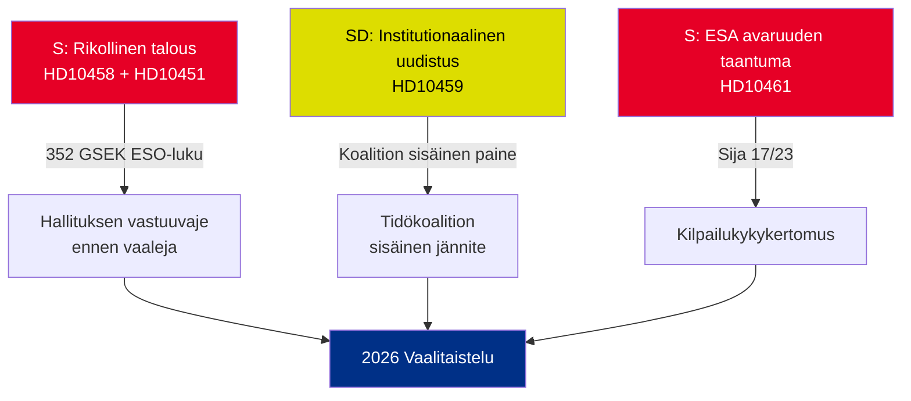

# Johtava tiedote — Interpellaatiot 2026-05-01

**BLUF (Ydinviesti)**: Viisi 22.–30. huhtikuuta 2026 jätettyjä interpellaatioita paljastaa kolme samanaikaista kriisiä — Ruotsin rikollinen talous (352 GSEK / 5,5 % BKT:stä), jengiväkivalta ja heikkenevä kilpailukyky avaruussektorilla — jotka kaikki saapuvat samanaikaisesti vaaleja edeltävässä poliittisessa kalenterissa. Oppositio S ja hallituspuolue SD käyttävät interpellaatioita muokatakseen kesä-2026 vaalikertomusta.

## Välittömästi vaadittavat päätökset

1. **Oikeusministeri Strömmer (M)**: Tulee operationalisoida "hävitä jengirikollisuus 4 vuodessa" ennen HD10458 vastauspäivää 2026-05-19 — muutoin uskottavuus kärsii ennen vaalikampanjaa
2. **Ministeri Edholm (L)**: Tulee selittää Ruotsin putoaminen ESA:n sijalle 17 ennen HD10461 vastauspäivää 2026-05-19 — Rymdstyrelsen pyytää huomattavasti enemmän kuin myönnetyt 100 MSEK
3. **Siviiliministeri Slottner (KD)**: Tulee vastata SD:n perustuslaillisen uudistuksen vaatimukseen (nimitysvalta Riksdagille) viimeistään 2026-05-20 — vastaus kertoo koalition sisäisestä SD:n myöntyväisyydestä

## Merkittävyysyhteenveto

| dok_id | Aihe | DIW-pisteet | Prioriteetti |
|--------|------|-------------|-------------|
| HD10458 | Lupaus jengirikollisuuden hävittämisestä | 8/10 | L2+ Prioriteetti |
| HD10451 | Rikollinen talous 352 GSEK | 7/10 | L2 Strateginen |
| HD10461 | ESA/avaruusrahoitus laskussa | 7/10 | L2 Strateginen |
| HD10459 | Vaatimus aktivistijärjestöjen reformista | 6/10 | L2 Strateginen |
| HD10460 | SFV bidragsfastigheter (RiR 2025:30) | 5/10 | L3 Operatiivinen |

## Keskeinen strateginen dynamiikka

## Aikakriittiset indikaattorit

- **2026-05-19**: Strömmer (jengit) + Edholm (avaruus) vastaavat — näkyvimmät päivämäärät
- **2026-05-20**: Slottner (virastolaktivismi) vastaa — koalitiojännitteet näkyvillä
- **2026-05-21**: Brandberg (SFV) vastaa — vähäisin näkyvyys

**Arvio**: HD10458:n ja HD10451:n konvergenssi luo vaarallisimman oppositiohaasteen hallitukselle: johdonmukainen kertomus "352 GSEK rikollinen talous + lisääntyvä väkivalta + hallitus ilman välineitä", jolla on itsenäinen lähdetuki (ESO) ja todennettavuus.

---
*Analyytikko: Agenttinen tiedusteluputki | Päivämäärä: 2026-05-01 | Luokitus: JULKINEN*

---

## Pass 2 -lisäykset: Laajennettu strateginen arvio

### Pass 1:n tarkastuksessa havaittu kriittinen aukko

Hallitus kohtaa rakenteellisen vastuuparadoksin: **kolmella vahvimman näytön interpellaatiolla (HD10458, HD10451, HD10461) on kaikilla itsenäiset lähteet** (ESO: 352 GSEK; ESA: sija 17/23; väkivalta: ennätysluvut 2025). Tämä on analyyttisesti epätavallista — tyypillisesti opposition interpellaatiot nojaavat poliittiseen kehystämiseen. Tässä erässä S on ankkuroinut kampanjansa lukuihin, joita hallitus ei uskottavasti voi kiistää haastamatta riippumattomia asiantuntijaelimiä (ESO) ja Rymdstyrelseniä.

### Parannettu päätöspuu

1. **Strömmer** (HD10458 + HD10451): Ilmoita lainsäädäntöpaketti (EU:n järjestäytynyttä rikollisuutta vastaan suunnatun direktiivin täytäntöönpano + varojen takavarikko) viimeistään 2026-05-12 (7 päivää ennen vastauspäivää) — tämä muuttaa defensiivisen hetken politiikkailmoitukseksi
2. **Edholm** (HD10461): VÅP-lisärahoitus on ainoa uskottava vastauspolku; on koordinoitava Finansdepartementetin kanssa
3. **Slottner** (HD10459): Ilmoita kohdennettu kansalaisyhteiskunnan tukien tarkastelu — osittainen SD-myöntyminen ilman perustuslaillista sitoutumista

### Taloudellinen konteksti (IMF/SCB)
- Ruotsin BKT 2025: arviolta 6 400 GSEK
- 352 GSEK rikollinen talous = ~5,5 % BKT:stä (ESO:n laskelma)
- EU-vertailu: UNODC arvioi EU:n rikollisen talouden 2–4 %:ksi BKT:stä; Ruotsin 5,5 % (jos ESO:n metodologia on johdonmukainen) osoittaa keskimääräistä suurempaa läpäisyä

---
*Pass 2 -lisäykset: 2026-05-01*

<!-- source-sha: 2d65e85af6ee6672a9ff7a4fcd257a8ea9b0651f -->
